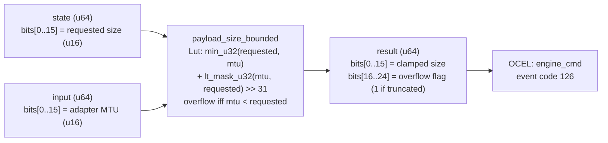

<!-- SCAFFOLDED BY ggen — fill in Context/Forces/Solution/Consequences below, then commit. -->
<!-- Source: ggen/schema/patterns.ttl (payload_size_bounded). Re-scaffold: `ggen sync`. -->

# Pattern: PayloadSizeBounded

> **Family:** Engine Bridge · **Kernel:** `payload_size_bounded` · **Lowering:** `Lut` · **Id:** 64

Clamp a payload size request to the adapter's maximum MTU via branchless min; return clamped size and an overflow flag.

---

## Context

Platform bridge adapters impose Maximum Transmission Unit (MTU) limits on command payloads; WebGPU, WebGL, and audio DSP adapters each have different MTU values. Oversized payloads corrupt the bridge's internal buffer ring and cause silent data loss or adapter faults; undersized payloads are always safe. Every command submission must clamp the requested payload size to the adapter's MTU before the payload is serialized. A naïve `if requested > mtu { clamped = mtu; overflow = true; }` guard branches on the size comparison at high frequency in the command submission path, creating misprediction pressure whenever a large batch of commands is split at the MTU boundary.

## Forces

- **Branch misprediction** — a conditional clamp on payload size mispredicts at the MTU boundary, which is hit systematically during large batch submissions.
- **Deterministic latency** — the Lut lowering via `min_u32` and `lt_mask_u32` gives O(1) constant time; the clamped size and overflow flag are computed unconditionally in parallel.
- **Overflow signaling** — callers must know whether the payload was truncated (overflow=1) so they can split the remainder into a second transmission; this signal must be computed without a separate branch.
- **Equality is not overflow** — a request exactly equal to the MTU is legal and must not set the overflow flag; only strict excess (request > MTU) overflows.
- **OCEL auditability** — OCEL event code 126 ties each payload bound check to an `engine_cmd` object trace for adapter buffer utilization auditing.

## Solution

The kernel packs `state` bits[0..15] as the requested payload size (u16) and `input` bits[0..15] as the adapter MTU (u16). `min_u32(requested, mtu)` computes the clamped size branchlessly — it is implemented via a mask selecting the smaller value without a conditional. The overflow flag is `(lt_mask_u32(mtu, requested) >> 31) as u64`: all-ones when `mtu < requested` (strict overflow), shifted to 1. Both are packed into the return u64: clamped size in bits[0..15], overflow flag in bits[16..24]. This is the Lut lowering: a two-output arithmetic transform on a single comparison that produces both the bounded value and the violation signal in one pass.

**Branchless primitive:** `bcinr_logic::mask::min_u32`

## Consequences

**Gains:** The clamped size and overflow flag are computed in parallel in one pipeline pass. The strict-overflow invariant (equal-to-MTU is not overflow) is verified by the Hoare-logic annotation and tested by the boundary corpus. The caller can use the overflow flag to split payloads without any additional comparison.

**Costs:** The bit-field ABI is fixed — requested in state bits[0..15], MTU in input bits[0..15], clamped size in result bits[0..15], overflow in result bits[16..24]. MTU and payload sizes are limited to 16 bits (64 KB); larger transfer units require a kernel variant.

**Compositions:** Payload size is bounded before the payload is transmitted over a CONNECTED bridge (`bridge_state_transitioned`). The bounded payload carries the encoded opcode from `command_opcode_encoded`. Higher-priority adapters (from `adapter_priority_ranked`) may have larger MTUs, so priority ranking can serve as an implicit MTU maximizer.

---

## Structure Diagram



---

## Evidence Model

| Field | Value |
|---|---|
| OCEL activity | `PayloadSizeBounded` |
| Event code | `126` |
| OTEL span | `126` |
| Object kinds | `engine_cmd` |
| Required status | `4` |
| Refusal status | `7` |
| Authority | oracle predicate: matches payload_size_bounded_reference for all inputs |

---

## Metadata

| Field | Value |
|---|---|
| Pattern id | 64 |
| Family | Engine Bridge |
| Lowering | `Lut` |
| State cardinality | 8 |
| Primitive | `bcinr_logic::mask::min_u32` |
| Kernel signature | `payload_size_bounded(state: u64, input: u64) -> u64` |
| Source kernel | `src/patterns/payload_size_bounded.rs` |

---

## How to Use

```rust
use wasm4games::patterns::payload_size_bounded;

// Pack state and input into u64 fields as documented in the kernel source.
let result = payload_size_bounded(state, input);
```

The kernel is a pure `fn(u64, u64) -> u64` — no side effects, no allocation, no branches.
Pair with the evidence layer to emit OCEL events, OTEL spans, and receipt folds:

```rust
use wasm4games::evidence::{ocel::OcelEvent, otel};

let result = payload_size_bounded(state, input);
otel::emit(126);
let ev = OcelEvent::new(126, logical_tick, admission_status);
```

---

## Related Patterns

- [BridgeStateTransitioned](bridge_state_transitioned.md) — payload is bounded immediately before transmission in CONNECTED state.
- [CommandOpcodeEncoded](command_opcode_encoded.md) — the bounded payload carries the opcode class and original command type.
- [AdapterPriorityRanked](adapter_priority_ranked.md) — higher-priority adapters are tried first; they may offer larger MTUs.
