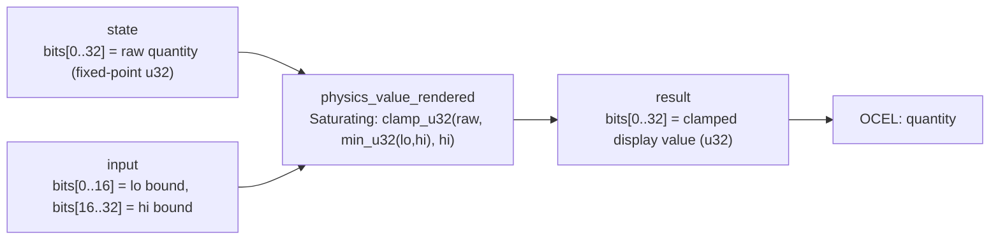

<!-- SCAFFOLDED BY ggen — fill in Context/Forces/Solution/Consequences below, then commit. -->
<!-- Source: ggen/schema/patterns.ttl (physics_value_rendered). Re-scaffold: `ggen sync`. -->

# Pattern: PhysicsValueRendered

> **Family:** Physics & Meaning · **Kernel:** `physics_value_rendered` · **Lowering:** `Saturating` · **Id:** 10

Render a raw quantity into a display-safe range by clamping to [lo, hi].

---

## Context

Physics engines produce raw fixed-point quantities — velocity magnitudes, pressure readings, damage scalars — whose range is unbounded by construction. When these values are piped directly into HUD rendering (health bars, speed gauges, altitude displays), a value above the display maximum wraps or clips to a nonsensical pixel coordinate, and a value below the display minimum renders garbage at the bottom of the bar. The conditional `if val > hi { hi } else if val < lo { lo } else { val }` branches twice per rendered element, injecting variable latency into the render tick whenever the physics integrator overshoots.

## Forces

- **Branch misprediction** — the two-sided conditional clamp (`if > hi / else if < lo / else pass`) branches unpredictably as physics values oscillate around boundaries, adding pipeline stalls to every HUD refresh.
- **Deterministic latency** — the Saturating lowering onto `clamp_u32` resolves the clamp in O(1) arithmetic with no data-dependent control flow, giving a flat nanosecond budget regardless of whether the value is in-range or not.
- **Range normalization** — the input `lo` and `hi` fields may arrive in any order from the caller; the kernel branchlessly normalizes them with `min_u32(lo, hi)` before clamping, so an inverted range never silently corrupts the output.
- **Display fidelity** — a clamped value is always the closest representable display value to the raw physics quantity; saturation to the boundary is semantically correct and visually interpretable, unlike wrapping or truncation.
- **OCEL auditability** — OCEL event code `48` ties each rendered-quantity transition to the `quantity` object trace, enabling post-hoc replay of exactly what the HUD displayed at each tick.

## Solution

The kernel resolves the forces by expressing clamping as pure arithmetic using `bcinr_logic::fix::clamp_u32` — a branchless primitive that computes `max(lo, min(hi, raw))` via conditional-move instructions with no branch target. The packed-u64 ABI places the raw fixed-point quantity in `state` bits[0..32], and the display bounds in `input` bits[0..16] (lo) and bits[16..32] (hi). Before clamping, `min_u32(lo, hi)` normalizes the bound pair branchlessly, so inverted-range inputs are silently corrected rather than silently wrong. The result is placed in bits[0..32] of the return value, ready for direct indexing into a pixel buffer or progress-bar shader. The Saturating lowering was chosen because the semantic of `clamp` is precisely saturation: a value that overshoots the boundary should stop at the boundary, not wrap or error.

**Branchless primitive:** `bcinr_logic::fix::clamp_u32`

## Consequences

**Gains:** Every HUD element that uses this kernel gets O(1), branch-free latency — no misprediction tax even when the physics integrator is routinely overshooting the display range. The OCEL event code `48` provides a full audit trail of what the display showed, decoupled from what the physics engine computed. The kernel is side-channel silent because clamp is data-oblivious: an attacker cannot distinguish in-range from out-of-range inputs by timing. **Costs:** The ABI fixes the display range representation to two u16 half-words packed into the low 32 bits of `input`; callers with wider or floating-point ranges must convert before calling. The state space is bounded to 32 bits of raw quantity. **Compositions:** This kernel feeds naturally into [SemanticLodSelected](semantic_lod_selected.md) (the clamped physics value becomes the distance input for LOD tier selection) and [ProjectileAdvanced](projectile_advanced.md) (the clamped position is the starting point for the next integration step).

---

## Structure Diagram



---

## Evidence Model

| Field | Value |
|---|---|
| OCEL activity | `PhysicsValueRendered` |
| Event code | `48` |
| OTEL span | `48` |
| Object kinds | `quantity` |
| Required status | `4` |
| Refusal status | `7` |
| Authority | oracle predicate: matches physics_value_rendered_reference for all inputs |

---

## Metadata

| Field | Value |
|---|---|
| Pattern id | 10 |
| Family | Physics & Meaning |
| Lowering | `Saturating` |
| State cardinality | 32 |
| Primitive | `bcinr_logic::fix::clamp_u32` |
| Kernel signature | `physics_value_rendered(state: u64, input: u64) -> u64` |
| Source kernel | `src/patterns/physics_value_rendered.rs` |

---

## How to Use

```rust
use wasm4games::patterns::physics_value_rendered;

// Pack state and input into u64 fields as documented in the kernel source.
let result = physics_value_rendered(state, input);
```

The kernel is a pure `fn(u64, u64) -> u64` — no side effects, no allocation, no branches.
Pair with the evidence layer to emit OCEL events, OTEL spans, and receipt folds:

```rust
use wasm4games::evidence::{ocel::OcelEvent, otel};

let result = physics_value_rendered(state, input);
otel::emit(48);
let ev = OcelEvent::new(48, logical_tick, admission_status);
```

---

## Related Patterns

- [SemanticLodSelected](semantic_lod_selected.md) — clamped physics values feed the distance input for LOD tier selection
- [ProjectileAdvanced](projectile_advanced.md) — projectile positions are physics-rendered quantities that then feed collision checks
