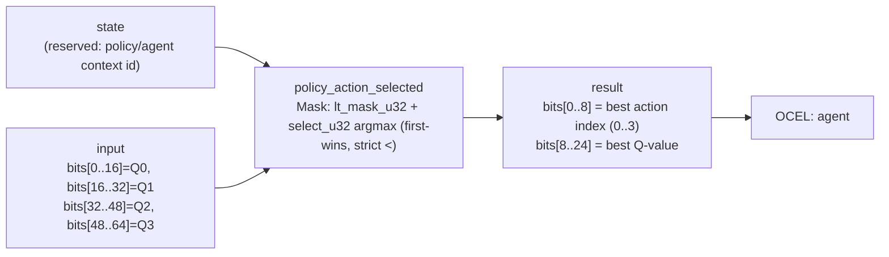

<!-- SCAFFOLDED BY ggen — fill in Context/Forces/Solution/Consequences below, then commit. -->
<!-- Source: ggen/schema/patterns.ttl (policy_action_selected). Re-scaffold: `ggen sync`. -->

# Pattern: PolicyActionSelected

> **Family:** AI Agent / Benchmark · **Kernel:** `policy_action_selected` · **Lowering:** `Mask` · **Id:** 67

Select the highest-value action from a policy's four Q-values, with first-index-wins tie-breaking.

---

## Context

A trained RL policy outputs a Q-value for each of 4 actions; the agent must execute the action with the highest Q-value. This is structurally identical to the utility argmax in [AiActionSelected](ai_action_selected.md) but operates on the inference side — it is the hot path of the trained policy, called once per environment step for every active agent during rollout. Because rollout frames may contain thousands of policy inference calls in sequence (vectorized batches), any branch in the argmax multiplies its misprediction cost across all agents.

## Forces

- **Branch misprediction** — a naïve `if q_i > best` loop branches on each Q-value comparison; during rollout the Q-value landscape changes every step, making prediction history ineffective.
- **Deterministic latency** — the Mask lowering onto `lt_mask_u32` / `select_u32` computes the argmax in 3 unconditional mask-and-select pairs, all O(1) with a flat cycle count regardless of Q-value ordering.
- **Tie-breaking determinism** — the strict `<` comparison in `lt_mask_u32(best_val, q_i)` ensures first-index-wins on equal Q-values, making the policy's behavior bitwise reproducible across any hardware and run — critical for offline policy analysis and debugging.
- **Inference vs. heuristic separation** — although the kernel structure mirrors [AiActionSelected](ai_action_selected.md), separating them into distinct kernels gives each its own OCEL event code (`129` vs `64`), enabling separate audit trails for trained-policy decisions and hand-authored utility decisions.
- **OCEL auditability** — OCEL event code `129` ties each policy inference step to the `agent` object trace, supporting per-step policy attribution in replays.

## Solution

The kernel is a direct application of the 4-lane branchless argmax. The packed-u64 ABI packs four u16 Q-values into `input` lanes [0..16], [16..32], [32..48], [48..64]; `state` is reserved for a policy/agent context id. Starting from lane 0 as the initial best, each subsequent lane is evaluated with `lt_mask_u32(best_val, q_i)` and both `best_idx` and `best_val` are updated with `select_u32(mask, candidate, current)`. The return value packs the winning action index in bits[0..8] and the winning Q-value in bits[8..24]. The Mask lowering was chosen because the argmax decision is a pure conditional-select problem — exactly what the mask/select primitive pair is designed for.

**Branchless primitive:** `bcinr_logic::mask::select_u32`

## Consequences

**Gains:** Policy inference argmax cost is flat regardless of Q-value distribution, enabling tight latency SLAs on rollout batches. The first-wins tie-break is a hardware-independent invariant, so policy replay is bitwise identical across machines. OCEL event `129` provides a per-step policy decision record distinct from NPC heuristic decisions. **Costs:** The ABI is fixed to exactly 4 Q-value slots; larger action spaces require a separate kernel. Q-values are limited to u16; policies with larger Q-value ranges must rescale before packing. **Compositions:** The action index output feeds into [ActionMaskApplied](action_mask_applied.md) for legality enforcement, and the executed action generates rewards that flow into [RewardSignalClamped](reward_signal_clamped.md).

---

## Structure Diagram



---

## Evidence Model

| Field | Value |
|---|---|
| OCEL activity | `PolicyActionSelected` |
| Event code | `129` |
| OTEL span | `129` |
| Object kinds | `agent` |
| Required status | `4` |
| Refusal status | `7` |
| Authority | oracle predicate: matches policy_action_selected_reference for all inputs |

---

## Metadata

| Field | Value |
|---|---|
| Pattern id | 67 |
| Family | AI Agent / Benchmark |
| Lowering | `Mask` |
| State cardinality | 2 |
| Primitive | `bcinr_logic::mask::select_u32` |
| Kernel signature | `policy_action_selected(state: u64, input: u64) -> u64` |
| Source kernel | `src/patterns/policy_action_selected.rs` |

---

## How to Use

```rust
use wasm4games::patterns::policy_action_selected;

// Pack state and input into u64 fields as documented in the kernel source.
let result = policy_action_selected(state, input);
```

The kernel is a pure `fn(u64, u64) -> u64` — no side effects, no allocation, no branches.
Pair with the evidence layer to emit OCEL events, OTEL spans, and receipt folds:

```rust
use wasm4games::evidence::{ocel::OcelEvent, otel};

let result = policy_action_selected(state, input);
otel::emit(129);
let ev = OcelEvent::new(129, logical_tick, admission_status);
```

---

## Related Patterns

- [AiActionSelected](ai_action_selected.md) — the same argmax structure for heuristic NPC utility scores rather than trained Q-values
- [ActionMaskApplied](action_mask_applied.md) — illegal Q-values should be zeroed by this kernel before policy action selection
- [RewardSignalClamped](reward_signal_clamped.md) — the policy's chosen action generates a reward that must be clamped before accumulation
