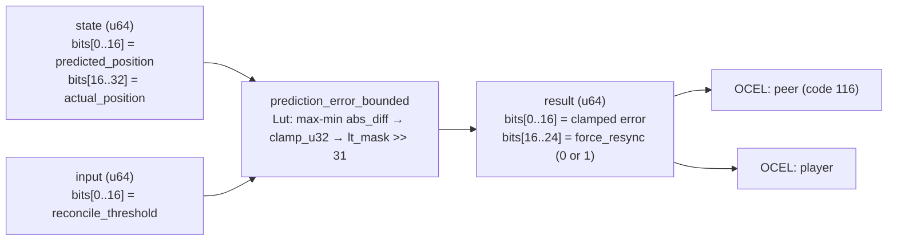

<!-- SCAFFOLDED BY ggen — fill in Context/Forces/Solution/Consequences below, then commit. -->
<!-- Source: ggen/schema/patterns.ttl (prediction_error_bounded). Re-scaffold: `ggen sync`. -->

# Pattern: PredictionErrorBounded

> **Family:** Multiplayer / Network · **Kernel:** `prediction_error_bounded` · **Lowering:** `Lut` · **Id:** 54

Clamp client-side prediction error magnitude to a reconciliation threshold; above it, set a force-resync flag.

---

## Context

Client-side prediction lets a player see their actions applied immediately, before the server confirms them. After each server reconciliation packet, the client computes the absolute error between its predicted position and the server's authoritative position. Small errors (below a threshold) can be smoothed; large errors (above the threshold) require a hard snap to the server position and a full state resync. Without clamping the error magnitude, a corrupted packet or integer overflow could set the resync flag incorrectly or skip it entirely — either snapping the client unnecessarily or allowing desync to persist.

## Forces

- **Branch misprediction** — a naïve `if error > threshold { force_resync = true; clamped = threshold; }` branches every time reconciliation crosses the resync boundary, which happens during lag spikes — exactly when the branch is most unpredictable.
- **Deterministic latency** — the Lut lowering uses branchless `max_u32`/`min_u32` for absolute difference, `clamp_u32` for error bounding, and `lt_mask_u32` for the resync flag, giving O(1) fixed execution.
- **Branchless absolute difference** — `max_u32(pred, actual) - min_u32(pred, actual)` computes |pred - actual| without a conditional sign-flip; neither argument can underflow because `max >= min` is guaranteed by construction.
- **Resync flag as a mask bit** — `(lt_mask_u32(threshold, error) >> 31) as u64` extracts the flag branchlessly: 1 iff `error > threshold`, 0 otherwise, packed into bits[16..24] of the result.
- **OCEL auditability** — event code 116 ties each error measurement to both the `peer` and `player` object traces, enabling per-client prediction accuracy analysis and anticheat verification.

## Solution

**Branchless primitive:** `bcinr_logic::fix::clamp_u32`

State bits[0..16] carry `predicted_position` and bits[16..32] carry `actual_position`; input bits[0..16] carry `reconcile_threshold`. The kernel computes `error = max_u32(pred, actual) - min_u32(pred, actual)` — a branchless unsigned absolute difference — then `clamped_error = clamp_u32(error, 0, threshold)` bounds the reported error. The resync flag is `(lt_mask_u32(threshold, error) >> 31) as u64`: the all-ones mask from `lt_mask_u32` when `threshold < error` is shifted to yield 1. The result packs `clamped_error` in bits[0..16] and `force_resync` in bits[16..24]. The Lut lowering was chosen because the primary invariant is an absolute output range with a flag derived from a threshold comparison — exactly `clamp_u32`'s domain.

## Consequences

**Gains:** Prediction error is provably bounded to [0, threshold]; the resync flag is structurally tied to the same threshold comparison as the clamp, eliminating the risk of flag/value mismatch; both the smoothed error and the flag are available in one result word. **Costs:** Threshold and positions are u16 fields, limiting coordinates to 0..65535; the error is an unsigned magnitude, so the direction of prediction error is not encoded in this kernel. **Compositions:** The bounded delta from `lag_compensation_applied` reduces the prediction error before it reaches this kernel; a force_resync=1 drives the DRIFTED transition in `sync_state_admitted`; bounded tick delta from `tick_delta_bounded` constrains how far state can diverge per frame.

---

## Structure Diagram



---

## Evidence Model

| Field | Value |
|---|---|
| OCEL activity | `PredictionErrorBounded` |
| Event code | `116` |
| OTEL span | `116` |
| Object kinds | `peer`, `player` |
| Required status | `4` |
| Refusal status | `7` |
| Authority | oracle predicate: matches prediction_error_bounded_reference for all inputs |

---

## Metadata

| Field | Value |
|---|---|
| Pattern id | 54 |
| Family | Multiplayer / Network |
| Lowering | `Lut` |
| State cardinality | 8 |
| Primitive | `bcinr_logic::fix::clamp_u32` |
| Kernel signature | `prediction_error_bounded(state: u64, input: u64) -> u64` |
| Source kernel | `src/patterns/prediction_error_bounded.rs` |

---

## How to Use

```rust
use wasm4games::patterns::prediction_error_bounded;

// Pack state and input into u64 fields as documented in the kernel source.
let result = prediction_error_bounded(state, input);
```

The kernel is a pure `fn(u64, u64) -> u64` — no side effects, no allocation, no branches.
Pair with the evidence layer to emit OCEL events, OTEL spans, and receipt folds:

```rust
use wasm4games::evidence::{ocel::OcelEvent, otel};

let result = prediction_error_bounded(state, input);
otel::emit(116);
let ev = OcelEvent::new(116, logical_tick, admission_status);
```

---

## Related Patterns

- [LagCompensationApplied](lag_compensation_applied.md) — lag compensation reduces the prediction error before it reaches this kernel by rewinding the server position.
- [SyncStateAdmitted](sync_state_admitted.md) — a force_resync=1 result drives the DRIFT or DRIFTED state transition in the sync FSM.
- [TickDeltaBounded](tick_delta_bounded.md) — bounded tick delta limits per-frame state divergence, constraining the maximum prediction error that can accumulate.
