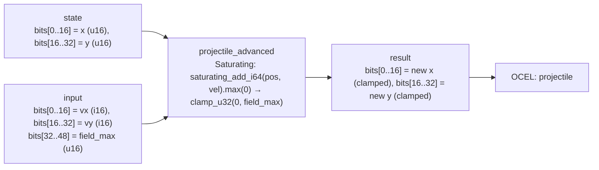

<!-- SCAFFOLDED BY ggen — fill in Context/Forces/Solution/Consequences below, then commit. -->
<!-- Source: ggen/schema/patterns.ttl (projectile_advanced). Re-scaffold: `ggen sync`. -->

# Pattern: ProjectileAdvanced

> **Family:** Physics & Meaning · **Kernel:** `projectile_advanced` · **Lowering:** `Saturating` · **Id:** 12

Integrate a projectile by velocity with saturation, then clamp into the field.

---

## Context

Projectiles — bullets, arrows, spells — must be advanced by their velocity vector on every game tick and kept within the play-field boundary. Without saturating arithmetic, a projectile with a large velocity near the field edge produces an integer overflow that wraps the position to the opposite side of the coordinate space, generating ghost hits against collision geometry that was never physically traversed and corrupting every downstream AABB test for that tick. The standard defensive fix is an if-overflow branch, but at hundreds of projectiles per tick those branches thrash the predictor unpredictably.

## Forces

- **Branch misprediction** — the naïve `if new_x > field_max { field_max } else if new_x < 0 { 0 } else { new_x }` guard fires unpredictably as projectiles approach boundaries at arbitrary angles, adding jitter proportional to projectile count.
- **Deterministic latency** — the Saturating lowering onto `saturating_add_i64` plus `clamp_u32` integrates and bounds both axes in O(1) arithmetic with no data-dependent control flow, giving a constant budget per projectile regardless of position.
- **Signed velocity** — projectile velocity is signed (can move in either direction); the kernel sign-extends the u16 velocity lanes to i16 then i64 before addition, and floors with `.max(0)` before the field clamp, all branchlessly.
- **Position integrity** — a position that overflows the i64 intermediate before saturation would silently corrupt the result; `saturating_add_i64` prevents this by clamping at i64::MAX/MIN, which the subsequent `clamp_u32` then brings back within field bounds.
- **OCEL auditability** — OCEL event code `50` ties each projectile position update to the `projectile` object trace, enabling deterministic replay of hit-detection disputes.

## Solution

The kernel integrates x and y independently using the same saturating pipeline. The packed-u64 ABI places the current position in `state` bits[0..16] (x) and bits[16..32] (y), and the signed velocity in `input` bits[0..16] (vx as i16) and bits[16..32] (vy as i16), with the field maximum in bits[32..48]. For each axis: the u16 velocity lane is reinterpreted as i16 via sign extension, widened to i64, added to the current coordinate with `saturating_add_i64`, floored at 0 with `.max(0)`, cast to u32, and then clamped to `[0, field_max]` with `clamp_u32`. The result packs the two new coordinates into bits[0..16] and bits[16..32]. The Saturating lowering was chosen because every legal projectile position is a finite integer in a bounded field — saturation is the correct semantic for motion that would leave the field.

**Branchless primitive:** `bcinr_logic::int::saturating_add_i64`

## Consequences

**Gains:** Every projectile integration costs the same number of cycles regardless of whether the projectile is near a boundary, moving fast, or slow — no misprediction tax. Overflow in the i64 intermediate is silently saturated rather than silently wrapping, eliminating the ghost-hit class of bug. OCEL event `50` makes every projectile step auditable. **Costs:** Both axes share a single `field_max` value; asymmetric field boundaries (different x/y limits) cannot be expressed in the current ABI. Position coordinates are limited to 16 bits (0..65535) per axis. **Compositions:** The output position feeds directly into [AabbCollisionResolved](aabb_collision_resolved.md) for hit detection, and a collision there triggers [DamageApplied](damage_applied.md).

---

## Structure Diagram



---

## Evidence Model

| Field | Value |
|---|---|
| OCEL activity | `ProjectileAdvanced` |
| Event code | `50` |
| OTEL span | `50` |
| Object kinds | `projectile` |
| Required status | `4` |
| Refusal status | `7` |
| Authority | oracle predicate: matches projectile_advanced_reference for all inputs |

---

## Metadata

| Field | Value |
|---|---|
| Pattern id | 12 |
| Family | Physics & Meaning |
| Lowering | `Saturating` |
| State cardinality | 32 |
| Primitive | `bcinr_logic::int::saturating_add_i64` |
| Kernel signature | `projectile_advanced(state: u64, input: u64) -> u64` |
| Source kernel | `src/patterns/projectile_advanced.rs` |

---

## How to Use

```rust
use wasm4games::patterns::projectile_advanced;

// Pack state and input into u64 fields as documented in the kernel source.
let result = projectile_advanced(state, input);
```

The kernel is a pure `fn(u64, u64) -> u64` — no side effects, no allocation, no branches.
Pair with the evidence layer to emit OCEL events, OTEL spans, and receipt folds:

```rust
use wasm4games::evidence::{ocel::OcelEvent, otel};

let result = projectile_advanced(state, input);
otel::emit(50);
let ev = OcelEvent::new(50, logical_tick, admission_status);
```

---

## Related Patterns

- [AabbCollisionResolved](aabb_collision_resolved.md) — the advanced projectile position enters the AABB hit test on the same tick
- [DamageApplied](damage_applied.md) — a positive AABB result from a projectile collision triggers damage application
