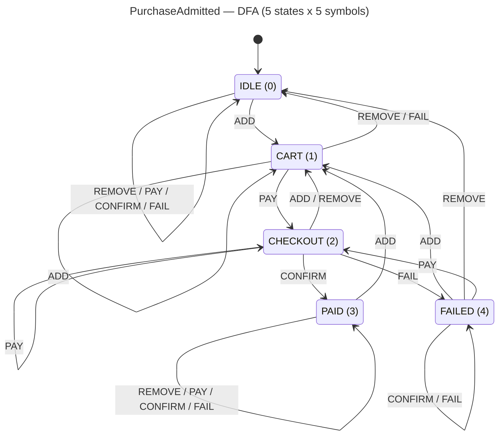

<!-- SCAFFOLDED BY ggen — fill in Context/Forces/Solution/Consequences below, then commit. -->
<!-- Source: ggen/schema/patterns.ttl (purchase_admitted). Re-scaffold: `ggen sync`. -->

# Pattern: PurchaseAdmitted

> **Family:** Economy / Progression · **Kernel:** `purchase_admitted` · **Lowering:** `Dfa` · **Id:** 34

Advance a purchase flow FSM one transition over a flat 5x5 transition table.

---

## Context

In-app purchase flows require a multi-step validation sequence: a player adds items to a cart, initiates checkout, and the purchase is either confirmed by the payment backend or rejected. Without a formal FSM, this flow is managed with nested if-else or match on a mutable state enum — code that is difficult to audit, prone to state-corruption under concurrent UI events, and branchy. The five states (IDLE, CART, CHECKOUT, PAID, FAILED) and five symbols (ADD, REMOVE, PAY, CONFIRM, FAIL) define exactly 25 legal transitions; a flat table encodes all of them, and `dfa_advance` selects the next state in O(1) with no branch.

## Forces

- **Branch misprediction** — a `match (state, event)` over 25 combinations adds many conditional branches and mispredictions per purchase event.
- **Deterministic latency** — the Dfa lowering resolves the transition in O(1) via a flat `TABLE[state * 5 + symbol]` array index, with no branch.
- **State-corruption risk** — without a formal table, concurrent UI events (e.g., tapping "confirm" while "pay" is in-flight) can reach illegal state combinations; the DFA table makes every state/symbol pair explicitly defined.
- **Out-of-domain robustness** — invalid symbols (e.g., from a buggy UI layer) must not index outside the table; OOB symbols are masked to ADD (0) branchlessly, holding the default transition.
- **Absorbing terminal states** — PAID and FAILED must be trapping states that absorb all subsequent events to prevent re-triggering a completed or failed purchase.
- **OCEL auditability** — OCEL event code 96 ties every purchase state transition to an auditable `player`/`item` object trace, supporting refund and dispute workflows.

## Solution

The kernel packs state as bits[0..8] = current FSM state (0..4, clamped to `[0, FAILED]`) and input as bits[0..8] = event symbol (0..4). The 5×5 transition table encodes all legal transitions as a flat array of 25 `usize` entries, indexed as `TABLE[state * 5 + symbol]`. Out-of-alphabet symbols are masked to ADD (0) branchlessly via `sym_raw & 0.wrapping_sub(in_alphabet)`, which zeroes the symbol when `sym_raw >= 5` without a conditional. `dfa_advance` performs the table lookup. PAID (state 3) and FAILED (state 4) are absorbing: every symbol loops back to the same state, making double-confirmation or double-failure structurally impossible. The `Dfa` lowering is correct because the purchase flow is inherently a finite-state machine where all legal behavior is captured by explicit enumeration.

## Consequences

**Gains:** all 25 state/symbol combinations are encoded explicitly and auditably in one flat array; OOB event symbols cannot corrupt state; PAID and FAILED are structurally absorbing; OCEL event 96 provides a per-purchase transition audit trail. **Costs:** extending the FSM (e.g., adding a REFUND state) requires widening both the state and symbol vocabularies and regenerating the table. **Compositions:** this pattern is preceded by [LevelGateEvaluated](level_gate_evaluated.md) — a level gate guards entry to the purchase flow — and triggers [CurrencyDeltaApplied](currency_delta_applied.md) when the CONFIRM symbol drives CHECKOUT to PAID.

---

## Structure Diagram



---

## Evidence Model

| Field | Value |
|---|---|
| OCEL activity | `PurchaseAdmitted` |
| Event code | `96` |
| OTEL span | `96` |
| Object kinds | `player`, `item` |
| Required status | `4` |
| Refusal status | `7` |
| Authority | oracle predicate: matches purchase_admitted_reference for all inputs |

---

## Metadata

| Field | Value |
|---|---|
| Pattern id | 34 |
| Family | Economy / Progression |
| Lowering | `Dfa` |
| State cardinality | 4 |
| Primitive | `bcinr_logic::dfa::dfa_advance` |
| Kernel signature | `purchase_admitted(state: u64, input: u64) -> u64` |
| Source kernel | `src/patterns/purchase_admitted.rs` |

---

## How to Use

```rust
use wasm4games::patterns::purchase_admitted;

// Pack state and input into u64 fields as documented in the kernel source.
let result = purchase_admitted(state, input);
```

The kernel is a pure `fn(u64, u64) -> u64` — no side effects, no allocation, no branches.
Pair with the evidence layer to emit OCEL events, OTEL spans, and receipt folds:

```rust
use wasm4games::evidence::{ocel::OcelEvent, otel};

let result = purchase_admitted(state, input);
otel::emit(96);
let ev = OcelEvent::new(96, logical_tick, admission_status);
```

---

## Related Patterns

- [LevelGateEvaluated](level_gate_evaluated.md) — the level gate precedes purchase; only ADMITTED players enter the purchase FSM.
- [CurrencyDeltaApplied](currency_delta_applied.md) — a CONFIRM event driving CHECKOUT to PAID triggers the downstream currency spend.
- [RewardTierSelected](reward_tier_selected.md) — purchases can affect reward tier by triggering prestige flag updates.
