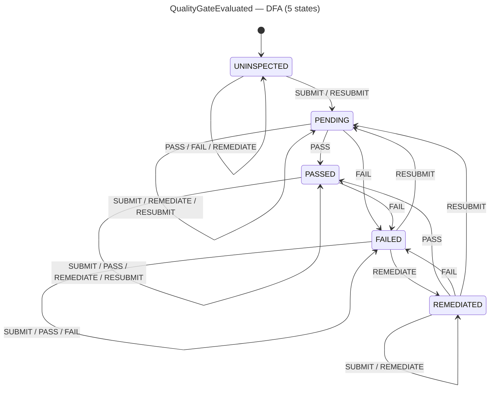

<!-- SCAFFOLDED BY ggen — fill in Context/Forces/Solution/Consequences below, then commit. -->
<!-- Source: ggen/schema/patterns.ttl (quality_gate_evaluated). Re-scaffold: `ggen sync`. -->

# Pattern: QualityGateEvaluated

> **Family:** DfLSS / Quality · **Kernel:** `quality_gate_evaluated` · **Lowering:** `Dfa` · **Id:** 60

Advance a quality gate FSM (UNINSPECTED/PENDING/PASSED/FAILED/REMEDIATED) via a flat DFA transition table.

---

## Context

Continuous delivery pipelines for live game services run quality gates that approve or block each build or session configuration from reaching players. These gates progress through a well-defined lifecycle: a new configuration starts UNINSPECTED, moves to PENDING when submitted for review, transitions to PASSED or FAILED based on CTQ and sigma evidence, and can move to REMEDIATED after a failed inspection is addressed. Implementing this lifecycle with a switch-on-state structure means every quality check event branches on the current state, causing branch mispredictions at exactly the moments when the gate is under load (high-volume quality events during a release window).

## Forces

- **Branch misprediction** — switch-on-state dispatches to different code paths per state, mispredicting at every quality check event when the state is in flux.
- **Deterministic latency** — the Dfa lowering via `dfa_advance` gives O(1) constant time: one table index read per transition, independent of which state or symbol is active.
- **Five-state lifecycle** — UNINSPECTED, PENDING, PASSED, FAILED, and REMEDIATED must all be reachable and their transitions must be total (every (state, symbol) pair must map somewhere defined).
- **Idempotent self-loops** — PASSED receiving another PASS event must stay PASSED; FAILED receiving a FAIL must stay FAILED. These self-loops must not branch.
- **OCEL auditability** — OCEL event code 122 ties each gate transition to a `quality_metric` object trace for audit and compliance.

## Solution

The kernel packs `state` bits[0..8] as the current gate state (0..=4, reduced mod 5 for out-of-range inputs) and `input` bits[0..8] as the transition symbol (0..=4, reduced mod 5). The flat 5×5 transition table encodes all 25 (state, symbol) pairs: rows are UNINSPECTED=0, PENDING=1, PASSED=2, FAILED=3, REMEDIATED=4; columns are SUBMIT=0, PASS=1, FAIL=2, REMEDIATE=3, RESUBMIT=4. `dfa_advance(st, sym, &TABLE, ALPHABET)` performs a single branchless array index read. The result (bits[0..8]) is the next gate state. This is the Dfa lowering: the entire state machine is a lookup into a flat constant-time table with no conditional logic.

**Branchless primitive:** `bcinr_logic::dfa::dfa_advance`

## Consequences

**Gains:** All 25 transitions execute at identical latency. Self-loops (PASSED + PASS -> PASSED) are free. Adding a sixth state requires only extending the table — no new branches in the kernel. The gate state is a plain u8, trivially loggable and serializable for OCEL audit.

**Costs:** The bit-field ABI is fixed. The table is a compile-time constant, so runtime-configurable quality policies cannot be expressed without a kernel variant. Out-of-range state or symbol values are silently reduced modulo 5; callers must validate inputs if they need strict rejection of invalid states.

**Compositions:** CTQ violation verdicts from `ctq_threshold_evaluated` drive FAIL symbols into this gate. Sigma level from `sigma_level_computed` determines whether a PASS or FAIL symbol is emitted. Defect rate from `defect_rate_quantized` provides the underlying evidence for the inspection event.

---

## Structure Diagram



---

## Evidence Model

| Field | Value |
|---|---|
| OCEL activity | `QualityGateEvaluated` |
| Event code | `122` |
| OTEL span | `122` |
| Object kinds | `quality_metric` |
| Required status | `4` |
| Refusal status | `7` |
| Authority | oracle predicate: matches quality_gate_evaluated_reference for all inputs |

---

## Metadata

| Field | Value |
|---|---|
| Pattern id | 60 |
| Family | DfLSS / Quality |
| Lowering | `Dfa` |
| State cardinality | 4 |
| Primitive | `bcinr_logic::dfa::dfa_advance` |
| Kernel signature | `quality_gate_evaluated(state: u64, input: u64) -> u64` |
| Source kernel | `src/patterns/quality_gate_evaluated.rs` |

---

## How to Use

```rust
use wasm4games::patterns::quality_gate_evaluated;

// Pack state and input into u64 fields as documented in the kernel source.
let result = quality_gate_evaluated(state, input);
```

The kernel is a pure `fn(u64, u64) -> u64` — no side effects, no allocation, no branches.
Pair with the evidence layer to emit OCEL events, OTEL spans, and receipt folds:

```rust
use wasm4games::evidence::{ocel::OcelEvent, otel};

let result = quality_gate_evaluated(state, input);
otel::emit(122);
let ev = OcelEvent::new(122, logical_tick, admission_status);
```

---

## Related Patterns

- [CtqThresholdEvaluated](ctq_threshold_evaluated.md) — CTQ verdict drives FAIL symbol into this gate's transition.
- [SigmaLevelComputed](sigma_level_computed.md) — sigma level determines whether PASS or FAIL symbol is submitted.
- [DefectRateQuantized](defect_rate_quantized.md) — defect rate provides the inspection evidence that triggers SUBMIT events.
