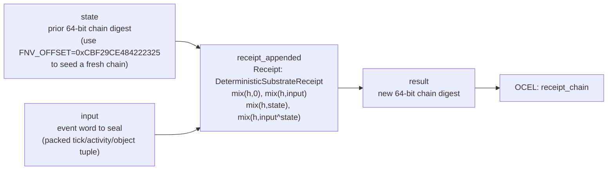

<!-- SCAFFOLDED BY ggen — fill in Context/Forces/Solution/Consequences below, then commit. -->
<!-- Source: ggen/schema/patterns.ttl (receipt_appended). Re-scaffold: `ggen sync`. -->

# Pattern: ReceiptAppended

> **Family:** Evidence & Replay · **Kernel:** `receipt_appended` · **Lowering:** `Receipt` · **Id:** 9

Append one transition to a rolling receipt chain via FNV-1a folding.

---

## Context

Every significant transition in a game — an entity dying, an item consumed, a quest step advanced — needs to be sealed into a tamper-evident record so that post-session audits, anti-cheat systems, and replay verifiers can confirm the event stream was not modified after the fact. A simple append-only log addresses replay but not in-place tampering. A Merkle tree provides tamper evidence but requires allocation and pointer chasing. This pattern provides a zero-allocation, O(1) rolling hash that seals each event word into a 64-bit chain digest by folding the prior digest, the event word, the current state, and their XOR through four FNV-1a multiply-mix steps, producing a new digest that is sensitive to both the event value and its position in the chain.

## Forces

- **Branch misprediction:** A conditional hash update that dispatches on event type (e.g., `match event_kind { ... }`) branches on the event structure and mispredicts whenever the event sequence is irregular — exactly the case in combat-heavy sessions where event types vary rapidly per frame.
- **Deterministic latency:** The Receipt lowering executes a fixed sequence of four FNV-1a mix operations — `mix(h, 0)` (steps seed), `mix(h, input)`, `mix(h, state)`, `mix(h, input ^ state)` — with no conditional logic, giving O(1) time for all event and state values.
- **Tamper evidence:** A simple CRC or additive hash is insensitive to event reordering — swapping two events produces the same hash. FNV-1a's ordered multiply-XOR mixing makes the digest order-sensitive: `receipt_appended(d, A)` then `receipt_appended(r, B)` produces a different result from the reverse order, so any replay that reorders events is detectable.
- **Allocation freedom:** The chain state is a single 64-bit word (the running digest); no heap allocation, no hash-map, no linked list. The `FNV_OFFSET` constant seeds a fresh chain from a well-known value without setup.
- **OCEL auditability:** Event code `32` ties each receipt append to the `receipt_chain` object in the OCEL trace, so the audit log itself records the chain-level integrity operation alongside the game-world events it seals.

## Solution

The kernel holds the prior chain digest in `state` (initialized to `DeterministicSubstrateReceipt::FNV_OFFSET` to start a fresh chain) and the event word to seal in `input`. It constructs a `DeterministicSubstrateReceipt` at `current_hash = state, steps = 0` and calls `r.record(input, state, input ^ state)`, which executes four mix steps: `mix(h, 0)` (the steps field), `mix(h, input)` (the event word / tag), `mix(h, state)` (the prior digest / state field), `mix(h, input ^ state)` (the XOR auxiliary term). The result of `r.finalize()` is the new 64-bit chain digest. The XOR auxiliary term `input ^ state` ensures that two different (event, digest) pairs with the same XOR still differ in the individual mix steps, increasing sensitivity. The Receipt lowering was the right choice because this is precisely the ordered-folding-with-tamper-evidence use case that `DeterministicSubstrateReceipt` was designed for.

**Branchless primitive:** `bcinr_logic::patterns::integrity_receipt::DeterministicSubstrateReceipt`

## Consequences

**Gains:** Each event is sealed into the chain in O(1) time with zero allocation and no branch. The chain is order-sensitive — a different event sequence or a different order produces a different digest. The `input ^ state` auxiliary term provides additional avalanche: changing any single bit of either input or state changes the final digest. The `FNV_OFFSET` seed makes a fresh chain immediately distinguishable from an empty-state chain.

**Costs:** The chain digest is 64 bits — suitable for practical anti-cheat and replay integrity but not cryptographically secure against a determined adversary. Each call seals exactly one event word; multi-field events must be packed into the 64-bit `input` word before calling. The chain cannot be verified incrementally (i.e., there is no per-event proof of inclusion) — only the full chain can be re-derived from the event log. A corrupted prior digest (wrong `state`) produces a wrong result with no error signal.

**Composes naturally with:** `replay_frame_recorded` (replay frames are a specialized receipt fold using the same substrate; `receipt_appended` is the general case that `replay_frame_recorded` specializes), `ocel_event_linked` (admitted OCEL link bitmasks can be packed and sealed into the receipt chain to produce a joint game-world + audit-trail digest), `noise_value_sampled` (noise sampling uses the same Receipt substrate for deterministic seeded generation).

---

## Structure Diagram



---

## Evidence Model

| Field | Value |
|---|---|
| OCEL activity | `ReceiptAppended` |
| Event code | `32` |
| OTEL span | `3` |
| Object kinds | `receipt_chain` |
| Required status | `4` |
| Refusal status | `7` |
| Authority | oracle predicate: matches receipt_appended_reference for all inputs |

---

## Metadata

| Field | Value |
|---|---|
| Pattern id | 9 |
| Family | Evidence & Replay |
| Lowering | `Receipt` |
| State cardinality | 64 |
| Primitive | `bcinr_logic::patterns::integrity_receipt::DeterministicSubstrateReceipt` |
| Kernel signature | `receipt_appended(state: u64, input: u64) -> u64` |
| Source kernel | `src/patterns/receipt_appended.rs` |

---

## How to Use

```rust
use wasm4games::patterns::receipt_appended;

// Pack state and input into u64 fields as documented in the kernel source.
let result = receipt_appended(state, input);
```

The kernel is a pure `fn(u64, u64) -> u64` — no side effects, no allocation, no branches.
Pair with the evidence layer to emit OCEL events, OTEL spans, and receipt folds:

```rust
use wasm4games::evidence::{ocel::OcelEvent, otel};

let result = receipt_appended(state, input);
otel::emit(3);
let ev = OcelEvent::new(32, logical_tick, admission_status);
```

---

## Related Patterns

- [ReplayFrameRecorded](replay_frame_recorded.md) — replay frame recording is a specialization of receipt folding that seeds at the tick count and mixes four game-frame fields; `receipt_appended` is the general single-event fold that `replay_frame_recorded` builds upon.
- [OcelEventLinked](ocel_event_linked.md) — admitted OCEL link bitmasks from `ocel_event_linked` can be packed as the event word and sealed into the receipt chain, tying the link audit trail to the rolling tamper-evident digest.
- [NoiseValueSampled](noise_value_sampled.md) — the noise sampling kernel uses the same `DeterministicSubstrateReceipt` substrate for seeded hash-based generation; both kernels share the FNV-1a mix primitive and the `FNV_OFFSET` seed constant.
