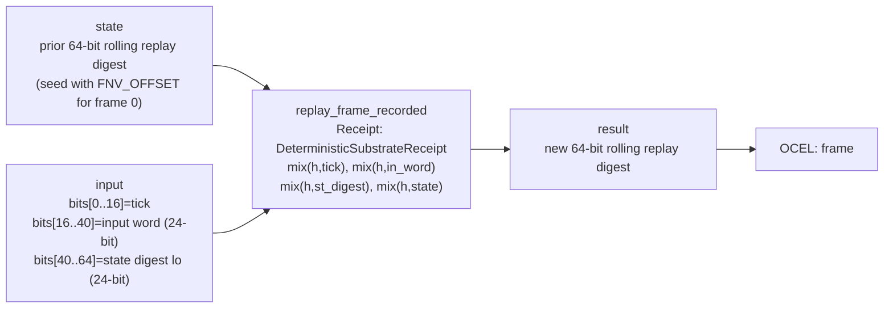

<!-- SCAFFOLDED BY ggen — fill in Context/Forces/Solution/Consequences below, then commit. -->
<!-- Source: ggen/schema/patterns.ttl (replay_frame_recorded). Re-scaffold: `ggen sync`. -->

# Pattern: ReplayFrameRecorded

> **Family:** Evidence & Replay · **Kernel:** `replay_frame_recorded` · **Lowering:** `Receipt` · **Id:** 8

Fold (prior digest, tick, input, state) into a deterministic replay digest.

---

## Context

Deterministic replay requires that every frame of a simulation can be reproduced exactly from its recorded inputs, and that any tampering with the recorded data can be detected. The standard approach — recording (tick, input, state) tuples to a file or ring buffer — is allocation-heavy and does not prevent silent in-place modification of recorded frames. Without a rolling hash that mixes all four frame fields (prior digest, tick, input word, state digest), an adversary can modify a frame's input while leaving the replay stream structurally valid. Even for non-adversarial use, a bug that causes a single field to be omitted from the hash (e.g., forgetting to mix the tick) makes the digest insensitive to that field's value, so two different frame sequences can produce the same digest. This pattern folds all four frame fields through `DeterministicSubstrateReceipt` in a fixed order — seeded at the tick count — to produce a 64-bit rolling digest that is sensitive to every field.

## Forces

- **Branch misprediction:** A conditional hash update that checks each field for zero or for sentinel values before mixing branches once per field per frame; at 60 Hz with 200 entities, those branches add jitter to every frame's recording pass.
- **Deterministic latency:** The Receipt lowering uses a fixed sequence of four FNV-1a `mix(h, x) = (h ^ x).wrapping_mul(PRIME)` operations with no conditional logic — all frames hash in identical time regardless of field values.
- **Tamper evidence:** A simple XOR or CRC hash is vulnerable to deliberate collision construction; FNV-1a's multiply-based mixing makes it computationally expensive to find two different frame streams with the same rolling digest, providing practical tamper evidence without allocation or cryptographic overhead.
- **Field completeness:** Every field — prior digest, tick, input word, and state digest — must participate in the mix; omitting any field makes the digest blind to changes in that field. The proptest weakening test (which drops the `in_word` mix step) explicitly verifies that omitting a field causes the digest to diverge from the oracle.
- **OCEL auditability:** Event code `35` ties every frame recording to the `frame` object in the OCEL trace, so the audit trail records the per-frame digest alongside the game-world events, enabling cross-system verification.

## Solution

The kernel accepts the prior rolling digest in `state` and a packed frame descriptor in `input`: bits[0..16] = tick, bits[16..40] = input word, bits[40..64] = state digest low bits. It constructs a `DeterministicSubstrateReceipt` seeded at `current_hash = state, steps = tick` and calls `r.record(in_word, st_digest, state)` which executes four ordered FNV-1a mix steps: `mix(h, tick)`, `mix(h, in_word)`, `mix(h, st_digest)`, `mix(h, state)`. The result of `r.finalize()` is the new rolling digest. The Receipt lowering was the right choice because the problem is ordered multi-field folding with tamper evidence requirements — exactly the capability `DeterministicSubstrateReceipt` was designed for, providing a standardized FNV-1a chain that the rest of the kernel family also uses for `receipt_appended`.

**Branchless primitive:** `bcinr_logic::patterns::integrity_receipt::DeterministicSubstrateReceipt`

## Consequences

**Gains:** Every frame's digest is computed in O(1) time with no allocation, no branch, and no external state beyond the 64-bit running hash. Identical frame streams always produce identical digests (verified by proptest equivalence). The four-field mix is sensitive to changes in any field — a one-bit flip in the tick, input word, or state digest produces a different rolling digest. The `FNV_OFFSET` seed (`0xCBF2_9CE4_8422_2325`) bootstraps a fresh chain from a well-known initial value.

**Costs:** The digest is 64 bits — sufficient for practical tamper evidence but not cryptographically secure against a motivated adversary with compute resources. The tick field is limited to 16 bits (`[0, 65 535]` ticks), which constrains session length at typical 60 Hz to about 18 minutes before tick wrap; callers must epoch-manage longer sessions. The input word is 24 bits and the state digest lo is 24 bits — wider game state must be summarized before packing.

**Composes naturally with:** `receipt_appended` (replay frames are a specialized receipt fold — both use `DeterministicSubstrateReceipt`; frame recording seeds the chain at the tick count while receipt appending seeds at 0), `ocel_event_linked` (replay frames correspond to OCEL events; the frame digest can be folded into the OCEL link receipt for cross-system verification), `input_admitted` (only admitted inputs are recorded in the frame hash — refused or blocked bytes are excluded from the digest).

---

## Structure Diagram



---

## Evidence Model

| Field | Value |
|---|---|
| OCEL activity | `ReplayFrameRecorded` |
| Event code | `35` |
| OTEL span | `35` |
| Object kinds | `frame` |
| Required status | `4` |
| Refusal status | `7` |
| Authority | oracle predicate: matches replay_frame_recorded_reference for all inputs |

---

## Metadata

| Field | Value |
|---|---|
| Pattern id | 8 |
| Family | Evidence & Replay |
| Lowering | `Receipt` |
| State cardinality | 64 |
| Primitive | `bcinr_logic::patterns::integrity_receipt::DeterministicSubstrateReceipt` |
| Kernel signature | `replay_frame_recorded(state: u64, input: u64) -> u64` |
| Source kernel | `src/patterns/replay_frame_recorded.rs` |

---

## How to Use

```rust
use wasm4games::patterns::replay_frame_recorded;

// Pack state and input into u64 fields as documented in the kernel source.
let result = replay_frame_recorded(state, input);
```

The kernel is a pure `fn(u64, u64) -> u64` — no side effects, no allocation, no branches.
Pair with the evidence layer to emit OCEL events, OTEL spans, and receipt folds:

```rust
use wasm4games::evidence::{ocel::OcelEvent, otel};

let result = replay_frame_recorded(state, input);
otel::emit(35);
let ev = OcelEvent::new(35, logical_tick, admission_status);
```

---

## Related Patterns

- [ReceiptAppended](receipt_appended.md) — replay frames use the same `DeterministicSubstrateReceipt` substrate as receipt appending; `replay_frame_recorded` is a specialized four-field fold (seeded at tick) while `receipt_appended` is a general two-field fold (seeded at 0).
- [OcelEventLinked](ocel_event_linked.md) — replay frame digests correspond to OCEL events in the same session trace; the frame digest can be cross-referenced against the OCEL link audit trail for session-level integrity verification.
- [InputAdmitted](input_admitted.md) — only admitted inputs (those passing the `input_admitted` gate) are packed into the frame's input word; refused bytes are excluded from the rolling digest.
