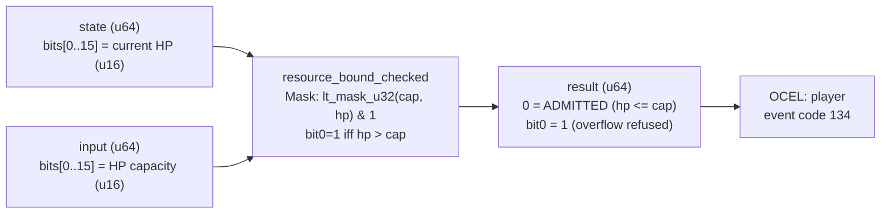

<!-- SCAFFOLDED BY ggen — fill in Context/Forces/Solution/Consequences below, then commit. -->
<!-- Source: ggen/schema/patterns.ttl (resource_bound_checked). Re-scaffold: `ggen sync`. -->

# Pattern: ResourceBoundChecked

> **Family:** Anti-Cheat · **Kernel:** `resource_bound_checked` · **Lowering:** `Mask` · **Id:** 72

Verdict bit0 set iff hp strictly exceeds hp_cap (resource-overflow cheat); hp at or under the cap is admitted.

---

## Context

Resource-overflow cheats inject HP, mana, stamina, or currency values that exceed the server-authoritative capacity for the player's current level and class. The anti-cheat gate checks `hp > hp_cap` and refuses any reported value above the cap. A naïve conditional branch on this comparison leaks timing information: an adversary can measure the branch timing to probe the cap value and confirm when an injected value just barely exceeds it, calibrating the cheat without triggering visible rejection. Branchless comparison closes this timing side channel while preserving the legality invariant that resources at or below the cap are always admitted.

## Forces

- **Branch misprediction** — a conditional `if hp > hp_cap` branches on the cheat condition, exposing timing variation that cheaters can exploit to probe the cap value.
- **Deterministic latency** — the Mask lowering via `lt_mask_u32` gives O(1) constant time; the verdict is computed as a pure mask operation with no conditional branching.
- **Side-channel resistance** — legal and illegal HP values must produce execution paths of identical duration; `lt_mask_u32(cap, hp)` achieves this by comparing without branching.
- **Boundary inclusivity** — HP exactly equal to hp_cap must be admitted (the player can be at full health); only strict overflow (hp > cap) is refused.
- **OCEL auditability** — OCEL event code 134 ties each resource check to a `player` object trace for anti-cheat audit logs.

## Solution

The kernel packs `state` bits[0..15] as the current HP (u16) and `input` bits[0..15] as the HP capacity (u16). `lt_mask_u32(cap, hp)` produces all-ones when `cap < hp` (HP overflow detected), all-zeros otherwise. The result is `u64::from(lt_mask_u32(cap, hp)) & 1`: verdict bit0 is 1 on refusal (overflow), 0 on admission. This is the Mask lowering: the overflow predicate `hp > cap` is resolved by a single `lt_mask_u32(cap, hp)` call with no branching — the argument order reversal (`cap < hp` rather than `hp > cap`) is the standard Mask idiom for greater-than comparisons.

**Branchless primitive:** `bcinr_logic::mask::lt_mask_u32`

## Consequences

**Gains:** Execution time is identical for legal and illegal HP values, closing the timing side channel. HP exactly equal to hp_cap is admitted (boundary-inclusive invariant verified by Hoare-logic). The verdict is a single bit composable with other anti-cheat verdict bits via OR to build a full per-tick refusal mask.

**Costs:** The bit-field ABI is fixed — HP in state bits[0..15], cap in input bits[0..15]. Resource values are limited to 16 bits (0..=65535); games with larger resource pools require a kernel variant with 32-bit resources.

**Compositions:** Verdict bit composes with `movement_legality_checked`, `cooldown_legality_checked`, and `action_rate_bounded` via OR to form the complete per-tick anti-cheat verdict. Resource bounds and cooldown legality are complementary gates that together cover both stat-injection and timing cheats.

---

## Structure Diagram



---

## Evidence Model

| Field | Value |
|---|---|
| OCEL activity | `ResourceBoundChecked` |
| Event code | `134` |
| OTEL span | `134` |
| Object kinds | `player` |
| Required status | `4` |
| Refusal status | `7` |
| Authority | legality spec: hp <= hp_cap |

---

## Metadata

| Field | Value |
|---|---|
| Pattern id | 72 |
| Family | Anti-Cheat |
| Lowering | `Mask` |
| State cardinality | 2 |
| Primitive | `bcinr_logic::mask::lt_mask_u32` |
| Kernel signature | `resource_bound_checked(state: u64, input: u64) -> u64` |
| Source kernel | `src/patterns/resource_bound_checked.rs` |

---

## How to Use

```rust
use wasm4games::patterns::resource_bound_checked;

// Pack state and input into u64 fields as documented in the kernel source.
let result = resource_bound_checked(state, input);
```

The kernel is a pure `fn(u64, u64) -> u64` — no side effects, no allocation, no branches.
Pair with the evidence layer to emit OCEL events, OTEL spans, and receipt folds:

```rust
use wasm4games::evidence::{ocel::OcelEvent, otel};

let result = resource_bound_checked(state, input);
otel::emit(134);
let ev = OcelEvent::new(134, logical_tick, admission_status);
```

---

## Related Patterns

- [MovementLegalityChecked](movement_legality_checked.md) — same anti-cheat Mask verdict idiom; movement and resource checks compose via OR.
- [CooldownLegalityChecked](cooldown_legality_checked.md) — resource bound and cooldown are complementary admission gates for stat vs. timing cheats.
- [ActionRateBounded](action_rate_bounded.md) — all four anti-cheat gates compose into the complete per-tick verdict bitmask.
