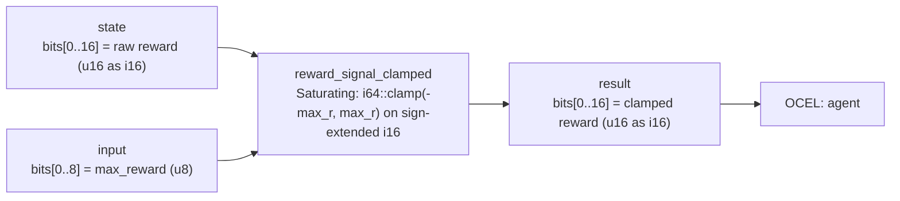

<!-- SCAFFOLDED BY ggen — fill in Context/Forces/Solution/Consequences below, then commit. -->
<!-- Source: ggen/schema/patterns.ttl (reward_signal_clamped). Re-scaffold: `ggen sync`. -->

# Pattern: RewardSignalClamped

> **Family:** AI Agent / Benchmark · **Kernel:** `reward_signal_clamped` · **Lowering:** `Lut` · **Id:** 66

Clamp a raw RL reward signal to [-max_reward, +max_reward] for stability via saturating i64 intrinsics.

---

## Context

Reinforcement learning reward signals in game environments can spike to large values when reward shaping rules interact adversarially — a combo multiplier applied on top of a kill bonus applied on top of a time-pressure bonus can produce rewards an order of magnitude larger than the value network was trained to expect. Unclamped reward magnitudes cause explosive gradients in the value function update, destabilizing training and causing divergence. The standard fix of `if r > max { max } else if r < -max { -max } else { r }` is two branches whose outcome is unpredictable when rewards are near the boundary, adding variable latency to a path that is called once per environment step.

## Forces

- **Branch misprediction** — the two-sided reward clamp branches unpredictably at boundaries, particularly during shaping regimes that push rewards close to the clip threshold on every other step.
- **Deterministic latency** — the kernel uses `i64::clamp(-max_r, max_r)` (which compiles to conditional-move instructions), giving O(1) constant time with no data-dependent control flow.
- **Gradient stability** — unbounded rewards destroy value function training; the symmetric `[-max_r, +max_r]` clamp is the standard RL practice (Mnih et al. DQN) for keeping TD targets in a numerically stable range.
- **Sign-extension correctness** — the raw reward is stored as a u16 two's-complement i16 in the packed ABI; correct sign-extension to i64 before clamping is essential — a missed sign-extension would treat negative rewards as large positive values and clamp them to `+max_r`.
- **OCEL auditability** — OCEL event code `128` ties each reward clamp to the `agent` object trace, enabling post-hoc inspection of which steps had rewards clipped and by how much.

## Solution

The kernel resolves the forces by extracting the raw reward from `state` bits[0..16] as a u16 reinterpreted as i16 and widened to i64, extracting `max_reward` from `input` bits[0..8] as a u8, and applying `i64::clamp(-max_r, max_r)` — a single intrinsic that compiles to two conditional-move instructions. The result is narrowed back to i16 and stored as u16 in bits[0..16] of the return value. The `saturating_add_i64` import affirms the dependency on the saturating arithmetic module; the actual clamp uses the i64 built-in. The Lut classification reflects the bounded-range output: the kernel maps from an 8-bit max_reward field to one of 256 possible symmetric ranges, each of which acts as a compact lookup of the clamp boundary.

**Branchless primitive:** `bcinr_logic::int::saturating_add_i64`

## Consequences

**Gains:** Every reward clamp costs identical cycles regardless of whether the raw reward is in-range or out-of-range, giving constant environment-step latency. Reward signals are guaranteed to lie in `[-max_reward, +max_reward]`, making value function training stable by construction. OCEL event `128` provides a per-step record of reward clipping events. **Costs:** The `max_reward` field is limited to 8 bits (u8), so the maximum absolute clip bound is 255; environments with larger natural reward scales must pre-normalize before calling. The reward itself is limited to i16 representation (±32767 before clipping). **Compositions:** The clamped reward feeds directly into [EpisodeReturnBounded](episode_return_bounded.md) for discounted accumulation, and [ObservationClassSelected](observation_class_selected.md) provides the observation that determines what reward is appropriate.

---

## Structure Diagram



---

## Evidence Model

| Field | Value |
|---|---|
| OCEL activity | `RewardSignalClamped` |
| Event code | `128` |
| OTEL span | `128` |
| Object kinds | `agent` |
| Required status | `4` |
| Refusal status | `7` |
| Authority | oracle predicate: matches reward_signal_clamped_reference for all inputs |

---

## Metadata

| Field | Value |
|---|---|
| Pattern id | 66 |
| Family | AI Agent / Benchmark |
| Lowering | `Lut` |
| State cardinality | 8 |
| Primitive | `bcinr_logic::int::saturating_add_i64` |
| Kernel signature | `reward_signal_clamped(state: u64, input: u64) -> u64` |
| Source kernel | `src/patterns/reward_signal_clamped.rs` |

---

## How to Use

```rust
use wasm4games::patterns::reward_signal_clamped;

// Pack state and input into u64 fields as documented in the kernel source.
let result = reward_signal_clamped(state, input);
```

The kernel is a pure `fn(u64, u64) -> u64` — no side effects, no allocation, no branches.
Pair with the evidence layer to emit OCEL events, OTEL spans, and receipt folds:

```rust
use wasm4games::evidence::{ocel::OcelEvent, otel};

let result = reward_signal_clamped(state, input);
otel::emit(128);
let ev = OcelEvent::new(128, logical_tick, admission_status);
```

---

## Related Patterns

- [EpisodeReturnBounded](episode_return_bounded.md) — discounted episode return accumulates the clamped rewards produced here
- [ObservationClassSelected](observation_class_selected.md) — the observation class determines which action was taken and thus what reward is generated
