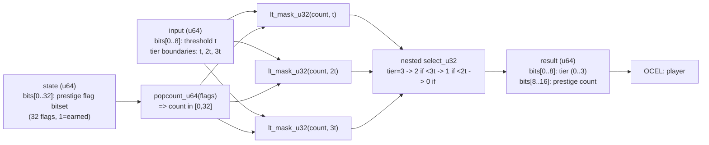

<!-- SCAFFOLDED BY ggen — fill in Context/Forces/Solution/Consequences below, then commit. -->
<!-- Source: ggen/schema/patterns.ttl (reward_tier_selected). Re-scaffold: `ggen sync`. -->

# Pattern: RewardTierSelected

> **Family:** Economy / Progression · **Kernel:** `reward_tier_selected` · **Lowering:** `Bitset` · **Id:** 35

Select a reward tier (0..3) by counting prestige flags set in a bitset, then bucketing the count against three thresholds.

---

## Context

Seasonal and prestige reward systems in live-service games classify players into tiers — Bronze, Silver, Gold, Platinum — based on how many prestige flags they have earned over the season. The tier determines which reward bundle the player receives at season end. Without branchless bitset operations, the tier selection requires iterating over all 32 prestige flags to count them, then comparing the count against three thresholds in a chain of if-else. Each comparison branch mispredicts when players cluster near tier boundaries, and the loop itself adds O(flags) cost.

## Forces

- **Branch misprediction** — a chain of `if count < t1 / else if count < t2 / else if count < t3 / else` introduces three mispredictable branches per tier evaluation.
- **Deterministic latency** — the Bitset lowering uses `popcount_u64` (a single hardware instruction) for the flag count, then three `lt_mask_u32` comparisons and nested `select_u32` calls, all O(1).
- **Monotone tier assignment** — higher prestige count must never yield a lower tier; the nested select construction enforces this invariant arithmetically.
- **Configurable thresholds** — the per-tier threshold `t` is a runtime parameter; tiers are assigned at `[0,t)`, `[t,2t)`, `[2t,3t)`, `[3t,∞)`, allowing season designers to adjust tier boundaries without code changes.
- **OCEL auditability** — OCEL event code 97 ties every tier assignment to an auditable `player` object trace, supporting reward dispute resolution.

## Solution

The kernel packs state as bits[0..32] = prestige flag bitset (up to 32 flags) and input as bits[0..8] = per-tier threshold `t`. `popcount_u64(flags)` counts set prestige flags in one instruction. Three thresholds are computed as `t`, `2t`, `3t` (using `saturating_mul` to avoid overflow). Three `lt_mask_u32` comparisons produce masks for `count < t1`, `count < t2`, `count < t3`. Nested `select_u32` calls build the tier bottom-up: start with tier=3, override with tier=2 if `count < t3`, override with tier=1 if `count < t2`, override with tier=0 if `count < t1`. The result packs the tier index into bits[0..8] and the prestige count into bits[8..16]. The `Bitset` lowering is correct because the core operation is population counting — extracting a scalar summary from a bit vector — followed by threshold bucketing.

## Consequences

**Gains:** tier selection is O(1) regardless of flag count or threshold values; the monotone tier invariant (higher count never gives lower tier) is structurally guaranteed by the nested select; the prestige count is returned alongside the tier for downstream use; OCEL event 97 provides per-player tier assignment audit. **Costs:** prestige flags are bounded to 32 bits; games with more flags must widen or segment the bitset. **Compositions:** prestige flags are set by [MasteryMomentDetected](mastery_moment_detected.md); tier rewards include inventory items that flow through [InventoryItemChanged](inventory_item_changed.md); tier can gate content through [LevelGateEvaluated](level_gate_evaluated.md).

---

## Structure Diagram



---

## Evidence Model

| Field | Value |
|---|---|
| OCEL activity | `RewardTierSelected` |
| Event code | `97` |
| OTEL span | `97` |
| Object kinds | `player` |
| Required status | `4` |
| Refusal status | `7` |
| Authority | oracle predicate: matches reward_tier_selected_reference for all inputs |

---

## Metadata

| Field | Value |
|---|---|
| Pattern id | 35 |
| Family | Economy / Progression |
| Lowering | `Bitset` |
| State cardinality | 16 |
| Primitive | `bcinr_logic::int::popcount_u64` |
| Kernel signature | `reward_tier_selected(state: u64, input: u64) -> u64` |
| Source kernel | `src/patterns/reward_tier_selected.rs` |

---

## How to Use

```rust
use wasm4games::patterns::reward_tier_selected;

// Pack state and input into u64 fields as documented in the kernel source.
let result = reward_tier_selected(state, input);
```

The kernel is a pure `fn(u64, u64) -> u64` — no side effects, no allocation, no branches.
Pair with the evidence layer to emit OCEL events, OTEL spans, and receipt folds:

```rust
use wasm4games::evidence::{ocel::OcelEvent, otel};

let result = reward_tier_selected(state, input);
otel::emit(97);
let ev = OcelEvent::new(97, logical_tick, admission_status);
```

---

## Related Patterns

- [MasteryMomentDetected](mastery_moment_detected.md) — prestige flags are set by mastery moment events; this kernel consumes the resulting bitset.
- [InventoryItemChanged](inventory_item_changed.md) — tier reward bundles include inventory items; tier selection drives the add event.
- [LevelGateEvaluated](level_gate_evaluated.md) — tier can gate access to level-gated content alongside the level check.
