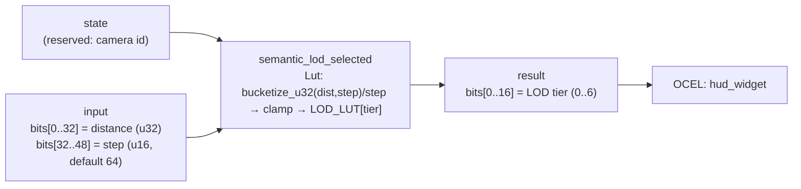

<!-- SCAFFOLDED BY ggen — fill in Context/Forces/Solution/Consequences below, then commit. -->
<!-- Source: ggen/schema/patterns.ttl (semantic_lod_selected). Re-scaffold: `ggen sync`. -->

# Pattern: SemanticLodSelected

> **Family:** Physics & Meaning · **Kernel:** `semantic_lod_selected` · **Lowering:** `Lut` · **Id:** 11

Select a semantic LOD tier for a HUD widget by quantizing distance.

---

## Context

HUD widgets and game entities carry rendering cost proportional to their detail level: a health bar at 400 units away needs neither sub-pixel anti-aliasing nor animated glow effects, but one at 10 units does. Without a branchless tier selector, each entity checks its distance against 6 thresholds via a cascade of `if dist < T1 ... else if dist < T2 ...` guards — 6 branches per entity per tick, each one potentially mispredicting as entities drift across tier boundaries during camera movement. At 200+ visible entities this compounds into measurable render-tick jitter.

## Forces

- **Branch misprediction** — a 7-tier distance cascade branches up to 6 times per entity call; entities clustered near a tier boundary cause the most mispredictions precisely when their rendering cost matters most (camera transitions).
- **Deterministic latency** — the Lut lowering maps the continuous distance to a tier index via `bucketize_u32` (integer division by step) followed by `clamp_u32` to the table bounds, both O(1) with no data-dependent control flow.
- **Safe default for zero step** — a `step` field of zero would cause integer division by zero; the kernel branchlessly replaces it with 64 via `raw_step.wrapping_add(64u32.wrapping_mul((raw_step == 0) as u32))`, keeping the kernel total.
- **Table bounds safety** — the bucket index can exceed the 7-tier table if distance is very large; `clamp_u32(bucket, 0, 6)` ensures the table read is always in-bounds without a conditional guard.
- **OCEL auditability** — OCEL event code `49` ties each LOD-tier selection to the `hud_widget` object trace, making post-hoc LOD decisions auditable and reproducible for regression testing.

## Solution

The kernel resolves the forces by converting the continuous distance to a tier index in two O(1) steps with no branches. The packed-u64 ABI places the distance in `input` bits[0..32] and the step (distance units per tier) in bits[32..48]; `state` is reserved for a camera id and unused. First, `bucketize_u32(dist, step) / step` computes the integer bucket index. Second, `clamp_u32(bucket, 0, LOD_LUT.len()-1)` bounds the index to the 7-entry table, then the index is used to read the tier directly from `LOD_LUT`. The Lut lowering was chosen because tier selection is fundamentally a binned lookup: the mapping from distance to tier is a step function, and integer division followed by a table read is the canonical branchless implementation of a step function.

**Branchless primitive:** `bcinr_logic::fix::bucketize_u32`

## Consequences

**Gains:** All LOD decisions for all entities in the scene consume identical cycles regardless of where each entity falls relative to tier boundaries. The bounded 7-tier table means the LOD state space is finite and fully testable by enumeration. OCEL event `49` enables replay-based LOD audits. **Costs:** The ABI fixes the tier count to 7; adding tiers requires a kernel regeneration. The step field is limited to 16 bits (u16), capping the maximum tier width at 65535 distance units. **Compositions:** [PhysicsValueRendered](physics_value_rendered.md) clamped values can serve as the distance input; [CameraDistanceClamped](camera_distance_clamped.md) produces the camera-relative distance that drives tier selection.

---

## Structure Diagram



---

## Evidence Model

| Field | Value |
|---|---|
| OCEL activity | `SemanticLodSelected` |
| Event code | `49` |
| OTEL span | `49` |
| Object kinds | `hud_widget` |
| Required status | `4` |
| Refusal status | `7` |
| Authority | oracle predicate: matches semantic_lod_selected_reference for all inputs |

---

## Metadata

| Field | Value |
|---|---|
| Pattern id | 11 |
| Family | Physics & Meaning |
| Lowering | `Lut` |
| State cardinality | 7 |
| Primitive | `bcinr_logic::fix::bucketize_u32` |
| Kernel signature | `semantic_lod_selected(state: u64, input: u64) -> u64` |
| Source kernel | `src/patterns/semantic_lod_selected.rs` |

---

## How to Use

```rust
use wasm4games::patterns::semantic_lod_selected;

// Pack state and input into u64 fields as documented in the kernel source.
let result = semantic_lod_selected(state, input);
```

The kernel is a pure `fn(u64, u64) -> u64` — no side effects, no allocation, no branches.
Pair with the evidence layer to emit OCEL events, OTEL spans, and receipt folds:

```rust
use wasm4games::evidence::{ocel::OcelEvent, otel};

let result = semantic_lod_selected(state, input);
otel::emit(49);
let ev = OcelEvent::new(49, logical_tick, admission_status);
```

---

## Related Patterns

- [PhysicsValueRendered](physics_value_rendered.md) — rendered physics values (e.g., clamped distance) drive LOD tier selection
- [CameraDistanceClamped](camera_distance_clamped.md) — camera distance is the distance input consumed by LOD selection
