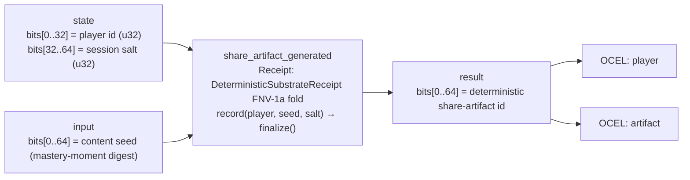

<!-- SCAFFOLDED BY ggen — fill in Context/Forces/Solution/Consequences below, then commit. -->
<!-- Source: ggen/schema/patterns.ttl (share_artifact_generated). Re-scaffold: `ggen sync`. -->

# Pattern: ShareArtifactGenerated

> **Family:** Promotion & NPS · **Kernel:** `share_artifact_generated` · **Lowering:** `Receipt` · **Id:** 19

Generate a deterministic, receipt-stamped shareable artifact id.

---

## Context

When a mastery moment fires — a perfect combo, a speed-run record, an achievement unlock — the game must immediately generate a shareable artifact id that encodes the game state at that exact moment: which player achieved it, in which session, on which content seed. This id must be deterministic (reproducible from the same inputs for verification), collision-resistant (two different achievements must produce different ids), and computed in O(1) time since it fires synchronously in the game tick. A naïve UUID4 requires an entropy source and is not deterministic; a hash with dynamic allocation violates the zero-allocation budget.

## Forces

- **Determinism** — the artifact id must be a pure function of its inputs so the server can re-derive it from the player id, session salt, and content seed for verification without storing it; non-deterministic ids (random UUIDs) fail this requirement.
- **Collision resistance** — two distinct player/session/seed tuples must produce distinct ids with overwhelming probability; a weak hash (e.g., XOR fold) fails on common inputs like player id 0 with any seed.
- **Zero allocation** — the Receipt lowering uses `DeterministicSubstrateReceipt` (an FNV-1a fold over the packed fields) with no heap allocation, satisfying the T0 zero-allocation budget.
- **Field isolation** — player id occupies the low 32 bits of state and session salt the high 32 bits; mixing them into the hash without masking would cause a player with high bits set to collide with a different player/salt combination — the kernel masks both fields before hashing.
- **OCEL auditability** — OCEL event code `81` ties each artifact generation to both the `player` and `artifact` object traces, enabling backend verification of share links by replaying the receipt fold.

## Solution

The kernel resolves the forces by folding three fields through a `DeterministicSubstrateReceipt` (FNV-1a-based hash with a fixed offset and prime). The packed-u64 ABI places the player id in `state` bits[0..32] and the session salt in bits[32..64]; the content seed (e.g. the mastery-moment digest) is the full `input` u64. The kernel extracts `player = state & 0xFFFF_FFFF` and `salt = (state >> 32) & 0xFFFF_FFFF`, creates a fresh receipt (`DeterministicSubstrateReceipt::new()` seeded at FNV_OFFSET), calls `r.record(player, input, salt)`, and returns `r.finalize()`. The FNV-1a fold is `(h ^ x).wrapping_mul(FNV_PRIME)` applied once for each field — fully O(1) and branch-free. The Receipt lowering was chosen because the semantic is precisely a receipt fold: a compact, deterministic, collision-resistant fingerprint of a game event's provenance.

**Branchless primitive:** `bcinr_logic::patterns::integrity_receipt::DeterministicSubstrateReceipt`

## Consequences

**Gains:** The artifact id is a 64-bit deterministic fingerprint reproducible by any party holding the three input fields; the game server can verify share links without storing a lookup table. FNV-1a provides strong avalanche — a single bit change in any field produces a completely different id. Zero heap allocation means this can fire in the hot game tick. OCEL events `81` on `player` and `artifact` enable complete share-link audit trails. **Costs:** The id space is 64 bits — birthday-collision probability is negligible at game scales (~10^9 artifacts before the first expected collision) but not cryptographically unforgeable; a motivated attacker with access to the hash parameters could forge ids. Player id and salt are limited to 32 bits each; larger id spaces require a wider ABI. **Compositions:** The artifact id produced here accompanies the [NpsPromptGated](nps_prompt_gated.md) prompt so the player can share the artifact from the prompt; it is triggered by [MasteryMomentDetected](mastery_moment_detected.md); and the same Receipt lowering appears in [ReceiptAppended](receipt_appended.md).

---

## Structure Diagram



---

## Evidence Model

| Field | Value |
|---|---|
| OCEL activity | `ShareArtifactGenerated` |
| Event code | `81` |
| OTEL span | `81` |
| Object kinds | `player`, `artifact` |
| Required status | `4` |
| Refusal status | `7` |
| Authority | oracle predicate: matches share_artifact_generated_reference for all inputs |

---

## Metadata

| Field | Value |
|---|---|
| Pattern id | 19 |
| Family | Promotion & NPS |
| Lowering | `Receipt` |
| State cardinality | 64 |
| Primitive | `bcinr_logic::patterns::integrity_receipt::DeterministicSubstrateReceipt` |
| Kernel signature | `share_artifact_generated(state: u64, input: u64) -> u64` |
| Source kernel | `src/patterns/share_artifact_generated.rs` |

---

## How to Use

```rust
use wasm4games::patterns::share_artifact_generated;

// Pack state and input into u64 fields as documented in the kernel source.
let result = share_artifact_generated(state, input);
```

The kernel is a pure `fn(u64, u64) -> u64` — no side effects, no allocation, no branches.
Pair with the evidence layer to emit OCEL events, OTEL spans, and receipt folds:

```rust
use wasm4games::evidence::{ocel::OcelEvent, otel};

let result = share_artifact_generated(state, input);
otel::emit(81);
let ev = OcelEvent::new(81, logical_tick, admission_status);
```

---

## Related Patterns

- [MasteryMomentDetected](mastery_moment_detected.md) — a detected mastery moment provides the content seed that triggers artifact generation
- [NpsPromptGated](nps_prompt_gated.md) — the NPS prompt that accompanies the share moment carries this artifact id
- [ReceiptAppended](receipt_appended.md) — shares the same DeterministicSubstrateReceipt FNV-1a Receipt lowering
