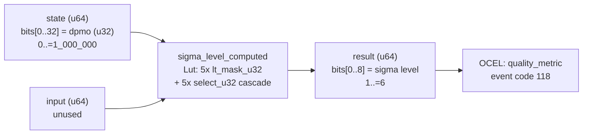

<!-- SCAFFOLDED BY ggen — fill in Context/Forces/Solution/Consequences below, then commit. -->
<!-- Source: ggen/schema/patterns.ttl (sigma_level_computed). Re-scaffold: `ggen sync`. -->

# Pattern: SigmaLevelComputed

> **Family:** DfLSS / Quality · **Kernel:** `sigma_level_computed` · **Lowering:** `Lut` · **Id:** 56

Compute Six-Sigma level from defects per million opportunities (DPMO) via branchless threshold comparisons.

---

## Context

Game quality monitoring pipelines measure DPMO continuously — every frame, every network tick — to classify the process health of a game session (matchmaking latency, render pipeline errors, audio glitches). DPMO thresholds that separate sigma levels 1 through 6 span four orders of magnitude ([3, 233, 6210, 66807, 308538]), so a naïve classifier uses a chain of five if-else comparisons. Each comparison is a potential branch misprediction that injects latency jitter into the monitoring loop, making the sigma level itself an unstable metric. Without this pattern, the classification becomes the noise source it is meant to measure.

## Forces

- **Branch misprediction** — five sequential if-else comparisons on DPMO mispredict unpredictably as DPMO crosses thresholds during trending quality shifts.
- **Deterministic latency** — the Lut lowering via `lt_mask_u32` and nested `select_u32` gives O(1) constant time independent of which sigma bucket DPMO falls into.
- **Monotone invariant** — sigma must be monotone-decreasing in DPMO; any branchy reordering risks violating the invariant under compiler optimization.
- **Bounded output** — the result must always be in [1, 6]; unbounded outputs corrupt downstream quality gate logic.
- **OCEL auditability** — OCEL event code 118 ties each sigma classification to an object trace on `quality_metric`, enabling process audit without branchy logging conditionals.

## Solution

The kernel accepts a packed-u64 where `state` bits[0..32] carry the DPMO value (u32, 0..=1_000_000) and `input` is unused. Five `lt_mask_u32` calls produce all-ones masks for each threshold (dpmo < 3, < 233, < 6210, < 66807, < 308538). A cascade of five `select_u32` calls then resolves the sigma level from bottom to top: starting at sigma=1 (the default for high DPMO), each successive select overwrites with a higher sigma if the corresponding mask is active. This is the Lut lowering: a priority-encoded selection table with O(1) depth regardless of input. The result is packed into bits[0..8] of the return u64.

**Branchless primitive:** `bcinr_logic::mask::lt_mask_u32`

## Consequences

**Gains:** Sigma classification now has constant, predictable latency; no branch predictor state is polluted by DPMO values. The monotone-decreasing invariant (higher DPMO yields lower or equal sigma) is structurally guaranteed by the priority cascade. OCEL event 118 provides a per-classification audit trail.

**Costs:** The bit-field ABI is fixed — callers must pack DPMO into bits[0..32] of state; the sigma level emerges in bits[0..8] of the result. The state space is bounded to 7 classes (sigma 0 is not a valid output; valid outputs are 1–6).

**Compositions:** Feed the result directly into `quality_gate_evaluated` (which gates PASSED vs FAILED on sigma level) and `ctq_threshold_evaluated` (which supplies the DPMO upstream). Pair with `defect_rate_quantized` to normalize raw defect counts to DPMO before this kernel.

---

## Structure Diagram



---

## Evidence Model

| Field | Value |
|---|---|
| OCEL activity | `SigmaLevelComputed` |
| Event code | `118` |
| OTEL span | `118` |
| Object kinds | `quality_metric` |
| Required status | `4` |
| Refusal status | `7` |
| Authority | oracle predicate: matches sigma_level_computed_reference for all inputs |

---

## Metadata

| Field | Value |
|---|---|
| Pattern id | 56 |
| Family | DfLSS / Quality |
| Lowering | `Lut` |
| State cardinality | 7 |
| Primitive | `bcinr_logic::mask::lt_mask_u32` |
| Kernel signature | `sigma_level_computed(state: u64, input: u64) -> u64` |
| Source kernel | `src/patterns/sigma_level_computed.rs` |

---

## How to Use

```rust
use wasm4games::patterns::sigma_level_computed;

// Pack state and input into u64 fields as documented in the kernel source.
let result = sigma_level_computed(state, input);
```

The kernel is a pure `fn(u64, u64) -> u64` — no side effects, no allocation, no branches.
Pair with the evidence layer to emit OCEL events, OTEL spans, and receipt folds:

```rust
use wasm4games::evidence::{ocel::OcelEvent, otel};

let result = sigma_level_computed(state, input);
otel::emit(118);
let ev = OcelEvent::new(118, logical_tick, admission_status);
```

---

## Related Patterns

- [DefectRateQuantized](defect_rate_quantized.md) — quantizes raw defect counts to DPMO; its output is the state input to this kernel.
- [CtqThresholdEvaluated](ctq_threshold_evaluated.md) — CTQ violations upstream drive the DPMO that feeds sigma classification.
- [QualityGateEvaluated](quality_gate_evaluated.md) — sigma level output feeds the quality gate FSM to decide PASSED vs FAILED.
