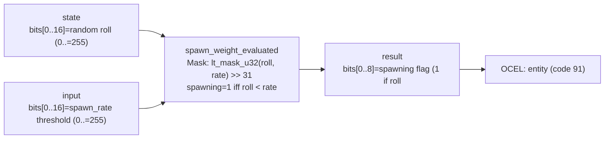

<!-- SCAFFOLDED BY ggen — fill in Context/Forces/Solution/Consequences below, then commit. -->
<!-- Source: ggen/schema/patterns.ttl (spawn_weight_evaluated). Re-scaffold: `ggen sync`. -->

# Pattern: SpawnWeightEvaluated

> **Family:** Procedural Gen · **Kernel:** `spawn_weight_evaluated` · **Lowering:** `Mask` · **Id:** 29

Evaluate whether a spawn should occur: spawn when a random roll is strictly less than the spawn_rate threshold.

---

## Context

Procedural map generation places enemies, treasure chests, and decorations by evaluating a spawn condition at each candidate tile: compare a random roll to the tile's spawn rate and emit a spawn if the roll falls below the threshold. A naive `if roll < spawn_rate { spawn() }` branch is evaluated at every tile during map generation, and since the roll is derived from a pseudorandom noise hash, the branch outcome is unpredictable — the CPU cannot learn a pattern. With large maps containing thousands of candidate tiles, these mispredictions accumulate into measurable generation latency. The Mask lowering replaces the conditional with `lt_mask_u32(roll, rate) >> 31`, a single arithmetic expression that produces 1 or 0 without branching and packs the roll itself into the result for auditability.

## Forces

- **Branch misprediction** — the comparison `roll < spawn_rate` is driven by a pseudorandom roll that changes at every tile; the CPU branch predictor has no prior to exploit, so each call mispredicts at near the theoretical maximum rate.
- **Deterministic latency** — `lt_mask_u32` produces a full-word mask in O(1) using branchless signed comparison; `>> 31` extracts the top bit to yield 0 or 1 without any conditional.
- **Strict less-than semantics** — a roll equal to the spawn_rate must not trigger a spawn (boundary is exclusive); the strict `<` in `lt_mask_u32` enforces this without a special case.
- **Embedded roll for audit** — the roll value must be packed into the result so that the spawn decision is fully reproducible from the result alone, without re-running the noise function; this is required for the OCEL event to carry enough information to replay the decision.
- **OCEL auditability** — event code 91 ties each spawn evaluation to the `entity` object, making the spawn rate, roll, and decision inspectable in the OCEL event log without side effects.

## Solution

The kernel accepts `state` packed as `bits[0..16] = random roll (value range 0..=255)` and `input` packed as `bits[0..16] = spawn_rate threshold (0..=255)`. It returns `bits[0..8] = 1 if spawning (roll < rate), 0 otherwise` and `bits[8..24] = roll` (embedded for audit). The spawning flag is `lt_mask_u32(roll, rate) >> 31`: `lt_mask_u32` returns `0xFFFFFFFF` when `roll < rate` and `0` otherwise; shifting right by 31 extracts exactly the top bit, giving 1 or 0. The roll is then packed into bits `[8..24]` of the result by `(roll as u64) << 8`. The Mask lowering is appropriate because the entire decision is a binary comparison between two scalar values — the canonical domain for mask primitives.

**Branchless primitive:** `bcinr_logic::mask::lt_mask_u32`

## Consequences

**Gains:** O(1) latency per tile regardless of roll and rate values; the spawning decision and the roll are both available in the single result word so callers need no auxiliary storage; the strict `<` boundary is enforced structurally; the OCEL trail at event code 91 logs each spawn decision against the `entity` object including the embedded roll. **Costs:** both roll and spawn rate are bounded to 16 bits in the ABI (values 0..=65535; typical use is 0..=255 but the kernel does not enforce the byte range on its own); a spawn rate of 0 never spawns and a rate of 65535 always spawns when roll is less than 65535. **Natural compositions:** `noise_value_sampled` produces the roll byte; `terrain_height_quantized` determines the height that the caller maps to a spawn_rate before passing it here; `tile_variant_selected` and `biome_class_selected` provide the tile context that determines which entity type to spawn after this kernel confirms a spawn should occur.

---

## Structure Diagram



---

## Evidence Model

| Field | Value |
|---|---|
| OCEL activity | `SpawnWeightEvaluated` |
| Event code | `91` |
| OTEL span | `91` |
| Object kinds | `entity` |
| Required status | `4` |
| Refusal status | `7` |
| Authority | oracle predicate: matches spawn_weight_evaluated_reference for all inputs |

---

## Metadata

| Field | Value |
|---|---|
| Pattern id | 29 |
| Family | Procedural Gen |
| Lowering | `Mask` |
| State cardinality | 2 |
| Primitive | `bcinr_logic::mask::lt_mask_u32` |
| Kernel signature | `spawn_weight_evaluated(state: u64, input: u64) -> u64` |
| Source kernel | `src/patterns/spawn_weight_evaluated.rs` |

---

## How to Use

```rust
use wasm4games::patterns::spawn_weight_evaluated;

// Pack state and input into u64 fields as documented in the kernel source.
let result = spawn_weight_evaluated(state, input);
```

The kernel is a pure `fn(u64, u64) -> u64` — no side effects, no allocation, no branches.
Pair with the evidence layer to emit OCEL events, OTEL spans, and receipt folds:

```rust
use wasm4games::evidence::{ocel::OcelEvent, otel};

let result = spawn_weight_evaluated(state, input);
otel::emit(91);
let ev = OcelEvent::new(91, logical_tick, admission_status);
```

---

## Related Patterns

- [noise_value_sampled](noise_value_sampled.md) — the noise byte produced by the FNV-1a fold serves as the random roll input to this kernel
- [terrain_height_quantized](terrain_height_quantized.md) — the clamped terrain height is the primary signal from which the caller derives the spawn_rate threshold
- [tile_variant_selected](tile_variant_selected.md) — tile variant determines what entity type is eligible to spawn at this tile
- [biome_class_selected](biome_class_selected.md) — biome class sets the base spawn weights that are passed as the rate input to this kernel
