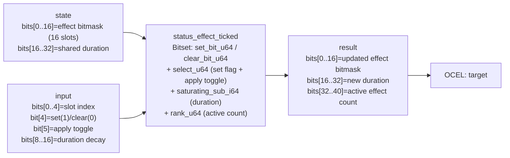

<!-- SCAFFOLDED BY ggen — fill in Context/Forces/Solution/Consequences below, then commit. -->
<!-- Source: ggen/schema/patterns.ttl (status_effect_ticked). Re-scaffold: `ggen sync`. -->

# Pattern: StatusEffectTicked

> **Family:** Core Sim & Combat · **Kernel:** `status_effect_ticked` · **Lowering:** `Bitset` · **Id:** 15

Tick a status-effect set: set/clear an effect bit, decay duration, recount actives.

---

## Context

RPG and action games track status effects — poison, stun, burn, freeze — as a collection of simultaneously active conditions on each entity. Each game tick must optionally apply or clear one effect, decay a shared duration counter, and report how many effects are currently active. Without a bitset, a common implementation loops over an array of effect structs: `for effect in &mut effects { if effect.active { effect.duration -= 1; if effect.duration == 0 { effect.active = false; } } }`. This loop branches on each active check and early-exits on duration expiry, producing data-dependent control flow that mispredicts whenever the active-effect pattern changes between ticks. A duration that underflows due to a missed saturation check can also wrap to a large positive value, keeping a supposedly-expired effect permanently active. This pattern eliminates all those branches by encoding up to 16 effect slots in a bitmask and decaying a single shared duration with saturating subtraction.

## Forces

- **Branch misprediction:** A per-effect loop with conditional active checks mispredicts on every transition between "effect active" and "effect expired"; with 16 potential effects and a variable active count per tick, the predictor cannot track the per-slot branch history.
- **Deterministic latency:** The Bitset lowering uses `set_bit_u64`, `clear_bit_u64`, `select_u64` (for the apply toggle), `saturating_sub_i64` (for duration decay), and `rank_u64` (for the active count), all executing in fixed time regardless of which bits are set.
- **Duration underflow:** A shared duration that is decremented past zero with wrapping arithmetic keeps all effects alive indefinitely; `saturating_sub_i64` followed by `.max(0)` ensures the duration floor is always zero regardless of the decay amount.
- **Apply atomicity:** The set/clear operation on one slot must be a no-op when the `apply` toggle bit is zero — the `select_u64(apply, toggled, mask)` call achieves this without branching on the apply flag.
- **OCEL auditability:** Event code `67` ties every tick operation to the `target` object, recording the pre-tick bitmask, the set/clear operation, the decay amount, and the post-tick active count for replay-based status-effect audits.

## Solution

The kernel stores the 16-slot effect bitmask in bits[0..16] of `state` and the shared duration in bits[16..32]. Input packs: bits[0..4] = slot index (which effect to set or clear), bit[4] = set(1)/clear(0) flag, bit[5] = apply toggle (1 to perform the set/clear, 0 to leave the mask unchanged), bits[8..16] = duration decay amount this tick. The kernel computes `with_set = set_bit_u64(mask, slot)` and `with_clear = clear_bit_u64(mask, slot)`, selects between them via `select_u64(set_flag, ...)`, then uses a second `select_u64(apply, toggled, mask)` to make the operation conditional on the apply bit without branching. Duration is decayed with `saturating_sub_i64(duration, decay).max(0)`. Active count is `rank_u64(new_mask, 15)` — the number of set bits in positions 0 through 15. The Bitset lowering was the right choice because the problem is set membership: the effect slots are independent boolean flags, and the branchless set/clear/count primitives operate on all 16 slots simultaneously without iteration.

**Branchless primitive:** `bcinr_logic::bitset::rank_u64`

## Consequences

**Gains:** All 16 effect slots are maintained in O(1) time with no per-slot loop and no branch on active/expired state. Duration underflow is structurally prevented by `saturating_sub_i64`. The active count is always consistent with the bitmask — `rank_u64` is a popcount, so there is no way for the count to drift from the actual set bits. The OCEL trace records every tick operation on the target entity via event code `67`.

**Costs:** All 16 effects share a single duration counter; effects with independent durations must either be composed across multiple `status_effect_ticked` calls or use a separate per-effect duration encoding. The bitmask is limited to 16 slots; games with more than 16 distinct effect types require wider state. Only one effect slot can be set or cleared per call; applying multiple effects simultaneously requires multiple calls.

**Composes naturally with:** `damage_applied` (damage events can trigger a status application — pass the effect slot and set flag to this kernel immediately after the damage call), `entity_state_transitioned` (a poison or burn effect with duration zero can generate a `hit` event to the lifecycle DFA), `inventory_item_changed` (equipping or consuming an item can clear a status effect bit via this kernel).

---

## Structure Diagram



---

## Evidence Model

| Field | Value |
|---|---|
| OCEL activity | `StatusEffectTicked` |
| Event code | `67` |
| OTEL span | `67` |
| Object kinds | `target` |
| Required status | `4` |
| Refusal status | `7` |
| Authority | oracle predicate: matches status_effect_ticked_reference for all inputs |

---

## Metadata

| Field | Value |
|---|---|
| Pattern id | 15 |
| Family | Core Sim & Combat |
| Lowering | `Bitset` |
| State cardinality | 16 |
| Primitive | `bcinr_logic::bitset::rank_u64` |
| Kernel signature | `status_effect_ticked(state: u64, input: u64) -> u64` |
| Source kernel | `src/patterns/status_effect_ticked.rs` |

---

## How to Use

```rust
use wasm4games::patterns::status_effect_ticked;

// Pack state and input into u64 fields as documented in the kernel source.
let result = status_effect_ticked(state, input);
```

The kernel is a pure `fn(u64, u64) -> u64` — no side effects, no allocation, no branches.
Pair with the evidence layer to emit OCEL events, OTEL spans, and receipt folds:

```rust
use wasm4games::evidence::{ocel::OcelEvent, otel};

let result = status_effect_ticked(state, input);
otel::emit(67);
let ev = OcelEvent::new(67, logical_tick, admission_status);
```

---

## Related Patterns

- [DamageApplied](damage_applied.md) — damage events can trigger a status-effect application immediately after HP reduction; the caller passes the effect slot and set flag to this kernel after each hit.
- [EntityStateTransitioned](entity_state_transitioned.md) — status effects with nonzero active count can drive a `hit` event symbol each tick into the entity lifecycle DFA, representing ongoing damage-over-time.
- [InventoryItemChanged](inventory_item_changed.md) — consuming a cure item clears one or more status effect bits by calling this kernel with the clear flag set on the affected slots.
