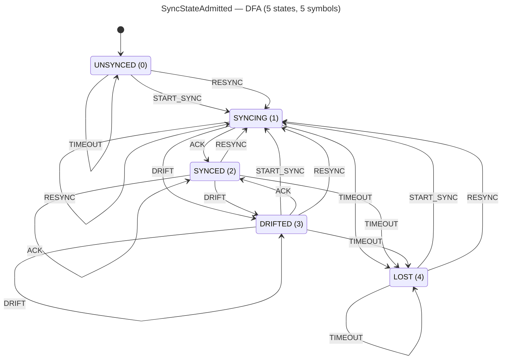

<!-- SCAFFOLDED BY ggen — fill in Context/Forces/Solution/Consequences below, then commit. -->
<!-- Source: ggen/schema/patterns.ttl (sync_state_admitted). Re-scaffold: `ggen sync`. -->

# Pattern: SyncStateAdmitted

> **Family:** Multiplayer / Network · **Kernel:** `sync_state_admitted` · **Lowering:** `Dfa` · **Id:** 55

Advance a synchronization FSM (UNSYNCED/SYNCING/SYNCED/DRIFTED/LOST) via DFA table lookup.

---

## Context

Multiplayer clients track their synchronization quality with the server through a well-defined lifecycle: they start UNSYNCED, negotiate handshake packets to enter SYNCING, receive an ACK to become SYNCED, may detect drift and enter DRIFTED if prediction error grows too large, and enter LOST when the server connection times out. Each of these transitions is driven by a different network event. A switch-on-state implementation branches at every packet receipt and timeout check — producing data-dependent mispredictions at precisely the network events that matter most (jitter, reconnect, reconcile).

## Forces

- **Branch misprediction** — a `match (state, symbol)` with 25 arms (5 states × 5 symbols) branches on every packet and timeout, with mispredictions clustering during reconnection and reconciliation.
- **Deterministic latency** — the Dfa lowering encodes all 25 transitions in a flat 25-entry `SYNC_TABLE`; `dfa_advance` performs a single `state * 5 + symbol` index arithmetic and array read, giving O(1) fixed latency.
- **LOST absorbing state** — from LOST, only START_SYNC and RESYNC escape; ACK, DRIFT, and TIMEOUT all stay in LOST. This absorbing property is encoded directly in the table and verified by proptest — it cannot be accidentally bypassed by a missing branch arm.
- **State-space completeness** — all 25 (state, symbol) pairs are defined; `dfa_advance` bounds both indices before the table access, ensuring no out-of-bounds read for any u64 input.
- **OCEL auditability** — event code 117 ties every state transition to both the `peer` and `session` object traces, enabling complete sync lifecycle reconstruction for connection diagnostics and anticheat.

## Solution

**Branchless primitive:** `bcinr_logic::dfa::dfa_advance`

State bits[0..8] carry the current sync state (UNSYNCED=0, SYNCING=1, SYNCED=2, DRIFTED=3, LOST=4); input bits[0..8] carry the symbol (START_SYNC=0, ACK=1, DRIFT=2, TIMEOUT=3, RESYNC=4). The 25-entry `SYNC_TABLE` is laid out row-major with named constants for all states. Key structural properties: UNSYNCED admits only START_SYNC and RESYNC (both go to SYNCING); SYNCED, SYNCING, and DRIFTED all respond identically to events except that SYNCED ignores START_SYNC (stays SYNCED); LOST absorbs ACK, DRIFT, and TIMEOUT (stays LOST) and only escapes on START_SYNC or RESYNC. `dfa_advance(current, symbol, &SYNC_TABLE, 5)` computes the next state as a branchless table lookup. The Dfa lowering was chosen because the problem is a 5-state lifecycle automaton — the exact structure for which flat DFA tables are optimal.

## Consequences

**Gains:** All 25 transitions are provably correct; the LOST absorbing property cannot be bypassed by a missing branch; latency is constant regardless of state or event; the complete transition history is reconstructible from the OCEL trace. **Costs:** The table occupies 25 × 8 bytes = 200 bytes; adding a new sync state or event requires rebuilding the table and proptest coverage. **Compositions:** Bounded tick delta from `tick_delta_bounded` drives the DRIFT symbol that transitions SYNCED → DRIFTED; large prediction errors from `prediction_error_bounded` also signal DRIFT; packets selected by `packet_priority_evaluated` generate the ACK symbol that drives SYNCING → SYNCED; `lag_compensation_applied` runs only in the SYNCED state.

---

## Structure Diagram



---

## Evidence Model

| Field | Value |
|---|---|
| OCEL activity | `SyncStateAdmitted` |
| Event code | `117` |
| OTEL span | `117` |
| Object kinds | `peer`, `session` |
| Required status | `4` |
| Refusal status | `7` |
| Authority | oracle predicate: matches sync_state_admitted_reference for all inputs |

---

## Metadata

| Field | Value |
|---|---|
| Pattern id | 55 |
| Family | Multiplayer / Network |
| Lowering | `Dfa` |
| State cardinality | 5 |
| Primitive | `bcinr_logic::dfa::dfa_advance` |
| Kernel signature | `sync_state_admitted(state: u64, input: u64) -> u64` |
| Source kernel | `src/patterns/sync_state_admitted.rs` |

---

## How to Use

```rust
use wasm4games::patterns::sync_state_admitted;

// Pack state and input into u64 fields as documented in the kernel source.
let result = sync_state_admitted(state, input);
```

The kernel is a pure `fn(u64, u64) -> u64` — no side effects, no allocation, no branches.
Pair with the evidence layer to emit OCEL events, OTEL spans, and receipt folds:

```rust
use wasm4games::evidence::{ocel::OcelEvent, otel};

let result = sync_state_admitted(state, input);
otel::emit(117);
let ev = OcelEvent::new(117, logical_tick, admission_status);
```

---

## Related Patterns

- [TickDeltaBounded](tick_delta_bounded.md) — excessive raw-vs-bounded delta difference produces the DRIFT symbol that transitions SYNCED → DRIFTED.
- [PredictionErrorBounded](prediction_error_bounded.md) — a force_resync flag from large prediction error generates a DRIFT symbol into this FSM.
- [PacketPriorityEvaluated](packet_priority_evaluated.md) — successful high-priority packet delivery generates the ACK symbol driving SYNCING → SYNCED.
- [LagCompensationApplied](lag_compensation_applied.md) — lag compensation is only applied when this FSM is in the SYNCED state.
