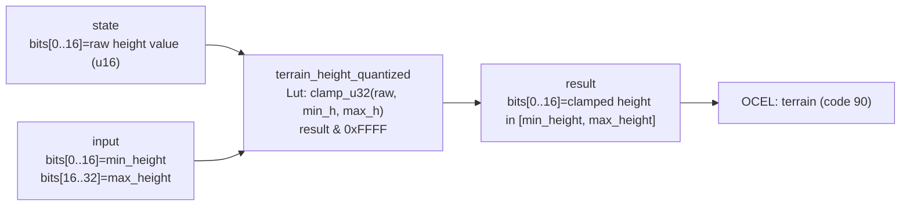

<!-- SCAFFOLDED BY ggen — fill in Context/Forces/Solution/Consequences below, then commit. -->
<!-- Source: ggen/schema/patterns.ttl (terrain_height_quantized). Re-scaffold: `ggen sync`. -->

# Pattern: TerrainHeightQuantized

> **Family:** Procedural Gen · **Kernel:** `terrain_height_quantized` · **Lowering:** `Lut` · **Id:** 28

Clamp a raw terrain height sample to [min_h, max_h], producing a bounded 16-bit height value.

---

## Context

Raw terrain height samples from a noise function span the full 16-bit unsigned range but a procedural map's playable height band is narrower — for example, a tower-defense map might constrain passable terrain to heights `[100, 200]` to ensure walls are always above water and below the sky. Without clamping, tiles sampled below `min_h` would render as underwater terrain and trigger incorrect collision layers, while tiles above `max_h` would be treated as impassable cliffs regardless of their intended role. A naïve `if raw < min_h { min_h } else if raw > max_h { max_h } else { raw }` branches twice on every tile; the Lut lowering replaces both branches with a single `clamp_u32` call.

## Forces

- **Branch misprediction** — the two boundary comparisons branch on the raw sample value, which is derived from a pseudorandom noise function and therefore unpredictable; both the floor branch and the ceiling branch mispredict at a rate proportional to how often samples fall near each boundary.
- **Deterministic latency** — `clamp_u32` is O(1) and branchless; it composes two mask-based min/max operations and executes in constant time regardless of where the raw sample falls relative to the bounds.
- **Domain safety** — downstream systems (biome selection, collision, tile type assignment) all assume height is in `[min_h, max_h]`; a height value outside that range is a precondition violation that silently corrupts those systems; the clamp enforces the invariant structurally.
- **Parameterized bounds** — different map regions can use different height bands (e.g., a cave region with `[50, 150]` vs. a mountain region with `[180, 255]`); the kernel accepts `min_h` and `max_h` at call time rather than hardcoding them, so the same kernel serves all regions.
- **OCEL auditability** — event code 90 ties each height quantization to the `terrain` object, making the applied bounds auditable without storing them in the tile struct.

## Solution

The kernel accepts `state` packed as `bits[0..16] = raw height value (u16)` and `input` packed as `bits[0..16] = min_height, bits[16..32] = max_height`. It returns `bits[0..16] = clamped height in [min_height, max_height]`. The raw value and both bounds are extracted and passed directly to `clamp_u32(raw, min_h, max_h)`, which computes `min(max(raw, min_h), max_h)` using branchless mask operations. The result is masked by `0xFFFF` to confirm it fits in a u16. The Lut lowering was chosen because the operation is a bounded projection: a fixed mapping from the full u16 range into the `[min_h, max_h]` subrange, which is the canonical Lut contract.

**Branchless primitive:** `bcinr_logic::fix::clamp_u32`

## Consequences

**Gains:** O(1) latency per tile; out-of-band height values are silently corrected to the nearest valid boundary without a branch or a panic; the clamp is parameterized so the same kernel handles any valid `[min_h, max_h]` range; the OCEL trail at event code 90 logs the applied bounds against the `terrain` object. **Costs:** the ABI requires that `min_h <= max_h` at call time — if the caller provides an inverted range the result is implementation-defined (generally returns `min_h`); both bounds and the raw height are 16-bit, so heights above 65535 cannot be represented. **Natural compositions:** `noise_value_sampled` produces the raw height byte that this kernel clamps; `biome_class_selected` uses the clamped height to set biome flags; `tile_variant_selected` selects the visual sprite from the height-determined tile type; `spawn_weight_evaluated` reads the clamped height to decide whether a spawn is valid at this elevation.

---

## Structure Diagram



---

## Evidence Model

| Field | Value |
|---|---|
| OCEL activity | `TerrainHeightQuantized` |
| Event code | `90` |
| OTEL span | `90` |
| Object kinds | `terrain` |
| Required status | `4` |
| Refusal status | `7` |
| Authority | oracle predicate: matches terrain_height_quantized_reference for all inputs |

---

## Metadata

| Field | Value |
|---|---|
| Pattern id | 28 |
| Family | Procedural Gen |
| Lowering | `Lut` |
| State cardinality | 8 |
| Primitive | `bcinr_logic::fix::clamp_u32` |
| Kernel signature | `terrain_height_quantized(state: u64, input: u64) -> u64` |
| Source kernel | `src/patterns/terrain_height_quantized.rs` |

---

## How to Use

```rust
use wasm4games::patterns::terrain_height_quantized;

// Pack state and input into u64 fields as documented in the kernel source.
let result = terrain_height_quantized(state, input);
```

The kernel is a pure `fn(u64, u64) -> u64` — no side effects, no allocation, no branches.
Pair with the evidence layer to emit OCEL events, OTEL spans, and receipt folds:

```rust
use wasm4games::evidence::{ocel::OcelEvent, otel};

let result = terrain_height_quantized(state, input);
otel::emit(90);
let ev = OcelEvent::new(90, logical_tick, admission_status);
```

---

## Related Patterns

- [noise_value_sampled](noise_value_sampled.md) — the noise byte produced by the FNV-1a fold serves as the raw height sample that this kernel clamps
- [tile_variant_selected](tile_variant_selected.md) — the clamped height determines the tile type; tile_variant_selected then picks the visual sprite within that type
- [biome_class_selected](biome_class_selected.md) — biome flags are derived from the clamped height; terrain_height_quantized feeds biome_class_selected in the procedural pipeline
- [spawn_weight_evaluated](spawn_weight_evaluated.md) — spawn rates depend on terrain height; the clamped height is used to look up the spawn rate for this tile
