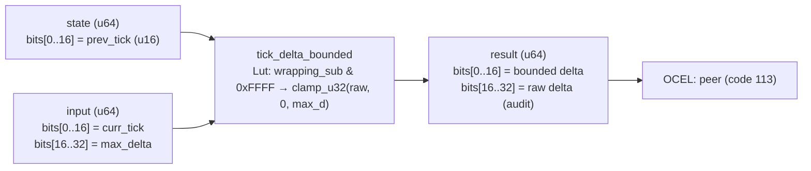

<!-- SCAFFOLDED BY ggen — fill in Context/Forces/Solution/Consequences below, then commit. -->
<!-- Source: ggen/schema/patterns.ttl (tick_delta_bounded). Re-scaffold: `ggen sync`. -->

# Pattern: TickDeltaBounded

> **Family:** Multiplayer / Network · **Kernel:** `tick_delta_bounded` · **Lowering:** `Lut` · **Id:** 51

Clamp a tick delta to a max_jitter window to prevent large desync jumps.

---

## Context

Multiplayer game servers receive tick-counter deltas from clients over unreliable UDP networks. Network jitter, packet loss, and re-ordering can produce tick deltas that are many times larger than a normal frame — a client reconnecting after a stall may send a delta of 300 ticks when the server expects 1 to 3. Applying such a spike naively to game state causes players to teleport, inventories to skip multiple accumulation cycles, and cooldown timers to expire in a single frame. Clamping the delta to `max_jitter` limits how much state can advance in a single network event.

## Forces

- **Branch misprediction** — a naïve `if raw_delta > max_delta { max_delta } else { raw_delta }` branches every time a jitter spike arrives, adding latency precisely when network conditions are worst.
- **Deterministic latency** — the Lut lowering uses `clamp_u32(raw_delta, 0, max_d)`, an O(1) branchless primitive that executes in constant time regardless of whether the bound fires.
- **Wrapping subtraction** — tick counters are u16 and may wrap; `curr.wrapping_sub(prev) & 0xFFFF` computes the unsigned wrapping delta correctly without a conditional, handling counter rollover transparently.
- **Dual output for audit** — the raw (unclamped) delta is preserved in bits[16..32] of the result for OCEL audit, allowing the server to detect and log jitter spikes without discarding the evidence.
- **OCEL auditability** — event code 113 ties each bounded delta to the `peer` object trace, enabling per-client jitter analysis and anticheat monitoring.

## Solution

**Branchless primitive:** `bcinr_logic::fix::clamp_u32`

State bits[0..16] carry the previous tick; input bits[0..16] carry the current tick and bits[16..32] carry `max_delta`. The raw delta is computed as `curr.wrapping_sub(prev) & 0xFFFF` — a branchless wrapping subtraction clamped to u16 range. `clamp_u32(raw_delta, 0, max_d)` then bounds the delta without branching. The result packs the bounded delta in bits[0..16] and the raw delta in bits[16..32]. The Lut lowering was chosen because the output is an absolute scalar bounded from above, exactly matching `clamp_u32`'s semantics.

## Consequences

**Gains:** Game state can advance by at most `max_delta` ticks per network event regardless of actual network conditions; the raw delta is preserved for audit without extra cost; wrapping tick arithmetic is handled correctly. **Costs:** A bounded delta means a client recovering from a long stall must catch up over multiple frames rather than instantly; the `max_delta` must be tuned per game (too small causes legitimate lag spikes to be under-applied). **Compositions:** The bounded delta feeds `lag_compensation_applied` (determines rewind depth); `sync_state_admitted` uses tick delta magnitude to trigger DRIFTED transitions; `fixed_tick_advanced` accumulates bounded deltas for the tick loop.

---

## Structure Diagram



---

## Evidence Model

| Field | Value |
|---|---|
| OCEL activity | `TickDeltaBounded` |
| Event code | `113` |
| OTEL span | `113` |
| Object kinds | `peer` |
| Required status | `4` |
| Refusal status | `7` |
| Authority | oracle predicate: matches tick_delta_bounded_reference for all inputs |

---

## Metadata

| Field | Value |
|---|---|
| Pattern id | 51 |
| Family | Multiplayer / Network |
| Lowering | `Lut` |
| State cardinality | 8 |
| Primitive | `bcinr_logic::fix::clamp_u32` |
| Kernel signature | `tick_delta_bounded(state: u64, input: u64) -> u64` |
| Source kernel | `src/patterns/tick_delta_bounded.rs` |

---

## How to Use

```rust
use wasm4games::patterns::tick_delta_bounded;

// Pack state and input into u64 fields as documented in the kernel source.
let result = tick_delta_bounded(state, input);
```

The kernel is a pure `fn(u64, u64) -> u64` — no side effects, no allocation, no branches.
Pair with the evidence layer to emit OCEL events, OTEL spans, and receipt folds:

```rust
use wasm4games::evidence::{ocel::OcelEvent, otel};

let result = tick_delta_bounded(state, input);
otel::emit(113);
let ev = OcelEvent::new(113, logical_tick, admission_status);
```

---

## Related Patterns

- [LagCompensationApplied](lag_compensation_applied.md) — the bounded delta limits the maximum rewind depth the lag compensation kernel will apply.
- [SyncStateAdmitted](sync_state_admitted.md) — large tick deltas (raw > bounded) signal drift, which drives the DRIFTED state transition.
- [PredictionErrorBounded](prediction_error_bounded.md) — bounded tick delta reduces the maximum prediction error by constraining state divergence per frame.
