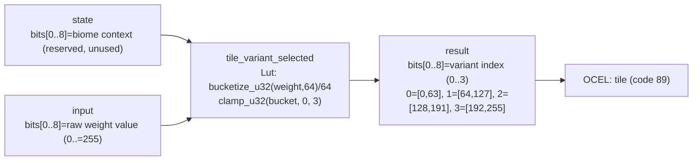

<!-- SCAFFOLDED BY ggen — fill in Context/Forces/Solution/Consequences below, then commit. -->
<!-- Source: ggen/schema/patterns.ttl (tile_variant_selected). Re-scaffold: `ggen sync`. -->

# Pattern: TileVariantSelected

> **Family:** Procedural Gen · **Kernel:** `tile_variant_selected` · **Lowering:** `Lut` · **Id:** 27

Select a tile variant index (0..4) from a weight value via bucketize with boundaries at [64, 128, 192].

---

## Context

Tile-based games add visual variety by selecting among multiple art variants for the same terrain type — for example, three grass tile sprites weighted 50%/30%/20% to break up repetitive patterns. During map generation, this selection must run for every tile, which can mean hundreds of thousands of calls. A naïve `if w < 64 { 0 } else if w < 128 { 1 } else if w < 192 { 2 } else { 3 }` chain adds three data-dependent branches per tile whose outcomes are determined by the noise input, which is pseudorandom and therefore maximally hard to predict. The Lut lowering collapses those three branches into a single `bucketize_u32` (which is itself a branchless shift-and-clamp) and a final clamp.

## Forces

- **Branch misprediction** — each `if w < boundary` branch mispredicts whenever the pseudorandom noise value straddles the boundary, which happens at roughly the frequency of each band's width; across millions of tiles the total mispredict penalty dominates generation time.
- **Deterministic latency** — the Lut lowering computes the bucket in O(1) using `bucketize_u32(weight, 64) / 64` followed by `clamp_u32(bucket, 0, 3)`, both of which are branchless arithmetic.
- **Boundary precision** — the four buckets must partition `[0, 255]` exactly at 64, 128, and 192 so that the variant distribution matches the intended weights; the step-size of 64 achieves this exactly.
- **Stability at extremes** — a weight of 255 must reliably select variant 3 (not overflow to a fifth bucket); `clamp_u32` ensures the result is always in `[0, 3]`.
- **OCEL auditability** — event code 89 ties each variant selection to the `tile` object, making the per-tile variant assignment auditable without storing it separately.

## Solution

The kernel accepts `state` (bits[0..8] reserved for biome context; unused in this kernel) and `input` packed as `bits[0..8] = raw weight value (0..=255)`. It returns `bits[0..8] = variant index (0..3)`. The weight byte is extracted from input and passed to `bucketize_u32(weight, 64)`, which computes `weight - (weight % 64)` — the floor to the nearest multiple of 64 — giving 0, 64, 128, or 192. Dividing by 64 yields bucket index 0, 1, 2, or 3. A final `clamp_u32(bucket, 0, 3)` guards against any edge case at the top of the range. The Lut lowering is appropriate because the transformation is a static partitioning of a fixed input range into a fixed number of output classes — a lookup by arithmetic rather than a table, but semantically identical.

**Branchless primitive:** `bcinr_logic::fix::bucketize_u32`

## Consequences

**Gains:** O(1) latency per tile with no branches; the four variant bands are defined by a single step parameter (64) rather than three comparison constants, making the partition easy to reason about; the result is guaranteed in `[0, 3]` by the final clamp; the OCEL trail at event code 89 logs each variant selection against the `tile` object. **Costs:** the weight input is bounded to a byte `[0, 255]`, so variant weights are quantized to multiples of 64 out of 256 (25% granularity); changing the number of variants or their relative weights requires changing the step size and recompiling the kernel. **Natural compositions:** `noise_value_sampled` produces the weight byte that this kernel consumes; `biome_class_selected` determines which tile set is used before this kernel selects the variant within that set; `terrain_height_quantized` co-determines the tile type alongside the variant.

---

## Structure Diagram



---

## Evidence Model

| Field | Value |
|---|---|
| OCEL activity | `TileVariantSelected` |
| Event code | `89` |
| OTEL span | `89` |
| Object kinds | `tile` |
| Required status | `4` |
| Refusal status | `7` |
| Authority | oracle predicate: matches tile_variant_selected_reference for all inputs |

---

## Metadata

| Field | Value |
|---|---|
| Pattern id | 27 |
| Family | Procedural Gen |
| Lowering | `Lut` |
| State cardinality | 8 |
| Primitive | `bcinr_logic::fix::bucketize_u32` |
| Kernel signature | `tile_variant_selected(state: u64, input: u64) -> u64` |
| Source kernel | `src/patterns/tile_variant_selected.rs` |

---

## How to Use

```rust
use wasm4games::patterns::tile_variant_selected;

// Pack state and input into u64 fields as documented in the kernel source.
let result = tile_variant_selected(state, input);
```

The kernel is a pure `fn(u64, u64) -> u64` — no side effects, no allocation, no branches.
Pair with the evidence layer to emit OCEL events, OTEL spans, and receipt folds:

```rust
use wasm4games::evidence::{ocel::OcelEvent, otel};

let result = tile_variant_selected(state, input);
otel::emit(89);
let ev = OcelEvent::new(89, logical_tick, admission_status);
```

---

## Related Patterns

- [noise_value_sampled](noise_value_sampled.md) — the noise byte produced by the FNV-1a receipt fold feeds directly into this kernel's weight input
- [biome_class_selected](biome_class_selected.md) — biome class determines which tile art set is active before this kernel selects the visual variant within that set
- [terrain_height_quantized](terrain_height_quantized.md) — terrain height and tile variant are co-determined from the same noise source; height selects the tile type, variant selects the sprite
