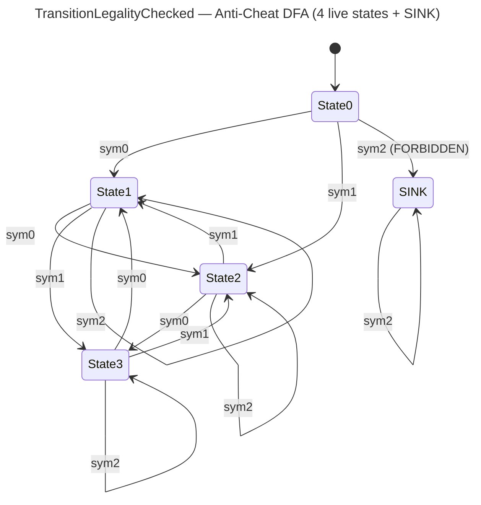

<!-- SCAFFOLDED BY ggen — fill in Context/Forces/Solution/Consequences below, then commit. -->
<!-- Source: ggen/schema/patterns.ttl (transition_legality_checked). Re-scaffold: `ggen sync`. -->

# Pattern: TransitionLegalityChecked

> **Family:** Anti-Cheat · **Kernel:** `transition_legality_checked` · **Lowering:** `Dfa` · **Id:** 75

Verdict bit0 set iff the (from_state, symbol) DFA edge lands on the absorbing SINK state (forbidden/state-desync transition).

---

## Context

State-desync cheats submit (from_state, action_symbol) pairs that are impossible in the game's legitimate FSM — for example, transitioning from DEAD to ATTACKING, or firing a weapon from a STUNNED state. Without explicit validation, a server that processes such transitions silently introduces an inconsistent game state that can be exploited for damage, loot duplication, or invincibility. The anti-cheat gate validates each transition against a DFA: legal transitions reach live states, and forbidden transitions land in an absorbing SINK state. A switch-on-state implementation of this validation branches at every from_state, and the SINK check adds another branch — together creating a branch misprediction on every illegitimate transition attempt.

## Forces

- **Branch misprediction** — validating each (from_state, symbol) pair with a switch-plus-SINK-check branches at every evaluation; adversarial cheat probing creates systematic mispredictions at the SINK boundary.
- **Deterministic latency** — the Dfa lowering via `dfa_advance` + `eq_mask_u32` gives O(1) constant time: one table read and one equality mask, regardless of whether the transition is legal or forbidden.
- **SINK absorption** — the SINK state (state 4) must be absorbing: once a DFA reaches SINK on any symbol, all subsequent symbols must also return SINK. This ensures repeated illegal transitions are all caught without state escape.
- **Five live states + SINK** — states 0–3 are live protocol states; state 4 is SINK. The alphabet has 3 symbols. One specific (state 0, symbol 2) edge is forbidden and leads to SINK.
- **OCEL auditability** — OCEL event code 137 ties each transition check to an `entity` object trace for desync detection audit logs.

## Solution

The kernel takes `state` bits[0..7] as the from-state index (reduced mod 5 into [0, 5)) and `input` bits[0..7] as the symbol (reduced mod 3 into [0, 3)). `dfa_advance(from, sym, &TABLE, ALPHABET)` performs a single branchless flat table lookup across the 5×3=15-entry transition table. `eq_mask_u32(next as u32, SINK as u32)` produces all-ones when the next state equals SINK=4, all-zeros otherwise. The result is `u64::from(eq_mask_u32(...)) & 1`: verdict bit0=1 means the transition is forbidden (landed on SINK), 0 means the transition is legal. This is the Dfa lowering: both the state advance and the SINK verdict are computed in one pass without branching.

**Branchless primitive:** `bcinr_logic::dfa::dfa_advance`

## Consequences

**Gains:** All 15 transitions execute at identical latency. The SINK state is absorbing by construction in the table, so repeated illegal transitions are permanently caught. The verdict bit composes with `movement_legality_checked`, `resource_bound_checked`, and `action_rate_bounded` via OR for a complete per-tick anti-cheat verdict.

**Costs:** The bit-field ABI is fixed — from-state in state bits[0..7], symbol in input bits[0..7], verdict in result bit0. Out-of-range state/symbol values are reduced mod 5 or mod 3; callers must validate if they need strict rejection of out-of-protocol state indices. The transition table is a compile-time constant; runtime-configurable FSM policies require a kernel variant.

**Compositions:** Feeds into the composite per-tick anti-cheat verdict alongside `movement_legality_checked`, `resource_bound_checked`, and `action_rate_bounded`. The DFA table idiom is shared with `entity_state_transitioned` for general entity FSM management (same `dfa_advance` lowering, different table).

---

## Structure Diagram



---

## Evidence Model

| Field | Value |
|---|---|
| OCEL activity | `TransitionLegalityChecked` |
| Event code | `137` |
| OTEL span | `137` |
| Object kinds | `entity` |
| Required status | `4` |
| Refusal status | `7` |
| Authority | legality spec: dfa_advance(from, symbol) != SINK (the edge is a legal protocol transition) |

---

## Metadata

| Field | Value |
|---|---|
| Pattern id | 75 |
| Family | Anti-Cheat |
| Lowering | `Dfa` |
| State cardinality | 2 |
| Primitive | `bcinr_logic::dfa::dfa_advance` |
| Kernel signature | `transition_legality_checked(state: u64, input: u64) -> u64` |
| Source kernel | `src/patterns/transition_legality_checked.rs` |

---

## How to Use

```rust
use wasm4games::patterns::transition_legality_checked;

// Pack state and input into u64 fields as documented in the kernel source.
let result = transition_legality_checked(state, input);
```

The kernel is a pure `fn(u64, u64) -> u64` — no side effects, no allocation, no branches.
Pair with the evidence layer to emit OCEL events, OTEL spans, and receipt folds:

```rust
use wasm4games::evidence::{ocel::OcelEvent, otel};

let result = transition_legality_checked(state, input);
otel::emit(137);
let ev = OcelEvent::new(137, logical_tick, admission_status);
```

---

## Related Patterns

- [MovementLegalityChecked](movement_legality_checked.md) — same anti-cheat family; movement legality is one source of the from_state input.
- [ActionRateBounded](action_rate_bounded.md) — all four anti-cheat checks compose into the complete per-tick verdict bitmask.
- [ResourceBoundChecked](resource_bound_checked.md) — resource overflow can trigger a state desync that this DFA catches as a SINK transition.
