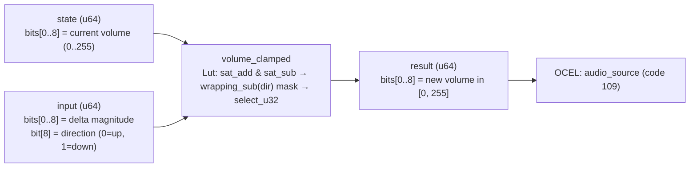

<!-- SCAFFOLDED BY ggen — fill in Context/Forces/Solution/Consequences below, then commit. -->
<!-- Source: ggen/schema/patterns.ttl (volume_clamped). Re-scaffold: `ggen sync`. -->

# Pattern: VolumeClamped

> **Family:** Audio · **Kernel:** `volume_clamped` · **Lowering:** `Lut` · **Id:** 47

Apply a volume change (delta) to current volume, clamping to [0, 255].

---

## Context

Game audio volume is adjusted from multiple sources simultaneously: a music slider, an SFX slider, a ducking system, and per-effect attenuation all write signed deltas to the same channel volume each frame. Without clamping to the hardware output range [0, 255], a negative delta that exceeds the current volume wraps around to 254 — producing a sudden ear-splitting burst — and a positive delta can overflow to a near-zero value, silencing the channel mid-playback. Both failure modes are silent data corruption from the caller's perspective.

## Forces

- **Branch misprediction** — a naïve `if new_vol < 0` or `if new_vol > 255` guard branches on data-dependent conditions that fire on fade completion and volume-limit events.
- **Deterministic latency** — the Lut lowering pre-computes both `vol.saturating_add(delta)` and `vol.saturating_sub(delta)`, then uses a branchless `select_u32` on the direction bit, giving O(1) fixed execution.
- **Direction encoding** — the direction (up vs down) is packed as a single bit (bit[8] of input) and converted to an all-ones/all-zeros mask via `0u32.wrapping_sub(dir)`, replacing a conditional with arithmetic.
- **Two-path symmetry** — both the up-result and down-result are computed eagerly before the select; neither path introduces dead code that the compiler might optimize away in a way that breaks the no-branch invariant.
- **OCEL auditability** — event code 109 ties each volume step to the `audio_source` object trace, enabling reconstruction of the volume envelope for any channel at any tick.

## Solution

**Branchless primitive:** `bcinr_logic::fix::clamp_u32`

State bits[0..8] carry the current volume (0..255). Input bits[0..8] carry the delta magnitude; bit[8] carries the direction (0 = increase, 1 = decrease). Both `clamp_u32(vol.saturating_add(delta), 0, 255)` (up path) and `clamp_u32(vol.saturating_sub(delta), 0, 255)` (down path) are evaluated unconditionally. The direction bit is widened to a full mask via `0u32.wrapping_sub(dir)` (all-ones when dir=1, all-zeros when dir=0), and `select_u32(dir_mask, down_result, up_result)` picks the correct result without branching. The Lut lowering was chosen because the output must always be in [0, 255] — a two-sided absolute range — matching `clamp_u32`'s domain exactly.

## Consequences

**Gains:** Volume is provably in [0, 255] after every call; direction handling is branch-free; the pre-computed dual-path evaluation ensures constant instruction count. **Costs:** Both addition and subtraction paths are always executed (2x ALU work vs 1x for a branching impl); delta is an 8-bit magnitude, limiting the maximum single-step change to 255. **Compositions:** The clamped volume feeds `audio_priority_selected` (priority ranking uses effective volume); `audio_fade_applied` applies repeated down-deltas until the floor fires; `audio_distance_attenuated` produces an attenuation delta that then passes through this kernel.

---

## Structure Diagram



---

## Evidence Model

| Field | Value |
|---|---|
| OCEL activity | `VolumeClamped` |
| Event code | `109` |
| OTEL span | `109` |
| Object kinds | `audio_source` |
| Required status | `4` |
| Refusal status | `7` |
| Authority | oracle predicate: matches volume_clamped_reference for all inputs |

---

## Metadata

| Field | Value |
|---|---|
| Pattern id | 47 |
| Family | Audio |
| Lowering | `Lut` |
| State cardinality | 8 |
| Primitive | `bcinr_logic::fix::clamp_u32` |
| Kernel signature | `volume_clamped(state: u64, input: u64) -> u64` |
| Source kernel | `src/patterns/volume_clamped.rs` |

---

## How to Use

```rust
use wasm4games::patterns::volume_clamped;

// Pack state and input into u64 fields as documented in the kernel source.
let result = volume_clamped(state, input);
```

The kernel is a pure `fn(u64, u64) -> u64` — no side effects, no allocation, no branches.
Pair with the evidence layer to emit OCEL events, OTEL spans, and receipt folds:

```rust
use wasm4games::evidence::{ocel::OcelEvent, otel};

let result = volume_clamped(state, input);
otel::emit(109);
let ev = OcelEvent::new(109, logical_tick, admission_status);
```

---

## Related Patterns

- [AudioPrioritySelected](audio_priority_selected.md) — the clamped volume feeds the priority comparison for voice slot assignment.
- [AudioFadeApplied](audio_fade_applied.md) — fade applies repeated down-deltas that must go through clamping to correctly detect the silent floor.
- [AudioDistanceAttenuated](audio_distance_attenuated.md) — distance attenuation produces a volume value that is subsequently bounded by the same [0, 255] range.
