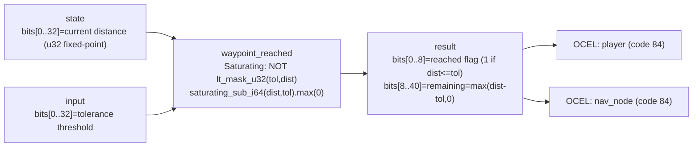

<!-- SCAFFOLDED BY ggen — fill in Context/Forces/Solution/Consequences below, then commit. -->
<!-- Source: ggen/schema/patterns.ttl (waypoint_reached). Re-scaffold: `ggen sync`. -->

# Pattern: WaypointReached

> **Family:** Pathfinding · **Kernel:** `waypoint_reached` · **Lowering:** `Saturating` · **Id:** 22

Check if remaining distance to a waypoint is within tolerance and compute saturating remainder.

---

## Context

An agent following a path must check at each tick whether its current distance to the next waypoint falls within an arrival tolerance, and must compute how much path budget remains after the check. Without saturating subtraction, when the agent is inside the tolerance zone the raw `dist - tol` expression underflows to a large positive remainder, which falsely signals that the agent is still far from the waypoint. The Saturating lowering clamps the difference floor to zero so that any distance within or at the tolerance produces a remainder of exactly zero, while distances beyond tolerance produce the true positive overage — and neither path involves a conditional branch.

## Forces

- **Branch misprediction** — a naïve `if dist <= tol { arrived } else { remaining = dist - tol }` branches on every tile, adding latency jitter proportional to the branch prediction error rate.
- **Underflow correctness** — raw integer subtraction wraps when `dist < tol`, producing a semantically wrong large remainder that would block the ARRIVED transition; saturating subtraction eliminates this class of error without a check.
- **Deterministic latency** — the Saturating lowering resolves in O(1) constant time: one `lt_mask_u32` and one `saturating_sub_i64` with a `.max(0)` floor.
- **Dual output** — both the boolean reached flag and the numeric remaining distance are needed by the caller; packing them into a single u64 avoids a second call or a struct allocation.
- **OCEL auditability** — event code 84 ties each waypoint check to object-centric traces over both `player` and `nav_node`, so arrival events are attributable to the exact agent and node.

## Solution

The kernel accepts `state` packed as `bits[0..32] = current distance to waypoint (u32, fixed-point units)` and `input` packed as `bits[0..32] = tolerance threshold`. It returns `bits[0..8] = 1 if reached (dist <= tol), 0 otherwise` and `bits[8..40] = saturating remaining distance = max(dist - tol, 0)`. The reached flag is computed as `NOT lt_mask_u32(tol, dist) & 1` — true when `tol` is not strictly less than `dist`, i.e. `dist <= tol`. The remaining is `saturating_sub_i64(dist as i64, tol as i64).max(0)`, which pins to zero whenever the agent is inside or at the tolerance boundary. The Saturating lowering was chosen because the core problem is preventing underflow at the tolerance boundary — exactly what saturating arithmetic was designed for — while keeping the execution path data-independent.

**Branchless primitive:** `bcinr_logic::int::saturating_sub_i64`

## Consequences

**Gains:** O(1) latency per tick; the arrived flag and remaining budget are produced atomically with no allocation; underflow at the tolerance boundary is structurally impossible rather than defensively guarded; the OCEL trail at event code 84 provides per-waypoint arrival evidence over `player` and `nav_node` object pairs. **Costs:** the ABI binds distance to 32-bit fixed-point units, which limits the navigable range to 2^32 units; tolerance and remaining occupy specific bit slices and callers must respect the packing contract. **Natural compositions:** `path_node_expanded` produces the node candidates whose distances feed this kernel; arrival triggers the ARRIVE event in `nav_state_advanced`; remaining distance feeds `path_cost_bounded` as the final budget check.

---

## Structure Diagram



---

## Evidence Model

| Field | Value |
|---|---|
| OCEL activity | `WaypointReached` |
| Event code | `84` |
| OTEL span | `84` |
| Object kinds | `player`, `nav_node` |
| Required status | `4` |
| Refusal status | `7` |
| Authority | oracle predicate: matches waypoint_reached_reference for all inputs |

---

## Metadata

| Field | Value |
|---|---|
| Pattern id | 22 |
| Family | Pathfinding |
| Lowering | `Saturating` |
| State cardinality | 16 |
| Primitive | `bcinr_logic::int::saturating_sub_i64` |
| Kernel signature | `waypoint_reached(state: u64, input: u64) -> u64` |
| Source kernel | `src/patterns/waypoint_reached.rs` |

---

## How to Use

```rust
use wasm4games::patterns::waypoint_reached;

// Pack state and input into u64 fields as documented in the kernel source.
let result = waypoint_reached(state, input);
```

The kernel is a pure `fn(u64, u64) -> u64` — no side effects, no allocation, no branches.
Pair with the evidence layer to emit OCEL events, OTEL spans, and receipt folds:

```rust
use wasm4games::evidence::{ocel::OcelEvent, otel};

let result = waypoint_reached(state, input);
otel::emit(84);
let ev = OcelEvent::new(84, logical_tick, admission_status);
```

---

## Related Patterns

- [path_node_expanded](path_node_expanded.md) — A* node expansion produces the candidate nodes whose distances this kernel tests for arrival
- [nav_state_advanced](nav_state_advanced.md) — the ARRIVE event that drives MOVING→ARRIVED is issued when this kernel's reached flag is 1
- [path_cost_bounded](path_cost_bounded.md) — remaining distance from this kernel feeds the path budget check before the next leg begins
