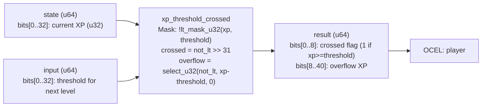

<!-- SCAFFOLDED BY ggen — fill in Context/Forces/Solution/Consequences below, then commit. -->
<!-- Source: ggen/schema/patterns.ttl (xp_threshold_crossed). Re-scaffold: `ggen sync`. -->

# Pattern: XpThresholdCrossed

> **Family:** Economy / Progression · **Kernel:** `xp_threshold_crossed` · **Lowering:** `Mask` · **Id:** 32

Check whether accumulated XP crosses a level-up threshold and compute overflow XP branchlessly.

---

## Context

Leveling systems accumulate XP from kills, quests, and exploration events and fire a level-up when the running total meets or exceeds the threshold for the next level. Overflow XP — the surplus above the threshold — must carry forward to the new level's counter rather than being discarded. The naïve implementation tests `if xp >= threshold` on every XP gain, introducing a conditional branch that mispredicts frequently during burst-XP events (area clears, quest completions). Two separate code paths for the crossed and not-crossed case also complicate replay-log analysis.

## Forces

- **Branch misprediction** — a conditional `if xp >= threshold` mispredicts at every level boundary crossing, introducing pipeline stalls during high-XP-rate events.
- **Deterministic latency** — the Mask lowering reduces the threshold check to a complement of `lt_mask_u32` and a `select_u32`, executing in O(1) regardless of XP or threshold values.
- **Overflow XP carry** — surplus XP above the threshold must be computed and returned when the threshold is crossed; a naïve subtraction without clamping could underflow when the threshold is not crossed.
- **Zero-masking** — when the threshold is not crossed, the overflow field must be zero, not `xp - threshold` (which would underflow); `select_u32` applies this mask branchlessly.
- **OCEL auditability** — OCEL event code 94 ties every XP accumulation event to a `player` object trace, enabling level-up forensics.

## Solution

The kernel packs state as bits[0..32] = current XP (u32) and input as bits[0..32] = XP threshold. `lt_mask_u32(xp, threshold)` produces 0xFFFF_FFFF when xp < threshold, else 0; complement (`!`) yields the "greater-or-equal" mask. The crossed flag is extracted from bit 31 of this mask. Overflow XP is computed with `xp.saturating_sub(threshold)` (safe — result is 0 when xp < threshold) and then zero-masked with `select_u32(not_lt_mask, overflow, 0)`. The result packs the crossed flag into bits[0..8] and the overflow XP into bits[8..40]. The `Mask` lowering is the right choice because the problem reduces to a single comparison whose boolean result gates a downstream value — exactly the select-on-mask idiom.

## Consequences

**Gains:** the level-up check and overflow computation complete in O(1) with no branch; the zero-masking of overflow when not-crossed eliminates the second code path; OCEL event 94 provides a per-level-up audit entry. **Costs:** XP and threshold are bounded to u32 (4 billion); games with larger XP ranges must widen the state field. **Compositions:** the crossed flag feeds directly into [LevelGateEvaluated](level_gate_evaluated.md) — a level-up result gates new content access — and the pattern is structurally parallel to [CurrencyDeltaApplied](currency_delta_applied.md), which uses the same saturating accumulation for balances.

---

## Structure Diagram



---

## Evidence Model

| Field | Value |
|---|---|
| OCEL activity | `XpThresholdCrossed` |
| Event code | `94` |
| OTEL span | `94` |
| Object kinds | `player` |
| Required status | `4` |
| Refusal status | `7` |
| Authority | oracle predicate: matches xp_threshold_crossed_reference for all inputs |

---

## Metadata

| Field | Value |
|---|---|
| Pattern id | 32 |
| Family | Economy / Progression |
| Lowering | `Mask` |
| State cardinality | 2 |
| Primitive | `bcinr_logic::mask::lt_mask_u32` |
| Kernel signature | `xp_threshold_crossed(state: u64, input: u64) -> u64` |
| Source kernel | `src/patterns/xp_threshold_crossed.rs` |

---

## How to Use

```rust
use wasm4games::patterns::xp_threshold_crossed;

// Pack state and input into u64 fields as documented in the kernel source.
let result = xp_threshold_crossed(state, input);
```

The kernel is a pure `fn(u64, u64) -> u64` — no side effects, no allocation, no branches.
Pair with the evidence layer to emit OCEL events, OTEL spans, and receipt folds:

```rust
use wasm4games::evidence::{ocel::OcelEvent, otel};

let result = xp_threshold_crossed(state, input);
otel::emit(94);
let ev = OcelEvent::new(94, logical_tick, admission_status);
```

---

## Related Patterns

- [CurrencyDeltaApplied](currency_delta_applied.md) — XP accumulation uses the same saturating-add pattern before the threshold check.
- [LevelGateEvaluated](level_gate_evaluated.md) — the crossed flag from this kernel gates ability and content unlocks.
- [MasteryMomentDetected](mastery_moment_detected.md) — a level-up crossing is the canonical mastery moment event.
