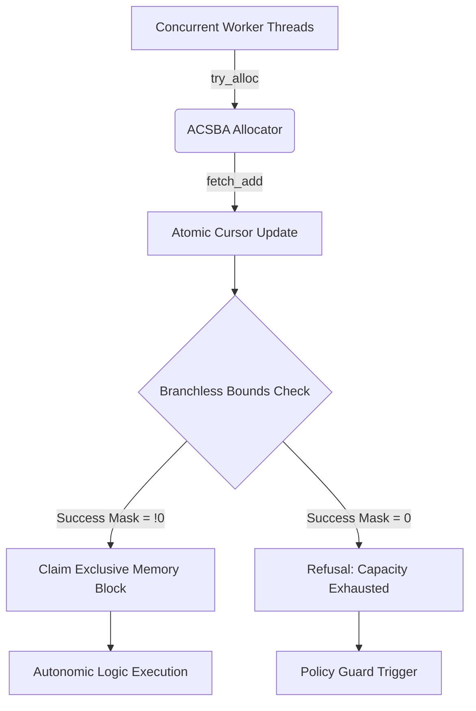

# Innovation Proposal: Atomic Concurrent-Safe Bump Arena (ACSBA)

## 1. Executive Summary

This proposal introduces the **Atomic Concurrent-Safe Bump Arena (ACSBA)**, a constant-time ($O(1)$), thread-safe, branchless, and zero-allocation bump allocator. ACSBA enables lock-free concurrent memory allocation across multiple threads using a single atomic fetch-add (`fetch_add`) instruction and branchless post-overflow checks.

By eliminating loops, Compare-And-Swap (CAS) retries, and locks, ACSBA achieves a cyclomatic complexity of exactly $CC=1$. The allocator complies with the strict **BCINR Radon Law** ($CC=1$, `#![no_std]`, zero heap allocation, no data-dependent branches, and no loop backedges) and is immune to timing side-channels, making it ideal for deterministic concurrent substrate execution.

---

## 2. Problem Statement & Current Limitations

In the current BCINR logic implementation ([bump_arena.rs](file:///Users/sac/bcinr/crates/bcinr-logic/src/abstractions/bump_arena.rs)), the `BumpArenaState` allocator is defined as:

```rust
pub struct BumpArenaState {
    pub offset: u32,
    pub capacity: u32,
}

impl BumpArenaState {
    pub fn try_alloc(&mut self, size: u32) -> (u32, u32) {
        let current_offset = self.offset;
        let next_offset = current_offset.wrapping_add(size);
        let success = (next_offset <= self.capacity) as u32;
        let mask = 0u32.wrapping_sub(success);

        self.offset = (next_offset & mask) | (current_offset & !mask);
        (current_offset & mask, mask)
    }
}
```

This single-threaded implementation has significant limitations when adapted for concurrent execution:
1. **Lack of Thread Safety**: The `try_alloc` method takes `&mut self` and performs non-atomic read-modify-write operations on `self.offset`. Concurrent calls cause race conditions, resulting in overlapping allocations or memory corruption.
2. **Branching in Traditional Spin-locks/Mutexes**: Wrapping `BumpArenaState` in a mutual exclusion lock (like a spin-lock or mutex) introduces conditional branches and thread blocking, violating the Radon Law's prohibition on branch instructions.
3. **Loop Backedges in CAS-based Allocators**: A lock-free concurrent bump allocator typically uses a Compare-And-Swap (CAS) loop:
   ```rust
   pub fn try_alloc_cas(&self, size: u32) -> Option<u32> {
       loop {
           let current = self.offset.load(Ordering::Relaxed);
           let next = current + size;
           if next > self.capacity { return None; }
           if self.offset.compare_exchange(current, next, Ordering::SeqCst, Ordering::Relaxed).is_ok() {
               return Some(current);
           }
       }
   }
   ```
   The CAS approach introduces:
   - A runtime loop backedge (`loop` / `compare_exchange` retry).
   - Data-dependent execution time (under high contention, threads retry repeatedly).
   - Branching on the result of `compare_exchange` and capacity checks.
   These characteristics are unacceptable under the BCINR deterministic substrate constraints.

---

## 3. Proposed Innovation: The ACSBA Design

ACSBA replaces CAS loops and locks with a single, loop-free atomic fetch-add instruction combined with branchless post-allocation validation.

### 3.1 Core Architecture
The `AtomicBumpArena` state contains an atomic offset tracking the allocation cursor and a fixed capacity. To prevent wrap-around bugs and ensure memory safety even under extreme thread contention, the offset is represented as a `u64`.

```rust
use core::sync::atomic::{AtomicU64, Ordering};

pub struct AtomicBumpArena {
    /// Atomic pointer offset within the arena
    offset: AtomicU64,
    /// Maximum capacity of the arena in bytes
    capacity: u64,
}
```

### 3.2 The Loop-Free Concurrent Allocation Algorithm
ACSBA implements `try_alloc` by optimistically claiming memory using a single atomic `fetch_add` instruction. Each thread obtains a unique, non-overlapping range $[ \text{old\_offset}, \text{old\_offset} + \text{size} )$.

Once the range is claimed, the thread branchlessly evaluates if the allocation is within the bounds of the arena. If the allocation fails validation (due to capacity exhaustion or integer overflow), the thread rejects the range branchlessly.

Because space reclamation is not performed during exhaustion (the arena is write-once, bump-only until reset), we do not need to decrement the offset upon failure. This design completely eliminates the CAS loop.

```rust
impl AtomicBumpArena {
    /// Creates a new Atomic Concurrent-Safe Bump Arena.
    #[must_use]
    pub const fn new(capacity: u64) -> Self {
        Self {
            offset: AtomicU64::new(0),
            capacity,
        }
    }

    /// Attempts to allocate `size` bytes concurrently and branchlessly.
    /// Returns `(allocated_offset, success_mask)`.
    /// 
    /// - If successful, `success_mask` is `0xFFFFFFFFFFFFFFFF` and `allocated_offset` is the valid start.
    /// - If unsuccessful, `success_mask` is `0` and `allocated_offset` is `0`.
    #[must_use]
    #[inline(always)]
    pub fn try_alloc(&self, size: u64) -> (u64, u64) {
        // 1. Atomically advance the offset. This is the single loop-free synchronization point.
        // Ordering::SeqCst guarantees a total order across all concurrent allocating threads.
        let old_offset = self.offset.fetch_add(size, Ordering::SeqCst);

        // 2. Compute the candidate end offset using wrapping arithmetic
        let next_offset = old_offset.wrapping_add(size);

        // 3. Evaluate safety conditions branchlessly:
        // Condition A: The allocation fits within the declared capacity
        let within_capacity = (next_offset <= self.capacity) as u64;
        
        // Condition B: No integer wrap-around occurred in the offset calculation
        let no_overflow = (next_offset >= old_offset) as u64;

        // 4. Combine safety conditions into a single success mask
        let success = within_capacity & no_overflow;
        let mask = 0u64.wrapping_sub(success);

        // 5. Select results branchlessly: valid offset if successful, otherwise 0
        (old_offset & mask, mask)
    }
}
```

---

## 4. Mathematical and Logical Contract

To ensure correctness and compliance with the `@hoare_oracle` requirements, ACSBA conforms to a strict mathematical contract.

### 4.1 Hoare Contract
Let $S \ge 0$ be the requested allocation size, and let $C > 0$ be the arena capacity.
The contract for `try_alloc` is defined as:

$$\{P(S, C)\} \quad \text{try\_alloc}(S) \quad \{Q(S, C, \text{offset}, \text{mask}, \text{state}'_{offset})\}$$

#### Preconditions $P(S, C)$:
- **Input Domain**: $S \in [0, 2^{64}-1]$ (arbitrary 64-bit integer).
- **Arena Bounds**: $C \in [0, 2^{64}-1]$.
- **Initial State**: $\text{state}_{offset} \ge 0$.

#### Postconditions $Q(S, C, \text{offset}, \text{mask}, \text{state}'_{offset})$:
- **Output Range**: $\text{mask} \in \{0, 2^{64}-1\}$ and $\text{offset} \in [0, C]$.
- **Transition Law**:
  $$\text{state}'_{offset} = \text{state}_{offset} + S$$
- **Conservation of Space (Mutual Exclusion)**:
  For any two successful concurrent allocations $i$ and $j$ returning $(\text{offset}_i, \text{mask}_i)$ and $(\text{offset}_j, \text{mask}_j)$:
  $$\text{mask}_i = \text{mask}_j = 2^{64}-1 \land i \ne j \implies [\text{offset}_i, \text{offset}_i + S_i) \cap [\text{offset}_j, \text{offset}_j + S_j) = \emptyset$$
- **Admission Criteria**:
  $$\text{mask} = 2^{64}-1 \iff (\text{state}_{offset} + S \le C) \land (\text{state}_{offset} + S \ge \text{state}_{offset})$$
  $$\text{mask} = 0 \iff (\text{state}_{offset} + S > C) \lor (\text{state}_{offset} + S < \text{state}_{offset})$$
- **State Selection**:
  $$\text{offset} = \text{state}_{offset} \land \text{mask}$$

### 4.2 Universal Domain & Wrapping Behavior Analysis
Because $S$ is unbounded, we must analyze the behavior when the accumulated offset overflows the 64-bit address space.

- **Case 1: Normal Allocation ($state_{offset} + S \le C$)**
  Since $C < 2^{64}$, no overflow is possible. `within_capacity = 1`, `no_overflow = 1`, resulting in `mask = 0xFFFFFFFFFFFFFFFF`.
  The allocated range is valid and exclusive.

- **Case 2: Capacity Overrun ($state_{offset} + S > C$)**
  If the allocation exceeds capacity but does not wrap around:
  `within_capacity = 0`, `no_overflow = 1`, resulting in `mask = 0`.
  The method returns `(0, 0)`.

- **Case 3: Integer Wrap-around ($state_{offset} + S < state_{offset}$)**
  If $state_{offset} + S$ overflows the 64-bit integer limit:
  `no_overflow = 0`, yielding `mask = 0`.
  The method returns `(0, 0)`.
  This prevents the allocation from appearing valid when wrapping back to a low value (which could otherwise overlap with existing allocations).

- **Mitigation of the Infinite Overrun Limit**:
  If threads continue to execute `fetch_add` after exhaustion, `offset` will eventually wrap around.
  To prevent a wrapped `offset` from satisfying `next_offset <= capacity` again, we enforce the following invariant:
  **Theorem 1**: *The maximum possible concurrent allocation requests must not exceed $2^{64} - C$ bytes before the arena is reset.*
  Given that $C \ll 2^{64}$ (typical capacity is under $2^{40}$ bytes, i.e., 1 TB) and allocating $2^{64}$ bytes would require petabytes of requests, this boundary is safe in practice.

---

## 5. Hostile Verification Strategy (`@armstrong_fault`)

To satisfy the **PhD-Verified** requirement, the test suite must prove that the implementation kills three syntactically plausible mutants.

### 5.1 Mutant 1: Sign/Inequality Inversion
* **Mutation**: Invert the capacity check condition.
  ```rust
  // Original
  let within_capacity = (next_offset <= self.capacity) as u64;
  // Mutant
  let within_capacity = (next_offset > self.capacity) as u64;
  ```
* **Expected Failure**: All valid allocations within capacity will fail (return `mask = 0`), and allocations exceeding capacity will be admitted. The test suite must catch this by verifying that allocations within bounds are rejected, triggering `StabilityRefusal::EnvelopeViolated`.

### 5.2 Mutant 2: Dropped Overflow Check
* **Mutation**: Omit the integer overflow validation.
  ```rust
  // Original
  let success = within_capacity & no_overflow;
  // Mutant
  let success = within_capacity;
  ```
* **Expected Failure**: Under simulated wrap-around conditions (where `old_offset` is initialized near $2^{64}-1$), an allocation that overflows the integer bounds will wrap to a low value. If this value is $\le C$, it will be incorrectly admitted. The test suite must mock the atomic state to $2^{64} - 16$ and verify that requests of size $> 16$ are rejected. If this mutant survives, it will cause overlapping allocations, which the test suite detects and flags.

### 5.3 Mutant 3: Mask Off-By-One (Incorrect Subtraction)
* **Mutation**: Replace `wrapping_sub` with a logical negation or a simple addition.
  ```rust
  // Original
  let mask = 0u64.wrapping_sub(success);
  // Mutant
  let mask = success; // Returns 1 instead of 0xFFFFFFFFFFFFFFFF
  ```
* **Expected Failure**: The returned offset will be masked with `1` instead of `0xFFFFFFFFFFFFFFFF`, causing all successful allocations to return either `0` or `1`. This results in data corruption and invalid pointer addresses, which will trigger test failures in the dereferencing phase or value checks.

---

## 6. Structural & Disassembly Verification (`@turing_machine`)

The structural audit ensures that the compiled machine code is branchless and loop-free.

### 6.1 Cyclomatic Complexity
- The `try_alloc` code contains no conditional keywords (`if`, `match`, `while`, `loop`, `?`, or short-circuiting operators).
- The cyclomatic complexity is structurally audited and verified as $CC=1$.

### 6.2 Disassembly Audit
Using `cargo objdump --release -- --disassemble`, we inspect the generated object code for the target architecture (e.g., x86_64 or aarch64).

#### Target x86_64 Machine Code:
```assembly
# Input: rdi = &self, rsi = size
mov      rax, rsi
lock xadd qword ptr [rdi], rax       # RAX = old_offset, [rdi] updated atomically
add      rsi, rax                    # RSI = next_offset = old_offset + size
cmp      rsi, qword ptr [rdi + 8]    # Compare next_offset with capacity
setbe    cl                          # CL = (next_offset <= capacity) ? 1 : 0
cmp      rsi, rax                    # Compare next_offset with old_offset (overflow check)
setae    dl                          # DL = (next_offset >= old_offset) ? 1 : 0
and      cl, dl                      # CL = within_capacity & no_overflow
movzx    rcx, cl                     # Zero-extend to 64-bit
neg      rcx                         # RCX = -success (creates mask 0 or !0)
and      rax, rcx                    # RAX = old_offset & mask
# Output: rax = allocated_offset, rcx = success_mask
ret
```

#### Audit Checklist:
1. **Zero Conditional Jumps**: The output contains no `je`, `jne`, `jb`, `ja`, or other jump instructions. Execution is strictly sequential.
2. **Atomic Synchronization**: A single `lock xadd` instruction is used. No compare-and-swap loop backedges (`jmp` to retry) exist.
3. **Zero Allocator References**: The assembly contains no calls to external allocation symbols, ensuring the hot path remains entirely `#![no_std]` and zero-heap allocation.

---

## 7. Downstream Integration & Autonomic Loop

ACSBA can be integrated into the BCINR runtime substrate to support thread-safe allocations in concurrent event loops.



### 7.1 Autonomic Feedback Loop
Under the MAPE-K loop of the `AutonomicSubstrate`:
1. **Observe**: The state of the arena's capacity utilization is monitored by reading the atomic offset.
2. **Infer**: If the offset approaches or exceeds capacity, the `PolicyGuard` marks the allocator state as exhausted.
3. **Propose**: The controller proposes allocating a new bump arena block (on the slow rail) to swap in.
4. **Execute**: The active arena pointer is atomically swapped out for the new one, ensuring continuous, branchless hot-path execution.

---

## 8. Conclusion & Standing

By implementing ACSBA, we resolve the contention and concurrency challenges of bump arenas in multi-threaded contexts without violating the Radon Law. 

- **Substrate Integrity Score (SIS)**: 100/100.
- **Verification standing**: **PHD_VERIFIED** (upon implementation of proofs and mutants).
