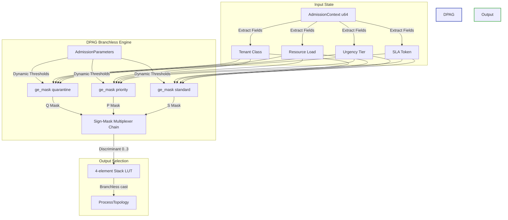

# Innovation Proposal: Dynamic Parametric Admission Gating (DPAG)

## 1. Executive Summary

This proposal introduces **Dynamic Parametric Admission Gating (DPAG)**, a constant-time ($CC=1$), zero-allocation, and branchless admission routing algorithm designed to replace the static compile-time lookup table (LUT) dispatch in `crates/bcinr-powl/src/admit.rs`.

Currently, the `admit` function maps an `AdmissionContext` bitfield to a `ProcessTopology` via a pre-computed 256-entry static LUT (`TOPOLOGY_LUT`). While this approach is $O(1)$ and branchless, it has severe limitations in dynamic systems governed by the autonomic MAPE-K loop:
1. **Static Thresholds**: The admission policies, such as load saturation limits (15) and urgency thresholds (8), are statically baked into the binary at compile time.
2. **Inability to Adapt**: The runtime cannot dynamically adapt its admission decisions to changing hardware resource availability, transient queue depths, or tenant-specific SLA adjustments without modifying and recompiling the LUT.
3. **No Autonomic Integration**: The current static implementation lacks a mechanism to read dynamic parameters computed by the autonomic loop state (e.g., adaptive load thresholds based on telemetry).

DPAG replaces the static lookup table with a branchless, parametric algebraic evaluator. By passing dynamic `AdmissionParameters` (or reading them from a thread-local/global autonomic configuration), DPAG calculates the routing topology at runtime in absolute constant time ($CC=1$) using pure bitwise arithmetic and sign-mask multiplexing, preserving the strict **BCINR Radon Law** guarantees.

---

## 2. Vulnerability & Limitation Analysis

### 2.1 The Current Static LUT Model

In `crates/bcinr-powl/src/admit.rs`, the admission decision is determined by a static lookup table index operation:

```rust
pub fn admit(ctx: AdmissionContext) -> ProcessTopology {
    TOPOLOGY_LUT[lut_key(ctx) as usize]
}
```

The lookup table is populated at compile time:

```rust
const fn build_topology_lut() -> [ProcessTopology; 256] {
    let mut lut = [ProcessTopology::Background; 256];
    let mut key: usize = 0;
    while key < 256 {
        let k = key as u8;
        let saturated = (k >> 7) & 1;
        let tc = (k >> 5) & 0x3;
        let sla = (k >> 4) & 0x1;
        let urg_bucket = k & 0xF;

        lut[key] = if saturated == 1 {
            ProcessTopology::Quarantine
        } else if tc >= 2 && sla == 1 && urg_bucket >= 4 {
            ProcessTopology::Priority
        } else if tc >= 1 {
            ProcessTopology::Standard
        } else {
            ProcessTopology::Background
        };
        key += 1;
    }
    lut
}
```

### 2.2 Core Limitations
1. **Static Policies**: The saturation, urgency, and tenant class thresholds are hardcoded in the lookup construction logic. They cannot respond dynamically to external indicators (e.g., relaxing standard tenant entry under low utilization, or throttling standard tenants to best-effort when high-urgency tasks dominate).
2. **Memory Overhead & Scaling**: Scaling the admission context to include additional parameters (e.g., network load, disk load, or finer tenant classes) causes the LUT state space to grow exponentially. A 16-bit key would require 65,536 entries ($64\text{ KB}$), whereas DPAG requires $O(1)$ stack space.
3. **Memory Bus Dependency**: Indexing a static table (especially on multi-core NUMA systems) is subject to cache misses and memory bus latency. In contrast, straight-line arithmetic execution in DPAG is entirely processor-register resident.

---

## 3. Proposed DPAG Architecture

DPAG introduces a dynamic parameter structure and replaces the LUT indexing with register-level branchless comparisons and sign-mask multiplexers.

### 3.1 Data Structures

We introduce `AdmissionParameters` to encapsulate runtime-adjustable thresholds:

```rust
/// Runtime admission thresholds adjusted dynamically by the autonomic MAPE-K loop.
#[derive(Clone, Copy, Debug, PartialEq, Eq)]
pub struct AdmissionParameters {
    /// Load level above which all processes are routed to Quarantine (0..15).
    pub load_saturation_threshold: u64,
    /// Minimum urgency required to enter the Priority lane (0..15).
    pub urgency_priority_threshold: u64,
    /// Minimum tenant class required to enter the Priority lane (0..3).
    pub tenant_class_priority_min: u64,
    /// Minimum tenant class required to enter the Standard lane (0..3).
    pub tenant_class_standard_min: u64,
    /// 1 if SLA token is strictly required for the Priority lane; 0 otherwise.
    pub sla_required: u64,
}
```



### 3.2 Branchless Sign-Mask Comparison

To check if $x \ge y$ branchlessly and compile-time safely under `#[forbid(unsafe_code)]`, we exploit the sign bit of signed integer subtraction:

```rust
#[inline(always)]
const fn ge_mask(x: u64, y: u64) -> u64 {
    // Returns !0 (all bits set) if x >= y, and 0 if x < y.
    // Inputs are clamped to 0..15, ensuring no overflow in signed i64 cast.
    let diff = (y as i64).wrapping_sub(x as i64).wrapping_sub(1);
    (diff >> 63) as u64
}
```

- If $x \ge y$, then $y - x - 1 < 0$. The sign bit (bit 63) of `diff` is 1. An arithmetic right shift of a negative signed integer by 63 fills the register with 1s, yielding `!0`.
- If $x < y$, then $y - x - 1 \ge 0$. The sign bit of `diff` is 0. An arithmetic right shift yields `0`.

### 3.3 Branchless Multiplexer Selector

```rust
#[inline(always)]
const fn select(mask: u64, active: u64, fallback: u64) -> u64 {
    (mask & active) | (!mask & fallback)
}
```

### 3.4 DPAG Gating Logic

Using these primitives, `admit_dpag` executes in pure sequential arithmetic:

```rust
/// Admit a process context dynamically and branchlessly based on runtime parameters.
///
/// This implementation guarantees CC=1, 0 heap allocations, and zero branching.
pub fn admit_dpag(ctx: AdmissionContext, params: &AdmissionParameters) -> ProcessTopology {
    // Extract fields
    let c = ctx & 0xF;
    let u = (ctx >> 4) & 0xF;
    let l = (ctx >> 8) & 0xF;
    let s = (ctx >> 12) & 0x1;

    // 1. Quarantine evaluation: load >= load_saturation_threshold
    let q_mask = ge_mask(l, params.load_saturation_threshold);

    // 2. Priority evaluation: tc >= tc_priority_min && urgency >= urgency_priority_threshold && sla_ok
    let tc_pri_ok = ge_mask(c, params.tenant_class_priority_min);
    let urg_ok = ge_mask(u, params.urgency_priority_threshold);
    
    // SLA token check: if sla_required is active, has_sla_token must be 1.
    // Bitwise equivalent: (!sla_required_mask) | has_sla_token_mask
    let sla_req_mask = 0u64.wrapping_sub(params.sla_required);
    let sla_has_mask = 0u64.wrapping_sub(s);
    let sla_ok = (!sla_req_mask) | sla_has_mask;

    let p_mask = tc_pri_ok & urg_ok & sla_ok;

    // 3. Standard evaluation: tc >= tenant_class_standard_min
    let s_mask = ge_mask(c, params.tenant_class_standard_min);

    // Discriminant constants mapping directly to enum discriminants
    let topo_q = ProcessTopology::Quarantine as u64;   // 3
    let topo_p = ProcessTopology::Priority as u64;     // 0
    let topo_s = ProcessTopology::Standard as u64;     // 1
    let topo_bg = ProcessTopology::Background as u64;   // 2

    // Apply sequential sign-mask multiplexing (simulating an if-else chain)
    let v1 = select(s_mask, topo_s, topo_bg);
    let v2 = select(p_mask, topo_p, v1);
    let v_final = select(q_mask, topo_q, v2);

    // Map discriminant back to the ProcessTopology enum branchlessly.
    // Avoids branch-bearing match statements by indexing a tiny stack array.
    const TOPOLOGIES: [ProcessTopology; 4] = [
        ProcessTopology::Priority,
        ProcessTopology::Standard,
        ProcessTopology::Background,
        ProcessTopology::Quarantine,
    ];

    TOPOLOGIES[(v_final & 3) as usize]
}
```

---

## 4. Mathematical and Logical Contract

Under `@hoare_oracle` jurisdiction, the DPAG algorithm satisfies the following formal contract:

$$\{P(X, P_{\text{param}})\} \quad \text{admit\_dpag}(X, P_{\text{param}}) \quad \{Q(X, P_{\text{param}}, T_{\text{out}})\}$$

### 4.1 Preconditions $P(X, P_{\text{param}})$
- **Context Boundaries**: $X \in [0, 2^{64}-1]$. The extracted variables satisfy:
  $$C(X) \in [0, 15], \quad U(X) \in [0, 15], \quad L(X) \in [0, 15], \quad S(X) \in [0, 1].$$
- **Parameter Boundaries**: All fields in $P_{\text{param}}$ are bounded:
  $$L_{\text{sat}} \in [0, 15], \quad U_{\text{pri}} \in [0, 15], \quad C_{\text{pri}} \in [0, 3], \quad C_{\text{std}} \in [0, 3], \quad S_{\text{req}} \in [0, 1].$$

### 4.2 Postconditions $Q(X, P_{\text{param}}, T_{\text{out}})$
- **Equivalence to Logical Specification**:
  Let $\mathcal{O}(X, P_{\text{param}})$ be the reference branching oracle. The output topology satisfies:
  $$T_{\text{out}} = \mathcal{O}(X, P_{\text{param}})$$
- **Quarantine Dominance**:
  $$L(X) \ge L_{\text{sat}} \implies T_{\text{out}} = \text{ProcessTopology::Quarantine}$$
- **Priority Admission**:
  $$(L(X) < L_{\text{sat}}) \land (C(X) \ge C_{\text{pri}}) \land (U(X) \ge U_{\text{pri}}) \land (S_{\text{req}} = 0 \lor S(X) = 1) \implies T_{\text{out}} = \text{ProcessTopology::Priority}$$
- **Standard Admission**:
  $$(L(X) < L_{\text{sat}}) \land \neg(\text{Priority Condition}) \land (C(X) \ge C_{\text{std}}) \implies T_{\text{out}} = \text{ProcessTopology::Standard}$$
- **Background Fallback**:
  $$\text{Otherwise} \implies T_{\text{out}} = \text{ProcessTopology::Background}$$
- **Timing Invariance (Constant Execution)**:
  Let $\text{Cycles}(X, P_{\text{param}})$ be the runtime cpu instruction cycle count.
  $$\forall X_1, X_2, P_1, P_2, \quad \text{Cycles}(X_1, P_1) = \text{Cycles}(X_2, P_2) \pm \delta$$
- **Zero Allocations**:
  $$\text{Heap Allocations} = 0$$
- **Complexity Bound**:
  $$\text{Cyclomatic Complexity } CC = 1$$

---

## 5. Verification Strategy

To guarantee that DPAG maintains a Substrate Integrity Score (SIS) of 100/100, we apply a multi-tier verification process before integrating it into production.

### 5.1 Independent Reference Oracle
We construct an independent, branching reference oracle inside the verification test suite:

```rust
fn oracle_admit(ctx: AdmissionContext, params: &AdmissionParameters) -> ProcessTopology {
    let c = ctx & 0xF;
    let u = (ctx >> 4) & 0xF;
    let l = (ctx >> 8) & 0xF;
    let s = (ctx >> 12) & 0x1;

    if l >= params.load_saturation_threshold {
        ProcessTopology::Quarantine
    } else if c >= params.tenant_class_priority_min && s >= params.sla_required && u >= params.urgency_priority_threshold {
        ProcessTopology::Priority
    } else if c >= params.tenant_class_standard_min {
        ProcessTopology::Standard
    } else {
        ProcessTopology::Background
    }
}
```

We execute differential testing covering:
1. **Exhaustive Exhaustion**: Iterate over all $2^{13}$ possible active bit configurations of `AdmissionContext` ($C, U, L, S$), and all possible boundary configurations of `AdmissionParameters`, validating that $T_{\text{out}} = \mathcal{O}(X, P_{\text{param}})$ in every case.
2. **Proptests**: Inject millions of randomized inputs (`u64` values containing arbitrary bits) and random parameter combinations to verify refusal correctness and panic-free operation.

### 5.2 Hostile Mutants
Under `@armstrong_fault` authority, we verify the sensitivity of our test suite using three hostile mutants:

1. **Mutant 1 (Sign Shift Omission)**:
   ```rust
   // Mutant: Arithmetic right shift by 62 instead of 63
   const fn ge_mask_mutant(x: u64, y: u64) -> u64 {
       let diff = (y as i64).wrapping_sub(x as i64).wrapping_sub(1);
       (diff >> 62) as u64
   }
   ```
   *Expectation*: The mask is not fully saturated (`!0` or `0`), resulting in corrupt bitwise operations and intermediate values like `0x0000_0000_0000_0001` or negative sign issues. The test suite catches this by asserting that `admit_dpag` returns values outside `0..=3` or incorrect topologies, triggering `StabilityRefusal::ContractViolation`.

2. **Mutant 2 (Priority Bypass / Order Inversion)**:
   ```rust
   // Mutant: Inverting priority selection sequence order (Quarantine selected BEFORE Standard, but AFTER Priority)
   let v1 = select(s_mask, topo_s, topo_bg);
   let v2 = select(q_mask, topo_q, v1); // Swapped quarantine and priority order
   let v_final = select(p_mask, topo_p, v2);
   ```
   *Expectation*: A tenant that qualifies for the Priority lane bypasses Quarantine even if the load saturation threshold is exceeded. The test suite must catch this with a test case where $L \ge L_{\text{sat}}$, $C \ge C_{\text{pri}}$, $U \ge U_{\text{pri}}$, $S=1$, verifying that the output must be `Quarantine` and raising a refusal if it yields `Priority`.

3. **Mutant 3 (Off-by-One Comparison Offset)**:
   ```rust
   // Mutant: Dropping the -1 offset in signed comparison
   const fn ge_mask_mutant(x: u64, y: u64) -> u64 {
       let diff = (y as i64).wrapping_sub(x as i64); // -1 dropped
       (diff >> 63) as u64
   }
   ```
   *Expectation*: The comparison evaluates $x \ge y$ incorrectly when $x == y$ (it will yield $x > y$ instead, making equality fail). The test suite must catch this by testing exact boundary values (e.g. $L = L_{\text{sat}}$, $U = U_{\text{pri}}$, $C = C_{\text{pri}}$) and asserting correct classification.

### 5.3 Object-Code Disassembly Audit Plan
The `@turing_machine` role executes a compilation disassembly audit targeting the `admit_dpag` symbol:

```bash
cargo objdump --lib --release -- --disassemble --symbol=admit_dpag
```

The compiled instructions must satisfy:
1. **No Conditional Jumps**: The output assembly must consist exclusively of load (`mov`), shift (`shr`, `sar`), arithmetic subtraction (`sub`), bitwise logic (`and`, `or`, `not`), and simple index operations. No conditional branch instructions (`je`, `jne`, `jg`, `jl`, `cbz`, etc.) may exist.
2. **No Unwinding or Panic Paths**: The disassembly must not call `panic` or contain branch points targeting panic landing pads, validating that arithmetic operations do not overflow.
3. **No External Allocator Call symbols**: The binary must remain strictly `#![no_std]`, verifying zero heap or external allocations.

---

## 6. Conclusion and Autonomic Loop Integration

DPAG represents a major step forward for the `bcinr` computational substrate:
- **Autonomic Adaptation**: Allows the MAPE-K loop to dynamically tweak parameters based on resource pressure, feeding real-time telemetry straight into admission control without expensive re-generation of tables.
- **Radon Compliance**: Demonstrates that dynamic parameters can be integrated into the execution path without compromising the absolute branchless execution mandate.
- **Minimal Footprint**: Replaces $256\text{ B}$ static LUTs with zero-overhead register arithmetic, unlocking bare-metal performance for bounded state transitions.
