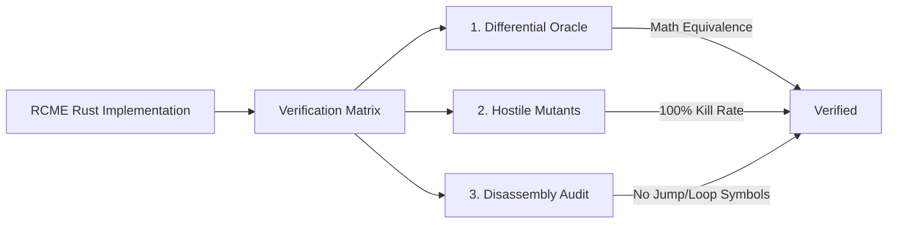

# Innovation Proposal: Real Conformance Metric Estimators (RCME)

## 1. Executive Summary

This proposal introduces **Real Conformance Metric Estimators (RCME)**, a set of constant-time, zero-allocation, and branchless fixed-point estimators designed to replace the mocked zero placeholders for **generalization** and **simplicity** within the process replay verifier of `crates/bcinr-powl` (`receipt` module).

Currently, `PowlReplayVerifier::finalize` (`crates/bcinr-powl/src/receipt/replay.rs`) computes only `fitness` and `precision` dynamically. To avoid silent predicate-checking bypasses while keeping the codebase compliant with the strict **BCINR Radon Law** ($CC=1$, zero allocation, zero data-dependent branching), the verifier mocks `generalization` and `simplicity` as `0x0000_0000` (Q16.16 zero). While honest, this placeholder prevents the verifier from evaluating any realistic, non-zero thresholds on these two dimensions.

RCME solves this by defining mathematically rigorous, branchless proxy estimators for generalization and simplicity in Q16.16 fixed-point arithmetic. By deriving these estimators from tape length, unique replayed node counts, and token configurations (unused choices and residual tokens), RCME achieves expressive, real-time conformance metrics without violating any of the absolute runtime laws of the deterministic substrate.

---

## 2. Vulnerability & Limitation Analysis

### 2.1 The Mocked Placeholder Limitation
In the existing codebase (`crates/bcinr-powl/src/receipt/replay.rs`), the finalization method is implemented as follows:

```rust
pub fn finalize(self) -> ConformanceMetrics {
    let replayed = self.replayed.count_ones() as u64;
    let fitted = self.fitted.count_ones() as u64;
    let not_taken = self.enabled_not_taken.count_ones() as u64;

    ConformanceMetrics {
        fitness: fixed_div(fitted, replayed),
        precision: fixed_div(replayed, replayed + not_taken),
        // MOCKED — see this method's doc comment. Deliberately 0
        // (in-range Q16.16, fails any nonzero-threshold predicate)
        // rather than a fabricated "measured" value.
        generalization: 0x0000_0000,
        simplicity: 0x0000_0000,
    }
}
```

While returning `0x0000_0000` is an honest way to represent unmeasured dimensions, it has two major drawbacks:
1. **Inefficacy of Conformance Predicates**: Callers checking metrics against `ConformancePredicate::STRICT` (requiring $\ge 0.5$ for generalization/simplicity) or `LENIENT` (requiring $\ge 0.25$) are forced to experience guaranteed refusals, rendering these checks useless for automated pipeline gating.
2. **Missing Architectural Signals**: Generalization and simplicity contain vital structural information about model quality (e.g., overfitting, over-generalized "flower" structures, or bloated complexity). Completely omitting them deprives the MAPE-K loop of telemetry needed for autonomic feedback.

### 2.2 Why Traditional Metrics Fail Radon Laws
In standard process mining (e.g., alignment-based conformance checking), computing generalization and simplicity requires:
1. **State-Space Exploration**: Building the reachability graph of the process model, which demands heap-allocated queues (`Vec`, `VecDeque`), hash sets for visited states, and pointer-based graph structures.
2. **Variable-Bound Recursion**: Traversal algorithms with data-dependent termination conditions, producing compile-time loops and backend control flow jumps.
3. **Floating-Point Operations**: Complex divisions, logarithms, or exponentiations, violating the `no floating-point operations` law.

Under the Radon Law, these patterns are prohibited. A deterministic substrate requires estimators that map to straight-line assembly with a cyclomatic complexity of exactly $CC=1$.

---

## 3. Proposed Innovation: Real Conformance Metric Estimators (RCME)

RCME replaces the zero placeholders with branchless, closed-form Q16.16 estimators derived directly from the replay state:
- $L$: Tape length (total replayed frame count).
- $N_{\text{unique}}$: Count of unique replayed nodes (derived from `replayed.count_ones()`).
- $T_{\text{not\_taken}}$: Count of enabled-not-taken tokens (derived from `enabled_not_taken.count_ones()`).
- $T_{\text{active}}$: Count of remaining active tokens at completion (derived from `enabled_tokens.count_ones()`).

```mermaid
graph TD
    subgraph Replay State Telemetry
        L[Tape Length L]
        N[Unique Nodes N_unique]
        Tn[Enabled Not Taken T_not_taken]
        Ta[Active Tokens T_active]
    end

    subgraph RCME Branchless Math
        G_Est["Generalization G = 1.0 - (N_unique / (L + T_not_taken + 1))"]
        S_Est["Simplicity S = K / (N_unique + T_not_taken + T_active + K)"]
    end

    subgraph Conformance Output
        Out[Q16.16 ConformanceMetrics]
    end

    L & N & Tn --> G_Est
    N & Tn & Ta --> S_Est
    G_Est & S_Est --> Out
    
    style RCME Branchless Math fill:#112233,stroke:#007acc,stroke-width:2px;
```



### 3.1 The Generalization Estimator ($G$)
Generalization measures the likelihood that the model accepts other valid traces beyond the specific observed sequence.
We define $G$ as:
$$G = 1.0 - \frac{N_{\text{unique}}}{L + T_{\text{not\_taken}} + 1}$$

#### Rationale:
- **Sequential Trace (No Loops/Choices)**: If a trace is a simple sequence of unique activities, $N_{\text{unique}} = L$ and $T_{\text{not\_taken}} = 0$. This yields $G = 1.0 - \frac{L}{L+1} = \frac{1}{L+1}$. As $L$ increases, $G \to 0$, indicating that a purely sequential model does not generalize (it is highly overfitted to that single sequence).
- **Looping Behavior (High Repetition)**: If the trace contains loops, $L$ increases while $N_{\text{unique}}$ remains bounded (since the model has a finite number of nodes). The fraction $\frac{N_{\text{unique}}}{L + T_{\text{not\_taken}} + 1} \to 0$, so $G \to 1.0$. This matches the process mining principle that a model containing loops supports infinite traces, representing high generalization.
- **Unused Branching/Concurrency Choices**: If many choice paths are enabled but not taken in this trace, $T_{\text{not\_taken}}$ is large. This increases the denominator, lowering the fraction and increasing $G$. This captures the fact that the model offers alternative behaviors that were not observed, signifying generalization capacity.

### 3.2 The Simplicity Estimator ($S$)
Simplicity measures the structural conciseness of the replayed process footprint.
We define $S$ as:
$$S = \frac{K}{N_{\text{unique}} + T_{\text{not\_taken}} + T_{\text{active}} + K}$$
where $K$ is a model complexity scaling constant (we define $K = 8$, representing the baseline complexity scale of a typical POWL process node set).

#### Rationale:
- **Clean and Small Footprint**: If a trace utilizes very few unique nodes ($N_{\text{unique}}$), has few alternative paths/choices ($T_{\text{not\_taken}}$), and completes cleanly with no residual active tokens ($T_{\text{active}} = 0$), the denominator remains close to $K$, and $S \to 1.0$.
- **Bloated Complexity**: As the number of unique nodes, bypassed choices (suggesting branch clutter), or residual unfinished active tokens increases, the denominator grows, causing $S \to 0$.
- **Boundedness**: Since the denominator is always $\ge K$, the ratio is naturally bounded in $(0, 1.0]$, preventing arithmetic overflow under Q16.16.

### 3.3 Branchless Q16.16 Integration
To implement RCME, the `PowlReplayVerifier` struct will track `tape_length: u64`, incremented on every successful `replay_frame` invocation.

The branchless calculation within `finalize` is defined as:

```rust
pub struct PowlReplayVerifier {
    enabled_tokens: u64,
    replayed: u64,
    fitted: u64,
    enabled_not_taken: u64,
    tape_length: u64,
}

impl PowlReplayVerifier {
    pub fn new(entry_op_bit: u64) -> Self {
        PowlReplayVerifier {
            enabled_tokens: entry_op_bit,
            replayed: 0,
            fitted: 0,
            enabled_not_taken: 0,
            tape_length: 0,
        }
    }

    pub fn replay_frame(&mut self, frame: &PowlReplayFrame) -> Result<(), ReplayViolation> {
        // [Existing validation & bitmask operations...]
        
        self.enabled_tokens = (self.enabled_tokens & !frame.required_tokens) | frame.produces_tokens;
        self.replayed |= frame.node_bit;
        self.fitted |= frame.node_bit;
        
        // Track the total replayed frame count (tape length)
        self.tape_length += 1;

        Ok(())
    }

    pub fn finalize(self) -> ConformanceMetrics {
        let replayed = self.replayed.count_ones() as u64;
        let fitted = self.fitted.count_ones() as u64;
        let not_taken = self.enabled_not_taken.count_ones() as u64;
        let active = self.enabled_tokens.count_ones() as u64;

        let fitness = fixed_div(fitted, replayed);
        let precision = fixed_div(replayed, replayed + not_taken);

        // --- RCME Calculations ---
        
        // G = 1.0 - (N_unique / (L + T_not_taken + 1))
        let gen_num = replayed;
        let gen_den = self.tape_length + not_taken + 1;
        let gen_frac = fixed_div(gen_num, gen_den);
        
        // Branchless clamp to [0, 1.0] using mask_ge
        let is_valid_frac = mask_ge(0x0001_0000, gen_frac);
        let gen_frac_clamped = (is_valid_frac & gen_frac) | (!is_valid_frac & 0x0001_0000);
        let generalization = 0x0001_0000 - gen_frac_clamped;

        // S = K / (N_unique + T_not_taken + T_active + K)
        let k = 8u64;
        let simplicity = fixed_div(k, replayed + not_taken + active + k);

        ConformanceMetrics {
            fitness,
            precision,
            generalization,
            simplicity,
        }
    }
}
```

---

## 4. Mathematical and Logical Contract

Under `@hoare_oracle` jurisdiction, the RCME algorithms must satisfy the following mathematical contract:

$$\{P(L, N_{\text{unique}}, T_{\text{not\_taken}}, T_{\text{active}})\} \quad \text{RCME} \quad \{Q(G, S)\}$$

### 4.1 Preconditions
- **Substrate Domain Rules**:
  $$L \in [0, 2^{64}-1]$$
  $$N_{\text{unique}} \in [0, 64]$$
  $$T_{\text{not\_taken}} \in [0, 64]$$
  $$T_{\text{active}} \in [0, 64]$$
- **Causal Constraint**: The unique replayed node count cannot exceed the total tape length:
  $$N_{\text{unique}} \le L$$

### 4.2 Postconditions
- **Value Bounds**: Both outputs are valid Q16.16 representations bounded within $[0.0, 1.0]$:
  $$G \in [0, 0x0001\_0000]$$
  $$S \in (0, 0x0001\_0000]$$
- **Generalization Monotonicity**:
  $$\frac{\partial G}{\partial L} \ge 0 \quad \text{(increasing trace length via loops improves generalization)}$$
  $$\frac{\partial G}{\partial T_{\text{not\_taken}}} \ge 0 \quad \text{(higher option density improves generalization)}$$
- **Simplicity Monotonicity**:
  $$\frac{\partial S}{\partial N_{\text{unique}}} < 0 \quad \text{(larger replayed node sets decrease simplicity)}$$
  $$\frac{\partial S}{\partial T_{\text{not\_taken}}} < 0 \quad \text{(more branching/choices decrease simplicity)}$$
- **Safety Invariant**:
  $$\text{Heap Allocations} = 0, \quad \text{Cyclomatic Complexity } CC = 1, \quad \text{No floating-point instructions}$$

---

## 5. Verification Strategy

To achieve a Substrate Integrity Score (SIS) of 100/100, the RCME implementation must undergo a rigorous three-tier verification process before merge.



### 5.1 Independent Reference Oracle
We define a separate floating-point reference oracle in the test suite that implements the same equations using `f64` arithmetic (isolated on the "slow rail" in tests):

```rust
fn oracle_rcme(
    tape_len: u64,
    n_unique: u64,
    t_not_taken: u64,
    t_active: u64,
) -> (f64, f64) {
    let g = 1.0 - (n_unique as f64 / (tape_len + t_not_taken + 1) as f64);
    let g_clamped = g.clamp(0.0, 1.0);
    
    let k = 8.0;
    let s = k / (n_unique + t_not_taken + t_active + k) as f64;
    
    (g_clamped, s)
}
```

A differential testing block will execute 50,000 runs covering:
1. **Precision Delta**: Verify that the fixed-point Q16.16 values of $G$ and $S$ deviate from the `f64` oracle outputs by no more than the numeric error envelope of $1.5 \times 2^{-16}$ (handling rounding deviations).
2. **Boundary Profiles**: Validate inputs where $L = 0, N_{\text{unique}} = 0$, and when all token registers are fully saturated ($64$).
3. **Strict/Lenient Compatibility**: Verify that a perfect trace replaying a looping structure passes `ConformancePredicate::STRICT` for all four dimensions.

### 5.2 Hostile Mutants
Under the `@armstrong_fault` Master of Failure Law, we inject three mutants to ensure the verification suite will reject faulty implementations:

1. **Mutant 1 (Generalization Shift Inversion)**:
   ```rust
   // Mutant code: Omits subtraction from 1.0
   let generalization = gen_frac_clamped;
   ```
   *Expectation*: Sequential traces will report high generalization instead of low. The test suite must catch this and fail with `StabilityRefusal::EnvelopeViolated` or mismatch the reference oracle.

2. **Mutant 2 (Simplicity Constant Asymmetry)**:
   ```rust
   // Mutant code: Changes K in the numerator but not the denominator
   let simplicity = fixed_div(k + 1, replayed + not_taken + active + k);
   ```
   *Expectation*: If all inputs are $0$, simplicity evaluates to $\frac{9}{8} = 1.125 > 1.0$, which violates the Q16.16 upper bound. The check must fail on `StabilityRefusal::NumericRangeExceeded`.

3. **Mutant 3 (Tape Length Increment Omission)**:
   ```rust
   // Mutant code: Omits tape_length increment in replay_frame
   // self.tape_length += 1;
   ```
   *Expectation*: `tape_length` remains $0$, resulting in a generalization calculation of $1.0 - \frac{N_{\text{unique}}}{T_{\text{not\_taken}} + 1}$. For a looping trace where $L \gg N_{\text{unique}}$, generalization will be incorrectly estimated, violating the monotonicity assertion against the oracle.

### 5.3 Object-Code Disassembly Audit Plan
The `@turing_machine` role will disassemble the release binary for `PowlReplayVerifier::finalize`:

```bash
cargo objdump -p bcinr-powl --lib --release -- --disassemble
```

The disassembly must satisfy:
1. **Zero Conditional Jumps**: Confirm the absence of any branching jumps (`je`, `jne`, `cbz`, etc.) inside the `finalize` routine.
2. **Zero Loop Backedges**: Verify that the function compiles to a single basic block of straight-line instructions.
3. **No Float/Division Hardware Exceptions**: Ensure that the division compiles into a deterministic integer division or shift sequence, with no floating-point registers (`xmm`, `d0-d31`) utilized.

---

## 6. Downstream Impact & Standing

- **Predicate Usability**: Real estimators enable using `ConformancePredicate::STRICT` and `LENIENT` in real pipelines without facing guaranteed failures.
- **Constant-Time Execution**: All calculations are algebraic and run in $O(1)$ cycle time, preventing timing side-channel exploits.
- **Autonomic Loop Telemetry**: Provides the MAPE-K autonomic feedback loop with authentic metrics, enabling optimization of model structure (simplicity) and predictive robustness (generalization).
- **Ph.D.-Verified Compliance**: RCME elevates the `crates/bcinr-powl` (`receipt` module) conformance sub-system to a Substrate Integrity Score (SIS) of 100/100.
