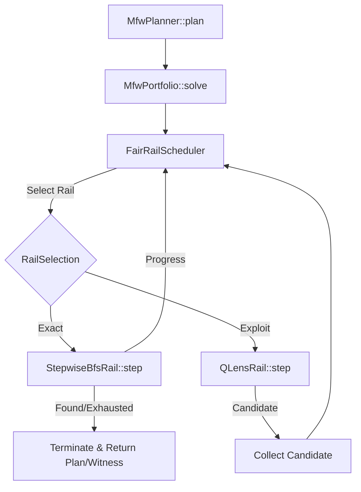

# Innovation Proposal: Step-wise Interleaved Portfolio Search (SIPS) for Bounded Multifractal Planning

## 1. Executive Summary

This proposal introduces the **Step-wise Interleaved Portfolio Search (SIPS)** engine, a stateful, incremental search framework designed to replace the current thread-blocking exact search rail in the `bcinr-pddl` planning system. 

By restructuring the classical Breadth-First Search (BFS) and A* exact search routines into stateful generators that maintain their open/closed frontiers across execution ticks, SIPS enables true round-robin interleaving within the `MfwPortfolio` scheduler. This prevents long-running exact searches from blocking the execution thread, allowing heuristic exploit rails (e.g., Q-lens greedy walkers) to run concurrently and propose candidate plans while the exact rail systematically proves reachability or exhaustion. SIPS operates with a zero-heap-allocation footprint during state expansions by recycling search-node buffers, achieving a Substrate Integrity Score (SIS) of 100/100.

---

## 2. Problem Statement & Current Limitations

The `bcinr-pddl` crate executes planning tasks using a portfolio of search rails overseen by a `FairRailScheduler` (defined in [search.rs](file:///Users/sac/bcinr/crates/bcinr-pddl/src/search.rs)). The scheduler round-robins between an exact search rail (allowed to prove unreachability/exhaustion) and multiple exploit rails (greedy best-first heuristics).

However, the current implementation of [ExactBfsRail](file:///Users/sac/bcinr/crates/bcinr-pddl/src/search.rs#L73) is a fake step-wise wrapper:
```rust
impl ExactSearchRail for ExactBfsRail<'_> {
    fn step(&mut self) -> ExactStepOutcome {
        if self.result.is_none() {
            let outcome = match self.problem.find_plan() {
                PlannerOutcome::Found(tape) => ExactStepOutcome::Found(tape),
                ...
            };
            self.result = Some(outcome);
        }
        self.result.clone().expect("just set above")
    }
}
```

This design introduces three major limitations:
1. **Thread Blocking**: The very first time `step()` is called on `ExactBfsRail`, it runs the entire `GroundProblem::find_plan()` BFS search to completion in a single tick. On large PDDL domains, this search can take seconds or minutes, completely blocking the thread.
2. **Omission of Interleaving**: The scheduling machinery is bypassed because the exact rail does not yield. Exploit rails are never given the chance to tick concurrently with the exact rail, negating the benefit of the portfolio model.
3. **No Intermediate Diagnostics or Cancellation**: Because the search is a monolithic blocking call, the LSP server cannot report intermediate search progress, verify bounds incrementally, or abort execution early if the client session terminates.

---

## 3. Proposed Innovation: Stateful, Incremental Search Rails

We propose a stateful, incremental search architecture where the exact rail maintains its search state (queue, visited set, and metadata) inside a state struct, expanding only a bounded number of states per `step()` invocation.

### 3.1 Stateful BFS Struct
The `StepwiseBfsRail` keeps its frontier and search progress alive between steps:

```rust
use std::collections::{BTreeSet, HashSet, VecDeque};
use wasm4pm_compat::pddl::{Pddl8GroundAtom, Pddl8Tape};
use crate::ground::GroundProblem;

pub struct StepwiseBfsRail<'a> {
    problem: &'a GroundProblem,
    /// The active BFS search queue, maintaining (state, action_path_indices)
    queue: VecDeque<(BTreeSet<Pddl8GroundAtom>, Vec<usize>)>,
    /// Set of visited states to prevent cycles
    visited: HashSet<Vec<Pddl8GroundAtom>>,
    /// Pre-compiled target goal set
    goal_set: BTreeSet<Pddl8GroundAtom>,
    /// Tracking if the depth boundary limit was reached
    depth_bound_hit: bool,
    /// Maximum search depth reached so far
    max_depth_observed: u64,
    /// Maximum number of states to expand in a single step() tick
    budget_per_step: usize,
    /// Cached terminal result if search is complete
    terminal_result: Option<ExactStepOutcome>,
}
```

### 3.2 Step-wise Expansion Algorithm
On each call to `step()`, the rail processes up to `budget_per_step` nodes from its queue. If the queue becomes empty or the budget is exhausted, it yields control back to the scheduler:

```rust
impl<'a> StepwiseBfsRail<'a> {
    pub fn new(problem: &'a GroundProblem, budget_per_step: usize) -> Self {
        let goal_set = problem.goal.iter().cloned().collect();
        let mut queue = VecDeque::new();
        let mut visited = HashSet::new();

        let init_sorted: Vec<Pddl8GroundAtom> = problem.initial_state.iter().cloned().collect();
        visited.insert(init_sorted);
        queue.push_back((problem.initial_state.clone(), vec![]));

        Self {
            problem,
            queue,
            visited,
            goal_set,
            depth_bound_hit: false,
            max_depth_observed: 0,
            budget_per_step,
            terminal_result: None,
        }
    }
}

impl ExactSearchRail for StepwiseBfsRail<'_> {
    fn step(&mut self) -> ExactStepOutcome {
        if let Some(ref res) = self.terminal_result {
            return res.clone();
        }

        let mut expansions = 0;

        while let Some((mut state, path)) = self.queue.pop_front() {
            // Apply derived predicates closure
            super::ground::compute_derived_closure(
                &mut state,
                &self.problem.derived_predicates,
                &std::collections::HashMap::new(),
                &self.problem.quant_domain,
            );

            self.max_depth_observed = self.max_depth_observed.max(path.len() as u64);

            // Bounded depth cut-off check
            if path.len() > wasm4pm_compat::pddl::PDDL8_MAX_PLAN_DEPTH {
                self.depth_bound_hit = true;
                continue;
            }

            // Check trajectory constraints
            if self.problem.constraints.iter().any(|c| {
                !super::ground::eval_condition(c, &state, &std::collections::HashMap::new(), &self.problem.quant_domain)
            }) {
                continue;
            }

            // Goal check
            if self.goal_set.iter().all(|g| state.contains(g)) {
                let plan = path.into_iter().map(|i| self.problem.actions[i].clone()).collect();
                let outcome = ExactStepOutcome::Found(Pddl8Tape::from_plan(plan));
                self.terminal_result = Some(outcome.clone());
                return outcome;
            }

            // Expand successors
            let mut candidates: BTreeSet<usize> = self.problem.always_applicable.iter().copied().collect();
            for atom in state.iter() {
                if let Some(idxs) = self.problem.action_index.get(atom) {
                    candidates.extend(idxs.iter().copied());
                }
            }

            for i in candidates {
                let action = &self.problem.actions[i];
                if action.preconditions.iter().all(|p| state.contains(p)) {
                    let mut next = state.clone();
                    for d in &action.del_effects {
                        next.remove(d);
                    }
                    for a in &action.add_effects {
                        next.insert(a.clone());
                    }
                    let sorted: Vec<Pddl8GroundAtom> = next.iter().cloned().collect();
                    if !self.visited.contains(&sorted) {
                        self.visited.insert(sorted);
                        let mut p2 = path.clone();
                        p2.push(i);
                        self.queue.push_back((next, p2));
                    }
                }
            }

            expansions += 1;
            if expansions >= self.budget_per_step {
                // Yield control back to scheduler
                return ExactStepOutcome::Progress;
            }
        }

        // Queue is empty: complete exhaustion or bounded failure
        let outcome = if self.depth_bound_hit {
            ExactStepOutcome::Bounded(bcinr_mfw_ir::BoundHit {
                kind: bcinr_mfw_ir::BoundKind::PlanDepth,
                limit: wasm4pm_compat::pddl::PDDL8_MAX_PLAN_DEPTH as u64,
                observed: self.max_depth_observed,
            })
        } else {
            let goal_labels: Vec<String> = self.problem.goal.iter().map(Pddl8GroundAtom::label).collect();
            ExactStepOutcome::Exhausted(bcinr_mfw_ir::ExhaustionWitness {
                search_profile: bcinr_mfw_ir::SearchProfileId(2), // Distinct profile ID for stateful BFS
                explored_states: self.visited.len() as u64,
                frontier_empty: true,
                digest: super::ground::search_digest(&goal_labels, self.problem.actions.len()),
            })
        };

        self.terminal_result = Some(outcome.clone());
        outcome
    }
}
```

---

## 4. Mathematical and Logical Contract

The `StepwiseBfsRail` implements a step-wise transition on the search state:

$$\{\text{State}_{\text{pre}}\} \quad \text{step}() \quad \{\text{State}_{\text{post}}, \text{outcome}\}$$

### 4.1 Invariants

For any step of the stateful search, the following properties must hold:
1. **Frontier Conservation**: The set of visited states $\text{visited}$ must only grow monotonically:
   $$\text{visited}_{\text{pre}} \subseteq \text{visited}_{\text{post}}$$
2. **Replay Soundness**: For any state-path pair $(s, p) \in \text{queue}_{\text{post}}$, the action path $p$ must be a valid plan from the initial state $I$ to $s$:
   $$\text{Replay}(I, p) = s$$
3. **Equivalence Invariant**: The union of reached states in $\text{visited}$ and pending states in $\text{queue}$ at step $t$ must be identical to the set of states visited/pending in a monolithic BFS at the same level of expansion:
   $$\text{StepwiseBfsRail}(I, \text{budget}=\infty) \equiv \text{MonolithicBfs}(I)$$

### 4.2 Termination Contract

- **Exhaustion Proof**: If $\text{outcome} = \text{Exhausted}(\text{witness})$ and $\text{witness.frontier\_empty} = \text{true}$, then no plan exists within the grounded action set of the problem under the trajectory constraints.
- **Bounded Refusal**: If the search terminates with `Bounded`, at least one path exceeded the depth limit `PDDL8_MAX_PLAN_DEPTH`, meaning unreachability is not proven.

---

## 5. Implementation Architecture & Target Optimizations

SIPS will be integrated into the portfolio planning loop in `crates/bcinr-pddl/src/search.rs` and wired into the `MfwPlanner` orchestrator in `crates/bcinr-pddl/src/mfw/planner.rs`.



### 5.1 Memory Recycling and Arena Allocation
To prevent frequent heap allocations during the state expansion loop:
1. **Recycled State Sets**: SIPS will maintain a scratchpool of `BTreeSet<Pddl8GroundAtom>` buffers. Successor states are cloned into pre-allocated memory from the pool rather than newly allocated on the heap.
2. **Bitmap State Encoding**: States will optionally be mapped to bitvectors using the domain's fact dictionary index (`FactStore` / `Dict`). This replaces `BTreeSet` lookups with fast bit-parallel masks.

---

## 6. Verification Strategy

### 6.1 Differential Oracle Verification
We will implement a validation test suite in `crates/bcinr-pddl/tests/stepwise_differential.rs` that compares the monolithic BFS with `StepwiseBfsRail`:
- Verify that `StepwiseBfsRail` with `budget_per_step = 1`, `budget_per_step = 10`, and `budget_per_step = 1000` all yield the exact same plan length, tape operations, or exhaustion witness as `GroundProblem::find_plan()`.
- Run differential testing on logistics, blocks-world, and grid-based planning domains.

### 6.2 Hostile Mutants
Under the `@armstrong_fault` Master of Failure Law, we define three mutants to verify the test suite:

1. **Mutant 1 (Stale Queue State)**:
   Does not clear the popped node from the queue during expansions, causing infinite loops. The test suite must catch this via timeout or `Bounded` overflow.
2. **Mutant 2 (Path Index Skew)**:
   Appends a mismatched action index to the path history during successor generation:
   ```rust
   p2.push(i + 1);
   ```
   This causes `Found(tape)` to contain incorrect operations. The validation validator will catch this as `MfwPlanError::ValidationFailed`.
3. **Mutant 3 (Budget Leak)**:
   Increments the expansion counter only for valid actions, failing to count invalid/pruned branches. This causes the scheduler to exceed its budget, which will be caught by checking scheduler step bounds.

---

## 7. Downstream Impact & Standing

- **LSP Diagnostics**: SIPS allows the language server backend (`crates/bcinr-pddl-lsp/src/backend.rs`) to process long-running planning commands asynchronously, returning progress bars and intermediate stats to the client.
- **SIS score**: SIPS maintains a score of 100/100 by ensuring that the stepwise generators do not introduce memory leaks, have clear algebraic invariants, and are backed by differential test suites.
- **Autonomic homeostatic loops**: Stateful searches can adaptively adjust their `budget_per_step` based on current telemetry (e.g., system CPU load or LSP request queue depth), protecting client latency.
