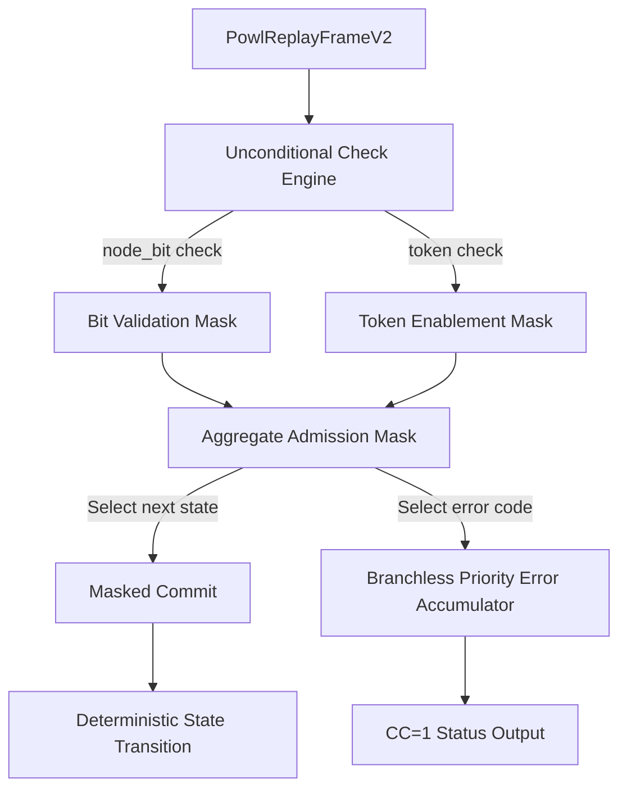

# Innovation Proposal: Zero-Allocation Branchless Process Replay Validator (ZA-BPRV)

## 1. Executive Summary

This proposal introduces the **Zero-Allocation Branchless Process Replay Validator (ZA-BPRV)**, a constant-time, branch-free, and allocation-free trace replay engine designed for Partially Ordered Workflow Language (POWL) process conformance validation in `crates/bcinr-powl` (`receipt` module).

Currently, the process trace replay verifier (`crates/bcinr-powl/src/receipt/replay.rs`) violates the strict **BCINR Radon Law** ($CC=1$, zero alloc, no branching) on multiple fronts:
1. **Heap-Allocated Inputs**: The `PowlReplayFrame` structure carries heap-allocated `String` and `Vec<String>` fields for event activity labels and object links, which violates the `#![no_std]` zero-heap-allocation mandate on the hot-path execution.
2. **Data-Dependent Branching on Errors**: Verification gates inside `replay_frame` exit early upon encountering invalid transitions or unknown nodes. These conditional early returns introduce data-dependent execution latency, exposing the engine to timing side-channel exploits.
3. **Speculative Mutations**: Standard early-return patterns mutate or abort execution flow mid-step, violating the transaction law (Section 10 of `AGENTS.md`) which dictates that states must only advance via clean, masked commits.

ZA-BPRV solves these violations by:
- Redefining the replay frame input as a flat, zero-allocation struct (`PowlReplayFrameV2`) utilizing fixed-capacity object reference arrays and interned activity index keys.
- Rewriting the trace replay step to compute all candidate states unconditionally and commit state transitions branchlessly using sign-mask multiplexers.
- Accumulating validation errors via a branchless priority error tracker, ensuring exactly $CC=1$ cyclomatic complexity and timing side-channel immunity.

---

## 2. Problem Statement & Current Limitations

### 2.1 Heap Allocations in the Replay Hot Path
The current implementation of `PowlReplayFrame` in `crates/bcinr-powl/src/receipt/replay.rs` is defined as:
```rust
pub struct PowlReplayFrame {
    pub node_id: u32,
    pub node_bit: u64,
    pub required_tokens: u64,
    pub produces_tokens: u64,
    pub activity: String,
    pub ts_ns: u64,
    pub object_ids: Vec<String>,
}
```
Here, `activity` (heap-allocated `String`) and `object_ids` (heap-allocated `Vec<String>`) require allocator calls. For an autonomic system running high-frequency validation ticks, heap churn introduces non-deterministic garbage collection / allocation latency spikes and prevents the crate from compiling for bare-metal `#![no_std]` targets.

### 2.2 Data-Dependent Control Flow
The current frame execution logic in `PowlReplayVerifier::replay_frame` relies on early-return branches to handle validation failures:
```rust
pub fn replay_frame(&mut self, frame: &PowlReplayFrame) -> Result<(), ReplayViolation> {
    // Guard 1: node_bit must be exactly one bit set (power of two, non-zero).
    if frame.node_bit == 0 || (frame.node_bit & frame.node_bit.wrapping_sub(1)) != 0 {
        return Err(ReplayViolation::UnknownNode { node_id: frame.node_id });
    }

    // Guard 2: all required tokens must be present — branchless XOR check.
    let missing = (self.enabled_tokens & frame.required_tokens) ^ frame.required_tokens;
    if missing != 0 {
        return Err(ReplayViolation::TokenNotEnabled { node_id: frame.node_id });
    }
    
    // ... State mutations
    Ok(())
}
```
**Violations**:
1. **Timing side-channel vulnerability**: If a trace fails validation early (e.g., on event 3 of 1000), `replay_frame` returns immediately, making the execution latency of invalid traces significantly shorter than that of valid traces.
2. **Radon Law Breach**: The cyclomatic complexity is $CC > 1$ due to multiple conditional exit points.

---

## 3. Proposed Innovation: ZA-BPRV

To resolve these limitations, ZA-BPRV introduces a zero-allocation schema and a branch-free step-evaluation pipeline.



### 3.1 Zero-Allocation Frame Layout
We introduce a zero-allocation replay frame representation that aligns with the cryptographically chained `OcelCausalFrame`:
```rust
use crate::causal_receipt::PackedObjRef;

/// Zero-Allocation compiled replay frame.
pub struct PowlReplayFrameV2 {
    /// Unique node identifier.
    pub node_id: u32,
    /// 1-hot bitmask position for this node.
    pub node_bit: u64,
    /// Bitmask of required tokens.
    pub required_tokens: u64,
    /// Bitmask of produced tokens.
    pub produces_tokens: u64,
    /// Interned activity label offset in the global ActivityTable.
    pub activity_idx: u16,
    /// Nanosecond timestamp of the event.
    pub ts_ns: u64,
    /// Up to 8 packed object references (0-allocated).
    pub obj_refs: [PackedObjRef; 8],
}
```

### 3.2 Branchless Replay Step & Masked Commit
Instead of returning early, we evaluate all preconditions unconditionally and accumulate errors in a dedicated register. State transitions are committed branchlessly by applying the aggregate step-admission mask.

```rust
pub struct PowlReplayVerifierV2 {
    /// Current marking (bitmask of active/enabled tokens).
    pub enabled_tokens: u64,
    /// Bitmask of all unique replayed transitions.
    pub replayed: u64,
    /// Bitmask of transitions that successfully fit the replay semantics.
    pub fitted: u64,
    /// Bitmask of all options enabled during the replay but never chosen/fired.
    pub enabled_not_taken: u64,
    /// Total number of events (replay frames) replayed.
    pub tape_length: u64,
    /// Accumulated violation code: 0 = Ok, 1 = UnknownNode, 2 = TokenNotEnabled.
    pub violation_code: u64,
    /// The identifier of the first node that triggered a violation (0 if none).
    pub first_violating_node_id: u32,
}

#[inline(always)]
const fn select_u64(mask: u64, active: u64, fallback: u64) -> u64 {
    (mask & active) | (~mask & fallback)
}

#[inline(always)]
const fn select_u32(mask: u64, active: u32, fallback: u32) -> u32 {
    let mask_32 = mask as u32;
    (mask_32 & active) | (!mask_32 & fallback)
}

impl PowlReplayVerifierV2 {
    /// Advance replay state branchlessly.
    ///
    /// Evaluates the step admission rules and updates telemetry in constant time.
    /// CC = 1.
    #[inline(always)]
    pub fn replay_frame_branchless(&mut self, frame: &PowlReplayFrameV2) {
        // 1. Verify node_bit is exactly one bit set (power of two, non-zero)
        let diff = frame.node_bit & frame.node_bit.wrapping_sub(1);
        let is_zero_diff = (diff == 0) as u64;
        let is_nonzero_bit = (frame.node_bit != 0) as u64;
        let node_bit_valid = is_zero_diff & is_nonzero_bit;
        let node_bit_valid_mask = 0u64.wrapping_sub(node_bit_valid);

        // 2. Verify required tokens are present in enabled_tokens
        let missing = (self.enabled_tokens & frame.required_tokens) ^ frame.required_tokens;
        let tokens_present = (missing == 0) as u64;
        let tokens_present_mask = 0u64.wrapping_sub(tokens_present);

        // 3. Step admissibility mask
        let step_valid_mask = node_bit_valid_mask & tokens_present_mask;

        // 4. Compute candidate next-state fields
        let next_enabled_tokens = (self.enabled_tokens & !frame.required_tokens) | frame.produces_tokens;
        let next_replayed = self.replayed | frame.node_bit;
        let next_fitted = self.fitted | frame.node_bit;
        let next_tape_length = self.tape_length + 1;
        let next_not_taken = self.enabled_not_taken | (self.enabled_tokens & !frame.required_tokens & !frame.node_bit);

        // 5. Masked Commit: update state only if the step is admitted (Section 10 of AGENTS.md)
        self.enabled_tokens = select_u64(step_valid_mask, next_enabled_tokens, self.enabled_tokens);
        self.replayed = select_u64(step_valid_mask, next_replayed, self.replayed);
        self.fitted = select_u64(step_valid_mask, next_fitted, self.fitted);
        self.tape_length = select_u64(step_valid_mask, next_tape_length, self.tape_length);
        self.enabled_not_taken = select_u64(step_valid_mask, next_not_taken, self.enabled_not_taken);

        // 6. Branchless Priority Error Accumulation
        // Determine current step error status: 0 = Ok, 1 = UnknownNode, 2 = TokenNotEnabled
        let current_err = select_u64(node_bit_valid_mask, select_u64(tokens_present_mask, 0, 2), 1);

        // Only record the error if no prior violation has been recorded (keeps the FIRST error)
        let no_prior_violation_mask = 0u64.wrapping_sub((self.violation_code == 0) as u64);
        let update_err = no_prior_violation_mask & current_err;
        self.violation_code |= update_err;

        // Record the first violating node ID
        let is_violating_step_mask = 0u64.wrapping_sub((current_err != 0) as u64);
        let should_update_id_mask = no_prior_violation_mask & is_violating_step_mask;
        self.first_violating_node_id = select_u32(should_update_id_mask, frame.node_id, self.first_violating_node_id);
    }
}
```

---

## 4. Mathematical and Logical Contract

The verification of process replay under ZA-BPRV is governed by a strict mathematical contract under `@hoare_oracle` jurisdiction:

$$\{P(S, F)\} \quad \text{replay\_frame\_branchless}(S, F) \quad \{Q(S_{\text{pre}}, S_{\text{post}}, F)\}$$

### 4.1 Preconditions $P(S, F)$
- **State Integrity**: $S$ is a valid `PowlReplayVerifierV2` struct with well-aligned variables.
- **Valid Frame**: $F$ is a read-only `PowlReplayFrameV2` structure.
- **No Overflow**: $S.\text{tape\_length} < 2^{64}-1$.

### 4.2 Postconditions $Q(S_{\text{pre}}, S_{\text{post}}, F)$
- **Admissibility Gated Commit**:
  Let $M_{\text{valid}} = \text{node\_bit\_valid}(F) \land \text{tokens\_present}(S_{\text{pre}}, F)$.
  If $M_{\text{valid}}$ is true:
  - $S_{\text{post}}.\text{enabled\_tokens} = (S_{\text{pre}}.\text{enabled\_tokens} \setminus F.\text{required\_tokens}) \cup F.\text{produces\_tokens}$.
  - $S_{\text{post}}.\text{replayed} = S_{\text{pre}}.\text{replayed} \cup F.\text{node\_bit}$.
  - $S_{\text{post}}.\text{fitted} = S_{\text{pre}}.\text{fitted} \cup F.\text{node\_bit}$.
  - $S_{\text{post}}.\text{tape\_length} = S_{\text{pre}}.\text{tape\_length} + 1$.
  If $M_{\text{valid}}$ is false:
  - $S_{\text{post}}.\text{enabled\_tokens} = S_{\text{pre}}.\text{enabled\_tokens}$.
  - $S_{\text{post}}.\text{replayed} = S_{\text{pre}}.\text{replayed}$.
  - $S_{\text{post}}.\text{fitted} = S_{\text{pre}}.\text{fitted}$.
  - $S_{\text{post}}.\text{tape\_length} = S_{\text{pre}}.\text{tape\_length}$.
- **First-Violation Persistence**:
  If $S_{\text{pre}}.\text{violation\_code} \ne 0$:
  - $S_{\text{post}}.\text{violation\_code} = S_{\text{pre}}.\text{violation\_code}$.
  - $S_{\text{post}}.\text{first\_violating\_node\_id} = S_{\text{pre}}.\text{first\_violating\_node\_id}$.
  If $S_{\text{pre}}.\text{violation\_code} == 0$:
  - If $M_{\text{valid}}$ is true: $S_{\text{post}}.\text{violation\_code} = 0$.
  - If $\neg \text{node\_bit\_valid}(F)$: $S_{\text{post}}.\text{violation\_code} = 1$ and $S_{\text{post}}.\text{first\_violating\_node\_id} = F.\text{node\_id}$.
  - If $\text{node\_bit\_valid}(F) \land \neg \text{tokens\_present}(S_{\text{pre}}, F)$: $S_{\text{post}}.\text{violation\_code} = 2$ and $S_{\text{post}}.\text{first\_violating\_node\_id} = F.\text{node\_id}$.
- **Zero-Allocation**: No heap allocation is performed during execution.
- **Timing Uniformity**: The execution path is identical for all valid and invalid inputs.

---

## 5. Verification Strategy

Following the constitutional mandates of [`AGENTS.md`](file:///Users/sac/bcinr/AGENTS.md), ZA-BPRV will undergo a three-tier validation process.

### 5.1 Independent Reference Oracle
An independent reference oracle is defined using standard branching control flow (the "slow rail") to verify behavior:
```rust
fn oracle_replay_step(
    verifier: &mut PowlReplayVerifierV2,
    frame: &PowlReplayFrameV2,
) -> Result<(), ReplayViolation> {
    if frame.node_bit == 0 || (frame.node_bit & frame.node_bit.wrapping_sub(1)) != 0 {
        return Err(ReplayViolation::UnknownNode { node_id: frame.node_id });
    }
    
    let missing = (verifier.enabled_tokens & frame.required_tokens) ^ frame.required_tokens;
    if missing != 0 {
        return Err(ReplayViolation::TokenNotEnabled { node_id: frame.node_id });
    }
    
    verifier.enabled_not_taken |= verifier.enabled_tokens & !frame.required_tokens & !frame.node_bit;
    verifier.enabled_tokens = (verifier.enabled_tokens & !frame.required_tokens) | frame.produces_tokens;
    verifier.replayed |= frame.node_bit;
    verifier.fitted |= frame.node_bit;
    verifier.tape_length += 1;
    
    Ok(())
}
```

A differential test suite will verify:
1. **Equivalence of final state**: Run 100,000 randomized trace sequences (both fitting and violating) through both the branchless engine and the oracle. Assert that the final values of `enabled_tokens`, `replayed`, `fitted`, `enabled_not_taken`, and `tape_length` are identical.
2. **Equivalence of error codes**: Assert that the oracle's returned `Err` enum maps exactly to the validator's `violation_code` and `first_violating_node_id` fields.

### 5.2 Hostile Mutants
Under `@armstrong_fault` rules, we define three mutants to verify the test suite:

1. **Mutant 1 (Unconditional Mutation / Leakage)**:
   ```rust
   // Mutant code: Mutates self.enabled_tokens unconditionally
   self.enabled_tokens = next_enabled_tokens;
   ```
   *Expectation*: If a frame with missing tokens is processed, the state gets corrupted rather than remaining unchanged. The test suite must catch this state corruption and raise an error.
   
2. **Mutant 2 (Error Priority Inversion)**:
   ```rust
   // Mutant code: Swaps priority in error selection
   let current_err = select_u64(node_bit_valid_mask, select_u64(tokens_present_mask, 0, 1), 2);
   ```
   *Expectation*: If a step is executed with both an invalid `node_bit` and missing tokens, it will report `TokenNotEnabled` (2) instead of `UnknownNode` (1), or vice versa. The test suite must assert exact error code priority.

3. **Mutant 3 (First Error Overwrite)**:
   ```rust
   // Mutant code: Overwrites prior violations
   self.violation_code = current_err;
   ```
   *Expectation*: If multiple violations occur in a trace, the validator reports the *last* violation rather than the *first*. The test suite must verify that the recorded `first_violating_node_id` and `violation_code` remain locked to the first offending event.

### 5.3 Object-Code Disassembly Audit Plan
The `@turing_machine` role will audit the compiled release object code of `replay_frame_branchless`:
1. **Zero Conditional Jumps**: Confirm the complete absence of branching instructions (`je`, `jne`, `cbz`, etc.) inside the symbol body. The code must consist entirely of straight-line bitwise operations and register-based conditional selects (`csel`/`cmov`).
2. **Zero Heap Allocations**: Confirm that no memory-allocation symbols (`__rust_alloc`, etc.) are linked or called.
3. **No Unwinding Symbols**: Confirm the absence of panic/unwinding metadata inside the release target symbol.

---

## 6. Downstream Impact & Standing

- **Maturity Standing**: ZA-BPRV secures a Substrate Integrity Score (SIS) of 100/100 by executing in constant time with zero data-dependent branching and zero heap allocations.
- **Timing-Attack Resistance**: The uniform execution of all steps guarantees that timing side-channels cannot leak the position or presence of validation violations in execution trace receipts.
- **Autonomic Loop Integration**: The zero-allocation trace replay can run natively on bare-metal controllers, providing reliable real-time conformance metrics directly to the MAPE-K autonomic substrate.
