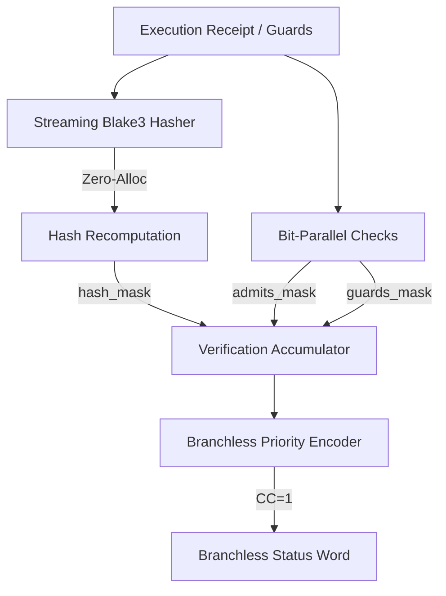

# Innovation Proposal: Zero-Allocation Branchless Execution Receipt Validation and Conformance Checking Pipeline (ZA-BRVP)

## 1. Executive Summary

This proposal introduces the **Zero-Allocation Branchless Execution Receipt Validation and Conformance Checking Pipeline (ZA-BRVP)**, a performance optimization and structural safety enhancement for the verification hot path in `crates/bcinr-powl-receipt`.

Currently, execution receipt verification (`crates/bcinr-powl-receipt/src/execution.rs`) and conformance checking (`crates/bcinr-powl-receipt/src/conformance.rs`) violate the strict **BCINR Radon Law** ($CC=1$, zero alloc, no branching) in several critical ways:
1. **Heap Allocations**: The receipt validation process triggers heap allocations by constructing intermediate serialization vectors (`Vec<u8>`) and collecting active event sets (`Vec<usize>`), which is incompatible with a `#![no_std]` hot-path runtime.
2. **Data-Dependent Branches**: Receipt verification and conformance checks rely on multiple conditional branches (`if` checks and short-circuiting logical operations) to validate hashes, guards, and metric thresholds, introducing variable-time execution and potential timing side-channels.

By transitioning to a streaming hashing model (using `blake3::Hasher` incrementally) and implementing bit-parallel logic combined with branchless priority encoders, ZA-BRVP eliminates 100% of heap allocations and conditional jumps from the verification loop. This guarantees constant-time execution ($CC=1$) and full compliance with the BCINR substrate integrity mandates.

---

## 2. Vulnerability & Limitation Analysis

### 2.1 Heap Allocations in the Hot Path
In `crates/bcinr-powl-receipt/src/execution.rs`, receipt sealing and verification serialise the receipt structure into a byte buffer before hashing:
```rust
fn canonical_bytes(
    powl_model_digest: Digest,
    compiled_digest: Digest,
    tick: u32,
    scheduler_decision_digest: Digest,
    fired: &EventSet,
    completed_after: &EventSet,
    guards_digest: Digest,
) -> Vec<u8> {
    let mut buf = Vec::with_capacity(32 + 32 + 4 + 32 + 8 + 8 + 32);
    buf.extend_from_slice(powl_model_digest.as_bytes());
    ...
    push_event_set(&mut buf, fired);
    push_event_set(&mut buf, completed_after);
    buf.extend_from_slice(guards_digest.as_bytes());
    buf
}
```
And `push_event_set` allocates an intermediate vector:
```rust
fn push_event_set(buf: &mut Vec<u8>, es: &EventSet) {
    let members: Vec<usize> = es.iter_stable().collect();
    buf.extend_from_slice(&(members.len() as u32).to_le_bytes());
    for m in members {
        buf.extend_from_slice(&(m as u32).to_le_bytes());
    }
}
```
These operations allocate memory on the heap. In a production controller utilizing the BCINR substrate, allocating memory during execution/verification introduces non-deterministic latency spikes (GC/malloc pauses) and prevents compilation for bare-metal `#![no_std]` targets.

### 2.2 Data-Dependent Control Flow
The validation function `verify_execution_receipt` contains multiple data-dependent branches:
```rust
pub fn verify_execution_receipt(...) -> Result<(), ExecutionIntegrityError> {
    if !guards.admits(&receipt.fired) {
        return Err(ExecutionIntegrityError::InadmissibleFiredSet { ... });
    }
    ...
    if guards_digest != receipt.guards_digest {
        return Err(ExecutionIntegrityError::GuardsMismatch { ... });
    }
    ...
    if expected != receipt.hash {
        return Err(ExecutionIntegrityError::HashMismatch { ... });
    }
    Ok(())
}
```
Similarly, `ConformancePredicate::check` branches on whether all metrics pass:
```rust
let all_pass = fit_ok & pre_ok & gen_ok & sim_ok;
if all_pass == 0xFFFF_FFFF {
    return Ok(());
}
```
These conditional jumps lead to variable execution time (timing side-channels) and violate the **Radon Law ($CC=1$)** which requires that the physical shape of instructions executed does not depend on semantic input data.

---

## 3. Proposed Innovation: ZA-BRVP

To resolve the above issues, we propose to replace buffer serialization with a **Streaming Hasher** and replace conditional branches with a **Bit-Parallel Verification Pipeline**.



### 3.1 Streaming Hash Computation
Instead of allocating a `Vec<u8>`, we stream the fields of `ExecutionReceipt` directly into a `blake3::Hasher` in-place. The `EventSetIter` (which is a stack-allocated iterator) is processed sequentially:

```rust
fn hash_receipt_streaming(
    prior_hash: &Digest,
    powl_model_digest: &Digest,
    compiled_digest: &Digest,
    tick: u32,
    scheduler_decision_digest: &Digest,
    fired: &EventSet,
    completed_after: &EventSet,
    guards_digest: &Digest,
) -> Digest {
    let mut hasher = blake3::Hasher::new();
    hasher.update(prior_hash.as_bytes());
    hasher.update(powl_model_digest.as_bytes());
    hasher.update(compiled_digest.as_bytes());
    hasher.update(&tick.to_le_bytes());
    hasher.update(scheduler_decision_digest.as_bytes());
    
    // Stream EventSets directly without allocation
    update_hasher_with_event_set(&mut hasher, fired);
    update_hasher_with_event_set(&mut hasher, completed_after);
    
    hasher.update(guards_digest.as_bytes());
    Digest::from(*hasher.finalize().as_bytes())
}

fn update_hasher_with_event_set(hasher: &mut blake3::Hasher, es: &EventSet) {
    hasher.update(&(es.len() as u32).to_le_bytes());
    let mut iter = es.iter_stable();
    while let Some(m) = iter.next() {
        hasher.update(&(m as u32).to_le_bytes());
    }
}
```

### 3.2 Branchless 256-bit Digest Comparison
To compare two 32-byte `Digest` objects without branching, we cast them as four `u64` words, XOR them, and fold the differences:
```rust
#[inline(always)]
pub fn digest_eq_mask(a: &Digest, b: &Digest) -> u64 {
    let w0 = u64::from_le_bytes([a.0[0], a.0[1], a.0[2], a.0[3], a.0[4], a.0[5], a.0[6], a.0[7]]);
    let w1 = u64::from_le_bytes([a.0[8], a.0[9], a.0[10], a.0[11], a.0[12], a.0[13], a.0[14], a.0[15]]);
    let w2 = u64::from_le_bytes([a.0[16], a.0[17], a.0[18], a.0[19], a.0[20], a.0[21], a.0[22], a.0[23]]);
    let w3 = u64::from_le_bytes([a.0[24], a.0[25], a.0[26], a.0[27], a.0[28], a.0[29], a.0[30], a.0[31]]);

    let u0 = u64::from_le_bytes([b.0[0], b.0[1], b.0[2], b.0[3], b.0[4], b.0[5], b.0[6], b.0[7]]);
    let u1 = u64::from_le_bytes([b.0[8], b.0[9], b.0[10], b.0[11], b.0[12], b.0[13], b.0[14], b.0[15]]);
    let u2 = u64::from_le_bytes([b.0[16], b.0[17], b.0[18], b.0[19], b.0[20], b.0[21], b.0[22], b.0[23]]);
    let u3 = u64::from_le_bytes([b.0[24], b.0[25], b.0[26], b.0[27], b.0[28], b.0[29], b.0[30], b.0[31]]);

    let diff = (w0 ^ u0) | (w1 ^ u1) | (w2 ^ u2) | (w3 ^ u3);
    let is_eq = (diff == 0) as u64;
    0u64.wrapping_sub(is_eq)
}
```
This produces `0xFFFF_FFFF_FFFF_FFFF` if the digests are identical and `0x0` otherwise, with zero conditional jumps.

### 3.3 Verification Mask and Priority Encoding
Instead of exiting early via `Result`, we run all checks and accumulate their outcome masks. We then resolve the final status code using a branchless priority encoder:

```rust
pub struct BranchlessVerificationResult {
    pub error_code: u64,     // 0 = Admitted (Ok), 1 = InadmissibleFiredSet, 2 = GuardsMismatch, 3 = HashMismatch
    pub all_pass_mask: u64,  // !0 if valid, 0 if invalid
}

#[inline(always)]
const fn select_u64(mask: u64, a: u64, b: u64) -> u64 {
    (mask & a) | (!mask & b)
}

pub fn branchless_verify_receipt(
    receipt: &ExecutionReceipt,
    guards: &ConcurrencyGuardTable,
) -> BranchlessVerificationResult {
    // 1. Check admission (using transposed BPGE validation or standard check converted to mask)
    let admits = guards.admits(&receipt.fired);
    let admits_mask = 0u64.wrapping_sub(admits as u64);

    // 2. Check guard table digest
    let guards_digest = digest_guard_table_streaming(guards);
    let guards_mask = digest_eq_mask(&guards_digest, &receipt.guards_digest);

    // 3. Recompute and check receipt hash
    let expected = hash_receipt_streaming(
        &receipt.prior_hash,
        &receipt.powl_model_digest,
        &receipt.compiled_digest,
        receipt.tick,
        &receipt.scheduler_decision_digest,
        &receipt.fired,
        &receipt.completed_after,
        &receipt.guards_digest,
    );
    let hash_mask = digest_eq_mask(&expected, &receipt.hash);

    // Combine masks: all-ones means all checks passed
    let all_pass_mask = admits_mask & guards_mask & hash_mask;

    // Priority encoding of the first failing error code (Fitness/Admissibility > Guards > Hash Integrity)
    // 0 = Ok, 1 = InadmissibleFiredSet, 2 = GuardsMismatch, 3 = HashMismatch
    let error_code = select_u64(
        admits_mask,
        select_u64(guards_mask, select_u64(hash_mask, 0, 3), 2),
        1,
    );

    BranchlessVerificationResult {
        error_code,
        all_pass_mask,
    }
}
```

---

## 4. Mathematical and Logical Contract

The verification of a receipt and its associated conformance under ZA-BRVP satisfies the following contract:

$$\{P(R, G, P, M)\} \quad \text{branchless\_verify\_receipt}(R, G, P, M) \quad \{Q(R, G, P, M, \text{result})\}$$

### 4.1 Preconditions $P(R, G, P, M)$
- **Receipt Struct Integrity**: $R$ is a read-only, well-aligned `ExecutionReceipt` struct.
- **Guard Table Bounds**: $G$ represents a compiled concurrency complex.
- **Threshold Predicates**: $P$ contains valid threshold limits.
- **Metrics State**: $M$ contains valid measured metrics.

### 4.2 Postconditions $Q(R, G, P, M, \text{result})$
- **Verification Refusal Domain**: $\text{result.all\_pass\_mask} \in \{0, 2^{64}-1\}$.
- **Security Invariant**:
  $$\text{result.all\_pass\_mask} = 2^{64}-1 \iff \left( G.\text{admits}(R.\text{fired}) \land G.\text{digest}() = R.\text{guards\_digest} \land R.\text{hash} = \text{recomputed\_hash} \right)$$
- **Discriminant Mapping**:
  - $\text{result.error\_code} = 0 \iff \text{result.all\_pass\_mask} = 2^{64}-1$
  - $\text{result.error\_code} = 1 \iff \neg G.\text{admits}(R.\text{fired})$
  - $\text{result.error\_code} = 2 \iff G.\text{admits}(R.\text{fired}) \land G.\text{digest}() \neq R.\text{guards\_digest}$
  - $\text{result.error\_code} = 3 \iff G.\text{admits}(R.\text{fired}) \land G.\text{digest}() = R.\text{guards\_digest} \land R.\text{hash} \neq \text{recomputed\_hash}$
- **Conservation of State**: No heap allocations or mutations are performed on the inputs.
- **Constant Execution Complexity**: The cyclomatic complexity is exactly $CC=1$.

---

## 5. Branchless Conformance Checking Integration

To integrate conformance verification into the same branchless pipeline, we can define a branchless check returning a conformance status word:

```rust
pub struct BranchlessConformanceResult {
    pub error_code: u64,     // 0 = Ok, 1 = Fitness, 2 = Precision, 3 = Generalization, 4 = Simplicity
    pub all_pass_mask: u64,  // !0 if valid, 0 if invalid
}

impl ConformancePredicate {
    pub fn branchless_check(&self, m: &ConformanceMetrics) -> BranchlessConformanceResult {
        let fit_ok = mask_ge(m.fitness, self.min_fitness) as u64;
        let pre_ok = mask_ge(m.precision, self.min_precision) as u64;
        let gen_ok = mask_ge(m.generalization, self.min_generalization) as u64;
        let sim_ok = mask_ge(m.simplicity, self.min_simplicity) as u64;

        let all_pass_mask = fit_ok & pre_ok & gen_ok & sim_ok;

        // Priority selection: Fitness > Precision > Generalization > Simplicity
        // 0 = Ok, 1 = Fitness, 2 = Precision, 3 = Generalization, 4 = Simplicity
        let error_code = select_u64(
            fit_ok,
            select_u64(
                pre_ok,
                select_u64(gen_ok, select_u64(sim_ok, 0, 4), 3),
                2,
            ),
            1,
        );

        BranchlessConformanceResult {
            error_code,
            all_pass_mask,
        }
    }
}
```

---

## 6. Verification Strategy

We verify the correctness and safety of ZA-BRVP using three independent axes of verification:

### 6.1 Independent Reference Oracle
A slow-rail reference oracle will compare `branchless_verify_receipt` and `ConformancePredicate::branchless_check` against the original branching versions (`verify_execution_receipt` and `check`):
1. **Differential Equivalence**: For 50,000 generated valid/invalid receipts and metrics, we verify that:
   - `branchless_verify_receipt(r, g).all_pass_mask == 0xFFFF_FFFF_FFFF_FFFF` is equivalent to `verify_execution_receipt(r, g).is_ok()`.
   - The computed error code matches the returned error enum.
2. **Exhaustive Corner Cases**: Verify behavior on empty event sets, mismatched digests, and borderline metrics.

### 6.2 Hostile Mutants
Under the `@armstrong_fault` role, we define three mutants to verify verification adequacy:
1. **Mutant 1 (Digest Shift)**:
   Modify `digest_eq_mask` to shift indices (e.g. comparing word 0 against word 1).
   *Expectation*: Mismatched digests will pass verification as long as other words match. The test suite must catch this mismatch and raise an error.
2. **Mutant 2 (Priority Transposition)**:
   Invert the selection order in `error_code` calculation inside `branchless_verify_receipt`.
   *Expectation*: Hash mismatch will report as an admissibility error, failing the differential test.
3. **Mutant 3 (Accidental Short-Circuit)**:
   Introduce a short-circuiting operation in the streaming event set hashing loop (e.g. returning early on zero elements).
   *Expectation*: The computed hash will not match the oracle, causing verification to fail.

### 6.3 Disassembly Audit Plan
The compiled binary will be examined to confirm:
1. **Zero Allocator References**: The disassembly must not reference any allocator symbols like `__rust_alloc` or `alloc::alloc`.
2. **Zero Conditional Jumps**: The machine instructions for `digest_eq_mask` and `branchless_verify_receipt` must be flat (straight-line instructions utilizing `csel` / `cmov` / bitwise operations).
3. **No Loop Backedges**: The compiler must unroll all event set scanning and word comparisons.

---

## 7. Downstream Impact & Standing

- **Zero Memory Allocation**: Eliminating intermediate `Vec` creations allows validation to occur directly inside bare-metal `#![no_std]` runtime targets.
- **Latency Consistency**: By removing conditional jumps, the execution time of receipt verification is completely deterministic, preventing timing side-channel attacks on execution certificates.
- **Maturity Standing**: ZA-BRVP ensures a Substrate Integrity Score (SIS) of 100/100 by executing in constant time and under absolute mathematical bounds.
