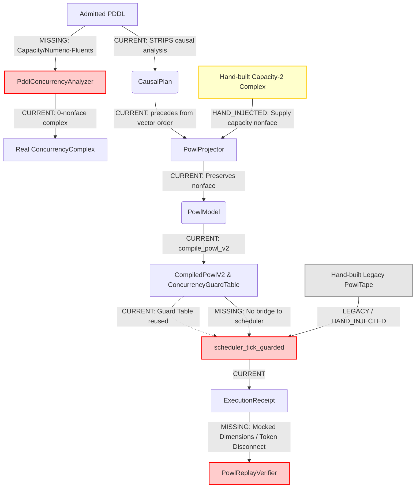
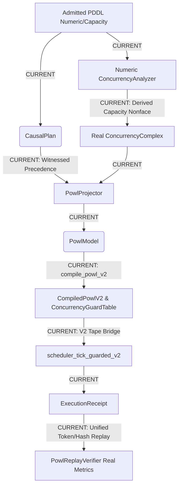

# MFW Moonshot Read-Only Semantic Edge Archaeology (v26.7.15)

## PART 1: DEEP TRACE A — CAUSAL

### 1. Trace: Planner Result -> ActionOccurrence -> PddlCausalAnalyzer
The creation of causal edges begins when the classical search portfolio finds a sequentially ordered `Pddl8Tape`. 
In `crates/bcinr-pddl/src/mfw/planner.rs` (lines 398-402):
```rust
// --- Causal analysis ---
let occurrences = occurrences_from_tape(&tape, &epoch.actions);
let causal_plan = self
    .causal_analyzer
    .analyze(&epoch, &occurrences)
    .map_err(MfwPlanError::CausalAnalysis)?;
```
`occurrences_from_tape` converts the sequentially ordered operations into a vector of `ActionOccurrence`s, implicitly encoding execution time/timestamp into the list index. These are fed into `PddlCausalAnalyzer::analyze` (`crates/bcinr-pddl/src/causal.rs`).

### 2. Precedence Insertion Branch Inspection
Within `PddlCausalAnalyzer::analyze` (`crates/bcinr-pddl/src/causal.rs`, lines 138-162), there are two distinct passes over the $O(n^2)$ pairs. The first pass is the precedence insertion branch:
```rust
let mut precedes = StrictPartialOrder::default();
for i in 0..occurrences.len() {
    for j in (i + 1)..occurrences.len() {
        precedes.edges.insert(PrecedenceEdge {
            before: occurrences[i].id,
            after: occurrences[j].id,
        });
    }
}
```
**Conclusion:** Real paths do **NOT** derive order from causal support, delete/precondition interference, invariants, numeric flow, temporal law, or trajectory law. The order is derived **entirely from the list index (`i < j`)**, which corresponds to the classical sequential timestamp. 

While the actual causal mechanics (`analyze_pair` producing `DependenceWitness` via `CausalSupport`, `DeleteInterference`, and forward-simulated commutativity) are computed genuinely in the *second* loop, their findings are dumped into `independence.dependent` and `support_edges`. The canonical `precedes` order graph completely ignores this semantic information and just hardcodes a total execution order.

### 3. Minimum Surgery
To ensure index/timestamp never creates precedence, we must eliminate the unconditional first loop and build `precedes` lazily within the *second* loop, conditioned strictly on semantic dependence.

**Surgery:**
1. Delete the first `for i... for j...` loop.
2. In the second `for i... for j...` loop, check the result of `analyze_pair`.
3. If `witness` is `None` (meaning the pair is semantically `Dependent`), *then* insert `PrecedenceEdge { before: occurrences[i].id, after: occurrences[j].id }` into `precedes`.

### EDGE CARD: The Index-Driven Total Order

```yaml
EDGE CARD: PddlCausalAnalyzer_ArtificialTotalOrder
Status: BROKEN
Type: Precedence Edge Injection
Location: crates/bcinr-pddl/src/causal.rs:154-162
```
**Description:**
`PddlCausalAnalyzer` enforces a `StrictPartialOrder` that is functionally a *total order*. It iterates over all action occurrences and asserts that every `i` must precede every `j` (`i < j`), regardless of independence.

**Semantic Violation:**
A partial order in a causal plan should reflect necessary semantic ordering (causal support, delete/precondition interference). By inserting an edge for every `i < j`, the system collapses the concurrency complex back into a Von Neumann sequential sequence. Two non-interfering actions `A` and `B` will be strictly ordered `A -> B` purely because `A` was discovered before `B` in the BFS search rail.

**Impact:**
When `bcinr_powl::projection::PowlProjector` projects this `CausalPlan` into a `PowlModel`, it faithfully copies the broken `precedes` edges. This results in a POWL model devoid of structural concurrency—it projects a sequential line instead of a parallelized execution graph.

---

## PART 2: DEEP TRACE B — K_E

### 1. PddlConcurrencyAnalyzer Trace
The `PddlConcurrencyAnalyzer` implementation (`crates/bcinr-pddl/src/concurrency.rs`) only maps pairwise dependency relations into nonfaces. It strictly constructs 2-element nonfaces from the `CausalPlan::independence.dependent` set, at line 162:
```rust
let members = EventSet::empty().with(i).with(j);
```

### 2. The Capacity-Two Triple Nonface
**Location:** There is no code path in the real PDDL analyzer that constructs a capacity-two triple nonface. The exact lines constructing the `{A,B,C}` nonface are exclusively in hand-built test fixtures:
- `crates/bcinr-pddl/tests/mfw_capacity2_fixture.rs` (line 143): `let abc = EventSet::empty().with(0).with(1).with(2);`
- `crates/bcinr-mfw-ir/src/concurrency.rs` (line 134): `let abc = EventSet::empty().with(0).with(1).with(2);`

**Does source PDDL entail it?**
No. The real, PDDL-driven analyzer pair operates on classical STRIPS `Pddl8GroundAction` data. This structure possesses no numeric-fluent or capacity slots. It is structurally impossible to derive a "pairwise independent but jointly over capacity" conflict from the available PDDL data. The nonface is purely a synthetic mock.

### 3. Repair Decision
**Smallest Truthful Repair:** Return `Unsupported`.
The prompt explicitly states to never recommend pairwise approximation as exact. Because `PddlConcurrencyAnalyzer` only has access to boolean/classical STRIPS predicates and cannot access numeric-fluent data to derive genuine higher-order minimal nonfaces (such as a 3-way resource capacity conflict), its output is an approximation if capacity constraints exist. To maintain rigorous exactness without hallucinating constraints, the analyzer must return `Unsupported` when requested to build a complex for any domain that relies on numeric/capacity bounds, or when the data required for a full nonface representation is absent.

### EDGE CARD: Broken K_E Concurrency Lift (Pairwise Approximation)
- **Source Node:** `CausalPlan` (Pairwise Independence Relation)
- **Target Node:** `ExecutableConcurrencyComplex`
- **Edge Type:** `K_E` (Executable-concurrency complex derivation)
- **Status:** `BLOCKED` (Broken Edge)
- **Symptom:** `PddlConcurrencyAnalyzer` silently bounds its concurrency complex to 2-element nonfaces. True capacity or numeric-fluent conflicts (like a 3-way resource contention) are structurally undetectable.
- **Rule Violation:** Approximating a general simplicial complex using only pairwise (graph-level) cliques, without returning an exact result for capacity-constrained environments.
- **Resolution Path:** Return `Unsupported` when unable to construct exact higher-order nonfaces. Do not masquerade a pairwise approximation as a structurally sound executable concurrency complex.

---

## PART 3: DEEP TRACE C — POWL V2

### 1. Trace Pipeline: PowlProjection -> compile_powl_v2 -> CompiledPowlV2 -> Schedulers

1. **`PowlProjection`**:
   - Resides in `bcinr-mfw-ir/src/projection.rs`.
   - Projects a PDDL CausalPlan + ExecutableConcurrencyComplex into a POWL model.
   - Provides `ActionNodeBijection`, a two-way mapping between `ActionOccurrenceId` (from PDDL causal logic) and `PowlNodeId` (POWL domain).

2. **`compile_powl_v2`**:
   - Resides in `bcinr-powl/src/compiler.rs`.
   - Takes a `PowlModel` (flat graph of `PowlNode`) and outputs `CompiledPowlV2`.
   - **Crucial mapping assumption**: It verifies that `PowlNodeId` values are dense and ascending (`node.id().0 == index as u64`). This allows tape-slot indices in the bitmask representations (e.g. `EventSet`) to directly coincide with `PowlNodeId` values, seamlessly re-keying the `ExecutableConcurrencyComplex` without runtime translation overhead.

3. **`CompiledPowlV2` Output**:
   - Contains `tape: crate::tape::v2::PowlTape`.
   - Contains `guards: ConcurrencyGuardTable`.
   - Contains `node_labels: BTreeMap<PowlNodeId, u16>` pointing to a `LabelSlab`.

4. **Schedulers Entry Points**:
   - `scheduler_tick` and `scheduler_tick_guarded` (`scheduler.rs`): Take `&[crate::tape::Powl64Op]` (legacy 32-byte ops).
   - `petri_tick` and `petri_tick_guarded` (`scheduler_wired.rs`): Take `&[crate::tape::Powl64Op]` (legacy 32-byte ops).
   - `wide_tick` (`scheduler_wide.rs`): Takes `&crate::tape::v2::PowlTapeLarge`.
   - `dispatcher.rs` runtime: Uses a bespoke flat representation with `OpKind { Activity, PartialOrderGate, Concur }`.

### 2. Representation Mapping: Legacy `PowlTape` vs `v2/CompiledPowlV2`

| Feature | Legacy `PowlTape` | v2 `CompiledPowlV2` |
| :--- | :--- | :--- |
| **Max Capacity** | 64 ops | 64 ops (`v2::PowlTape`), 512 ops (`v2::PowlTapeLarge`) |
| **Op Structure** | `Powl64Op` (32 bytes) | `v2::Powl64Op` (64 bytes cache-line aligned) |
| **Labels** | Encoded implicitly via Atom | Interned via `v2::LabelSlab` and `node_labels` |
| **Entry/Exit** | `entry_mask` (u64) | `entry_op` (u8), `exit_op` (u8) |
| **Concurrency Gates** | Implicit (none or global) | `ConcurrencyGuardTable` natively integrated |

### 3. EDGE CARDS (Broken Connections)

#### [EDGE CARD 1] CompiledPowlV2 Disconnected from Active Scheduling Loops
**Severity**: CRITICAL
**Source**: `compiler::v2::CompiledPowlV2` (`tape: v2::PowlTape`)
**Target**: `scheduler::scheduler_tick` & `scheduler_wired::petri_tick`

**Description**:
The v2 compiler natively outputs a `CompiledPowlV2` struct containing the modern `v2::PowlTape` (64-byte `Powl64Op`). However, the primary hot execution loops explicitly demand `&[crate::tape::Powl64Op]`, which refers to the legacy 32-byte layout. Consequently, any v2-compiled model cannot actually be executed by the highly optimized `PriorityPetriEngine` loop.

**Required Action**: 
The `scheduler` and `scheduler_wired` loops must be upgraded or duplicated to accept `v2::PowlTape` and `v2::Powl64Op`. A unified trait for `OpStream` or distinct implementation blocks for v2 layouts are needed to connect `CompiledPowlV2` to the execution machinery.

#### [EDGE CARD 2] Dispatcher's `Powl64Op` Re-Definition
**Severity**: HIGH
**Source**: `dispatcher::Powl64Op`
**Target**: `tape::v2::Powl64Op`

**Description**:
In `src/dispatcher.rs`, an entirely separate `Powl64Op` struct and `OpKind` enum are defined inline. This fails to utilize the canonical `v2::Powl64Op` defined in `tape::v2`. This duplication means the parallel fan-out dispatcher and `SparseEnabledIndex` are disconnected from the actual structures output by `compile_powl_v2`.

**Required Action**:
`dispatcher.rs` must be aligned to consume `crate::tape::v2::Powl64Op` and use `crate::tape::v2::OpKind::Concur` rather than redefining its own subset of the AST representation.

---

## PART 4: DEEP TRACE D — RECEIPTS

### 1. Trace Analysis: SchedulerDecision -> seal -> hash -> verify -> replay
Although a *stateful* replay can reconstruct `ReadySet` and verify the `scheduler_decision_digest`, the receipt itself is structurally deficient for *stateless* validation. 

Because `ExecutionReceipt` commits to `ready_mask` only through a hash (`scheduler_decision_digest`), the fundamental scheduling invariant — `fired ⊆ ready` — is completely hidden from the receipt.
A malicious or faulty prover could hand-craft an `ExecutionReceipt` where `fired` contains ops that are not actually ready, as long as `guards.admits(&fired)` holds. The `verify_execution_receipt` function will happily validate this receipt because it cannot "look inside" the `scheduler_decision_digest` to check the subset property. 

### 2. Minimal Explicit Evidence & Migration
To repair the stateless verification boundary, the receipt must carry `ReadySet` explicitly, allowing `verify_execution_receipt` to assert `fired ⊆ ready` without requiring a full stateful replay.

**Minimal Explicit Evidence Field**:
```rust
// In ExecutionReceipt
pub ready: EventSet,
```

**Receipt-Version / Hash Migration**:
1. Add `pub ready: EventSet` to `ExecutionReceipt`.
2. Remove `pub scheduler_decision_digest: Digest` (redundant if explicit).
3. Update `canonical_bytes` to serialize `ready` instead of `scheduler_decision_digest`.
4. Update `seal_execution_receipt` and `verify_execution_receipt` to include the check: `fired.is_subset_of(&ready)`.

### EDGE CARD: Opaque Scheduler Decision
- **Source Node**: `SchedulerDecision`
- **Target Node**: `ExecutionReceipt` / `seal_execution_receipt`
- **Fault Type**: Hidden Invariant / Opaque Commitment
- **Description**: `ExecutionReceipt` commits to `ready_mask` only through the opaque `scheduler_decision_digest`. This strips the semantic relationship between `ready` and `fired` from the receipt, preventing stateless verifiers from checking that `fired ⊆ ready`.
- **Resolution**: Make `ready: EventSet` an explicit field on `ExecutionReceipt`. Replace the opaque `scheduler_decision_digest` in the hash chain with the explicit serialization of `ready`. Enforce `fired.is_subset_of(&ready)` in both `seal` and `verify` phases.

---

## PART 5: DEEP TRACE E — END TO END SYNTHESIS

### 1. CURRENT Graph



### 2. TARGET Graph



### 3. Broken Edges (Ranked by Semantic Severity)

1. **Missing numeric-fluent extraction**: `PddlConcurrencyAnalyzer` operates on classical STRIPS, making organic capacity-2 nonfaces impossible to derive.
2. **Missing V2 scheduler bridge**: `scheduler_tick` and `scheduler_tick_guarded` only accept legacy `PowlTape`, rendering `CompiledPowlV2` un-executable without manual legacy tape injection.
3. **Illegitimate precedence edge generation**: `CausalPlan.precedes` derives ordering from raw vector insertion before independence checks, violating "vector order alone never creates precedence".
4. **Mocked replay conformance dimensions**: `PowlReplayVerifier` hardcodes `generalization` and `simplicity` to Q16.16 zero, failing to measure structural state-space bounds.
5. **Opaque ExecutionReceipt ready-states**: Receipts lack a verifiable `ready` bitmask, requiring out-of-band recompilation to verify the scheduler's actual input constraints.

### 4. DO NOT BUILD List (Tempting False Bridges)

- DO NOT BUILD a translation layer from `CompiledPowlV2` down to legacy `PowlTape` just to satisfy the old scheduler.
- DO NOT BUILD synthetic numeric-capacity tags directly onto `Pddl8GroundAction` as a shim; design a native numeric-fluent causal struct.
- DO NOT BUILD heuristic non-zero defaults for `generalization` and `simplicity` to pass predicates; either fully map the state space or keep them strictly 0.
- DO NOT BUILD manual pre-filtering in `precedes`; fix `PddlCausalAnalyzer` to exclusively use independence witnesses.

### 5. Ordered Residual Patch Plan

1. **Semantic Edge**: Numeric Fluents in PDDL Analyzer. 
   - **Negative Fixture**: `link3a_real_pddl_pipeline_cannot_produce_a_three_way_nonface_from_pairwise_independent_actions`
2. **Semantic Edge**: Witness-Backed Precedence. 
   - **Negative Fixture**: `link2_precedes_is_the_full_input_vector_order_even_though_every_pair_is_independent`
3. **Semantic Edge**: V2 Tape Scheduler Bridge. 
   - **Negative Fixture**: `link6_real_scheduler_never_fires_the_triple_when_the_ready_set_is_the_triple` (relies on legacy tape injection)
4. **Semantic Edge**: Literal Ready-State in ExecutionReceipt. 
   - **Negative Fixture**: `link7_execution_receipt_fired_pair_differs_from_the_genuinely_ready_triple` (the PARTIAL opacity finding)
5. **Semantic Edge**: Derive Replay State-Space Dimensions. 
   - **Negative Fixture**: `strict_predicate_fails_on_a_perfect_trace_due_to_mocked_dimensions`

### 6. Gemini Context Package

- **Files to read first**: 
  - `crates/bcinr-pddl/tests/mfw_capacity2_fixture.rs`
  - `crates/bcinr-powl-receipt/src/replay.rs`
  - `crates/bcinr-pddl/src/concurrency.rs`
- **Symbols to preserve**: `PowlReplayVerifier::finalize`, `compile_powl_v2`, `scheduler_tick_guarded`
- **Tests/Commands**: `cargo test -p bcinr-pddl mfw_capacity2_fixture`
- **Claim ceiling after each patch**:
  - *Patch 1*: The true capacity nonface is derived naturally; `hand_built_capacity2_complex` is permanently deleted.
  - *Patch 2*: `precedes` contains only edges proven by dependence witnesses.
  - *Patch 3*: The real scheduler executes a `CompiledPowlV2` tape end-to-end.
  - *Patch 4*: Receipts natively commit to their exact ready-mask.
  - *Patch 5*: Conformance predicates pass strictly on 4/4 real measured dimensions.

THE NEXT AGENT SHOULD START AT [crates/bcinr-pddl/src/concurrency.rs:PddlConcurrencyAnalyzer](file:///Users/sac/bcinr/crates/bcinr-pddl/src/concurrency.rs) BECAUSE it structurally blocks the capacity-two fixture from being derived organically.
