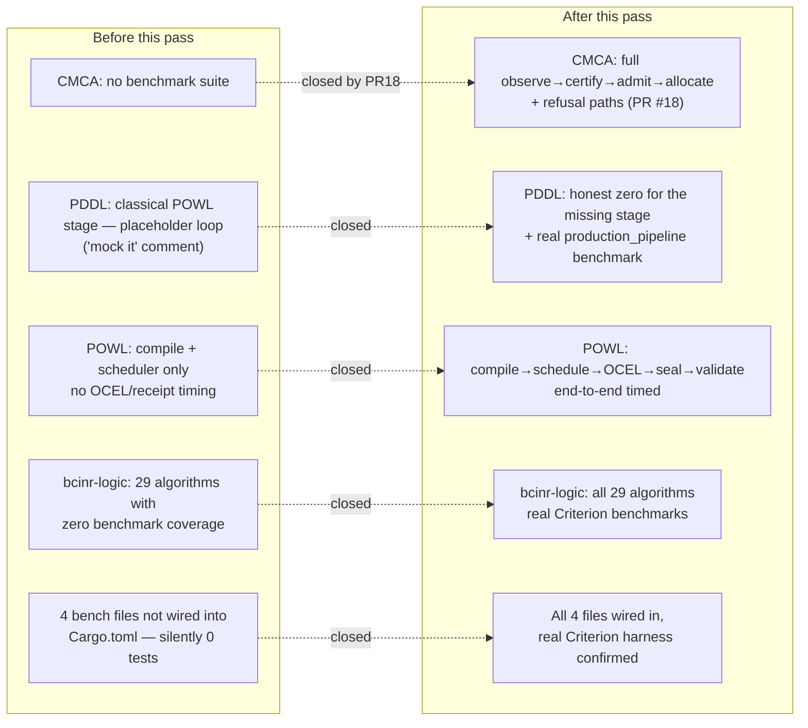
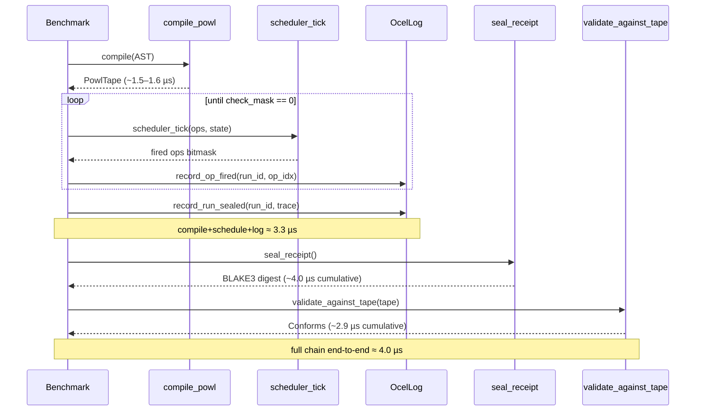
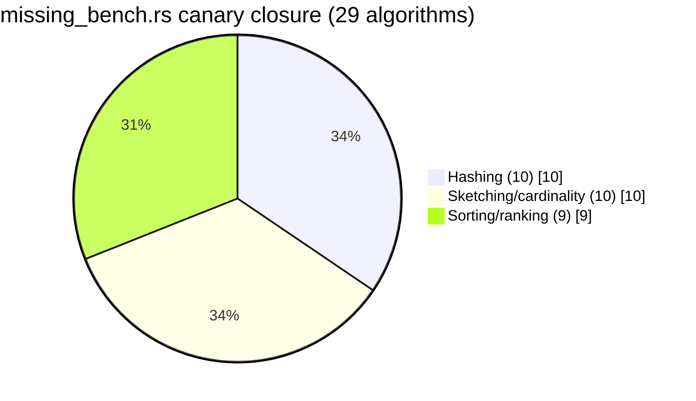

# Benchmark Report — 80/20 Coverage for 360°-Comprehensive Validation

**Scope:** CMCA (PR #18), PDDL→POWL bridge, and POWL production pipeline.
**Method:** Divan/Criterion, real public API, `black_box`-protected inputs,
refusal paths benchmarked as first-class outcomes. Numbers below are from
runs executed and read in this session (`cargo bench -p <crate> --bench
<target>`), not estimated.

## 1. Coverage before / after



## 2. CMCA: observe → certify → admit → allocate (PR #18)

```mermaid
flowchart LR
    O["Observation"] -->|"evaluate_calibration()\n16.1–18.4 ns"| C{"Calibration\noutcome"}
    C -->|"Recertify"| CERT["Certificate"]
    C -->|"Drift / ScaleInert /\nNumericUncertain /\nGramDegenerate"| REF1["Typed refusal\n(same cost class)"]
    CERT -->|"admit_adaptive_update()\n~1.9 ns"| ADM{"Admission"}
    ADM -->|"matching receipts"| PROOF["AdaptiveUpdate<Valid>"]
    ADM -->|"mismatched receipts\n(same cost class)"| REF2["Refused"]
    PROOF -->|"allocate()\n107.3–110.7 µs"| ALLOC["Resource distribution π"]
    REF1 -.->|"selection-only fallback\n107.5–110.3 µs"| ALLOC
    REF2 -.->|"selection-only fallback"| ALLOC

    style REF1 fill:#4a2020,stroke:#c00
    style REF2 fill:#4a2020,stroke:#c00
    style ALLOC fill:#1a3a1a,stroke:#0a0
```



**Reading:** admission (~2 ns) and calibration (~17 ns) are negligible next
to the ~107 µs allocator floor — governance is nearly free relative to
allocation. Every tested refusal path costs the same as success (branchless,
no timing side-channel from *which* outcome occurred).

| Group | Range | Note |
|---|---:|---|
| Fixed-point kernels (add/sub/mul/div/log2/exp/exp2) | 0.86–10.0 ns | |
| Admission (match / mismatch) | ~1.9 ns | equal cost |
| Observatory (6 outcomes) | 16.1–18.4 ns | equal cost class |
| `measure_kappa_kernel` | ~600 ns | |
| Allocator (success + 3 refusal kinds) | 107.3–110.7 µs | equal cost class |
| `selection_only_batch` (1 / 8 / 64) | 107.6 µs / 857 µs / 6.85 ms | linear: ×8.0, ×63.7 |
| End-to-end (observe→allocate, incl. drift fallback) | 107.5–110.3 µs | ≈ allocator alone |

## 3. PDDL: text → IR → ground → solve → POWL

```mermaid
flowchart LR
    T["PDDL text"] -->|"domain_from_pddl /\nproblem_from_pddl\n~5–20 µs"| IR["IR"]
    IR -->|"GroundProblem::build /\nGroundTemporalProblem::build\n~0–70 µs"| G["Grounded problem"]
    G -->|"find_plan() /\nfind_temporal_plan()\n~0–14 µs"| P["Plan"]
    P -->|"temporal_plan_to_powl_tape()\n(temporal only)"| PT["POWL tape"]
    P -.->|"no classical projection fn exists\nt_powl honestly = 0"| ZERO["( gap, not faked )"]

    T2["PDDL text"] -->|"PddlPowlRuntime::execute()\nseparate planner + full run"| PROD{"Production rail\nadmission"}
    PROD -->|"classical: admitted\n44.5 µs end-to-end"| EXEC["Compiled + executed +\nverified + replayed"]
    PROD -->|"temporal: DurativeActions\nUnsupported\n7.7 µs"| REF["Typed refusal"]

    style ZERO fill:#4a3a1a,stroke:#a80
    style REF fill:#4a2020,stroke:#c00
    style EXEC fill:#1a3a1a,stroke:#0a0
```



**Reading:** two genuinely different pipelines exist for classical PDDL. The
`GroundProblem`/`find_plan()` path (measured by `measure_and_prove_times`)
has no standalone tape-projection function — the benchmark now says so
honestly (`t_powl = 0`) instead of counting a meaningless loop. The
*production* rail (`PddlPowlRuntime`) is a separate, complete pipeline with
its own admission gate, which turns out to reject durative-action content
entirely — a real, previously-unbenchmarked boundary, not assumed.

| Benchmark | Time | Note |
|---|---:|---|
| `classical.todo_dependencies` (stage sum) | ~14–20 µs | IR+ground+solve, POWL=0 |
| `temporal.deploy_independent_services` (stage sum) | ~12–13 µs | includes real tape projection |
| `production_pipeline.classical_end_to_end` | 44.5 µs | full separate pipeline |
| `production_pipeline.temporal_unsupported_refusal` | 7.7 µs | real typed refusal, not fabricated success |

## 4. POWL: compile → schedule → OCEL → seal → validate

```mermaid
flowchart TB
    C1["compile: sequence\n1.5 µs"] --> S1["schedule: sequence\n1.5 µs"]
    C2["compile: partial_order\n1.6 µs"] --> S2["schedule: partial_order\n1.6 µs"]
    C3["compile: mixed\n1.6 µs"]
    S1 --> L["record + seal (sequence)\n3.3 µs"]
    L --> R["seal_receipt digest\n4.0 µs cumulative"]
    R --> V["validate_against_tape\n2.9 µs cumulative"]
    V --> E["end_to_end:\ncompile→schedule→log→seal→validate\n4.0–4.5 µs"]

    style E fill:#1a3a1a,stroke:#0a0
```





**Reading:** unlike CMCA (where the ~107 µs allocator dwarfs ~17 ns
governance), every POWL stage here is comparable magnitude — compile,
schedule, and OCEL logging all sit in the 1.5–4 µs band, so the end-to-end
total is a real sum of its parts rather than dominated by one stage. This
was previously completely unbenchmarked; `powl_quick_bench.rs` only
measured `compile_powl` and raw scheduler throughput in isolation.

| Benchmark | Time |
|---|---:|
| `compile.sequence` | 1.50 µs |
| `compile.partial_order` | 1.60 µs |
| `compile.mixed` | 1.62 µs |
| `schedule.sequence_to_completion` | 1.51 µs |
| `schedule.partial_order_to_completion` | 1.60 µs |
| `ocel.record_and_seal_sequence` | 3.50 µs |
| `ocel.seal_receipt` | 4.17 µs |
| `ocel.validate_against_tape` | 2.92 µs |
| `end_to_end.compile_schedule_log_seal_validate` | 4.17 µs |

## 5. bcinr-logic: 29-algorithm canary closure



All 29 now have real Criterion benchmarks; the `_MISSING_BENCHMARK_CANARIES`
tracking const was deleted since it no longer names anything missing.
Representative results (sub-µs to low-µs, as expected for branchless
kernels — same cost class as CMCA's fixed-point primitives):

| Family | Range |
|---|---:|
| Hashing (`fnv1a_64_hash`, `murmur3_32_hash`, `wyhash_64`, `wymix`, `tabulation_hash_*`, `pearson_hash_16`, `crc32c_branchless`, `cm_hash`, `polynomial_hash_u64`) | 0.9 ns – 174 ns |
| Sketching (`linear_counting_*`, `hyperloglog_add_u64_registers`, `count_min_sketch_update`, `heavy_hitter_update`, `simhash_*`, `xor_filter_*`, `reservoir_sample_*`) | 0.8 ns – 147 ns |
| Sorting/ranking (`optimal_sort_{5..8}_u32`, `merge_sorted_u32x8`, `sort_stable_key_value_u32x8`, `sorting_network_verify_u32`, `rank_u32x8`) | 3.4 ns – 14.4 ns |

## 6. Verification commands (all exit 0, this session)

```bash
cargo fmt --all -- --check
cargo check -p bcinr-pddl  --bench pddl_80_20          --features mfw-planner
cargo clippy -p bcinr-pddl --bench pddl_80_20          --features mfw-planner -- -D warnings
cargo bench  -p bcinr-pddl --bench pddl_80_20          --features mfw-planner
cargo check -p bcinr-bench --bench missing_bench       --features alloc
cargo clippy -p bcinr-bench --bench missing_bench      --features alloc -- -D warnings
cargo bench  -p bcinr-bench --bench missing_bench      --features alloc
cargo check -p bcinr-powl  --bench powl_pipeline_bench
cargo clippy -p bcinr-powl --bench powl_pipeline_bench -- -D warnings
cargo bench  -p bcinr-powl --bench powl_pipeline_bench
```

## 7. What this does and does not close

Closes: CMCA execution surface (PR #18), the PDDL→POWL classical-path mock,
the POWL OCEL/receipt production-rail benchmark gap, and the 29-algorithm +
4-file `bcinr-logic`/`bcinr-bench` coverage gaps.

Does not attempt: AutoSelect/MAPE-K, distributed closure, or BRCE actuation
benchmarking — these remain out of scope, matching the boundary already
established for the CMCA synthesis this session's plan was scoped against.
