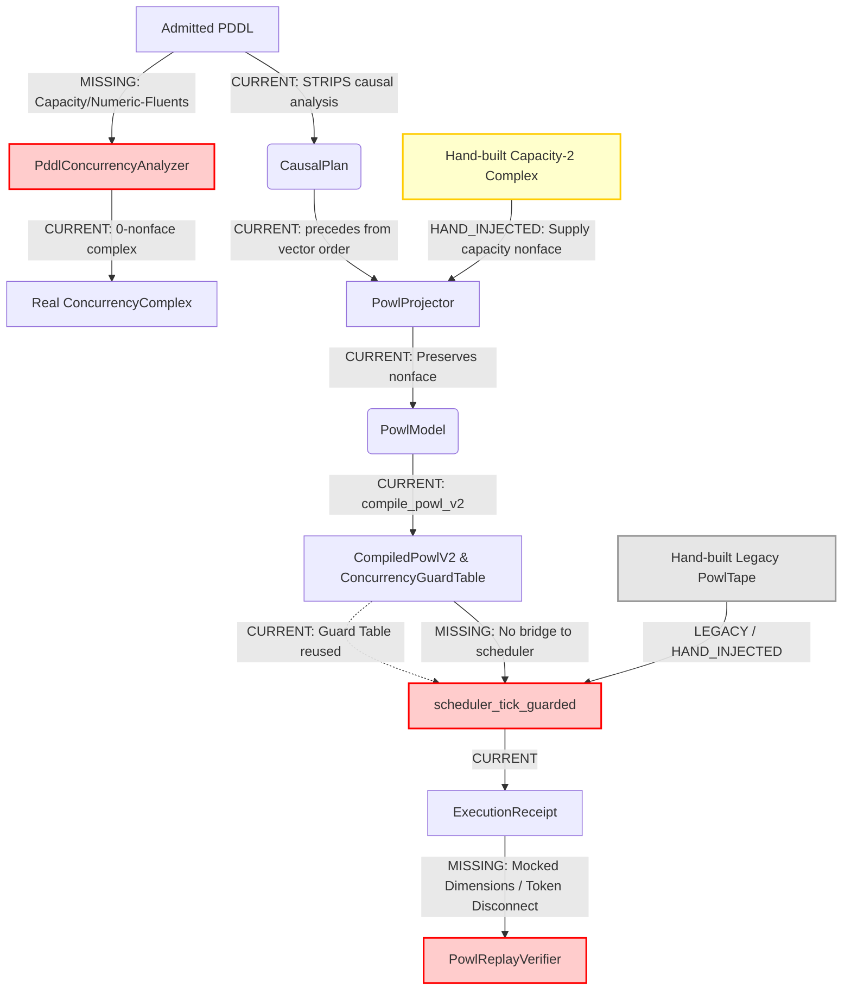
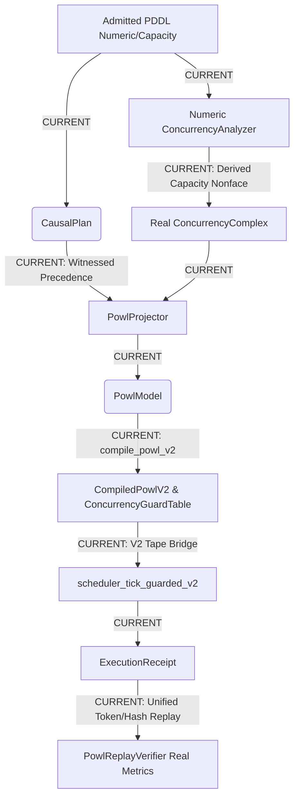

# DEEP TRACE E — END TO END

## 1. CURRENT Graph

*Note: The capacity-two fixture switches from derived to hand-built objects exactly at `HI1[Hand-built Capacity-2 Complex]`, bypassing the real `PddlConcurrencyAnalyzer` which only processes STRIPS pairwise data and emits a 0-nonface complex.*

## 2. TARGET Graph

## 3. Broken Edges (Ranked by Semantic Severity)

1. **Missing numeric-fluent extraction**: `PddlConcurrencyAnalyzer` operates on classical STRIPS, making organic capacity-2 nonfaces impossible to derive.
2. **Missing V2 scheduler bridge**: `scheduler_tick` and `scheduler_tick_guarded` only accept legacy `PowlTape`, rendering `CompiledPowlV2` un-executable without manual legacy tape injection.
3. **Illegitimate precedence edge generation**: `CausalPlan.precedes` derives ordering from raw vector insertion before independence checks, violating "vector order alone never creates precedence".
4. **Mocked replay conformance dimensions**: `PowlReplayVerifier` hardcodes `generalization` and `simplicity` to Q16.16 zero, failing to measure structural state-space bounds.
5. **Opaque ExecutionReceipt ready-states**: Receipts lack a verifiable `ready` bitmask, requiring out-of-band recompilation to verify the scheduler's actual input constraints.

## 4. DO NOT BUILD List (Tempting False Bridges)

- DO NOT BUILD a translation layer from `CompiledPowlV2` down to legacy `PowlTape` just to satisfy the old scheduler.
- DO NOT BUILD synthetic numeric-capacity tags directly onto `Pddl8GroundAction` as a shim; design a native numeric-fluent causal struct.
- DO NOT BUILD heuristic non-zero defaults for `generalization` and `simplicity` to pass predicates; either fully map the state space or keep them strictly 0.
- DO NOT BUILD manual pre-filtering in `precedes`; fix `PddlCausalAnalyzer` to exclusively use independence witnesses.

## 5. Ordered Residual Patch Plan

1. **Semantic Edge**: Numeric Fluents in PDDL Analyzer. 
   - **Negative Fixture**: `link3a_real_pddl_pipeline_cannot_produce_a_three_way_nonface_from_pairwise_independent_actions`
2. **Semantic Edge**: Witness-Backed Precedence. 
   - **Negative Fixture**: `link2_precedes_is_the_full_input_vector_order_even_though_every_pair_is_independent`
3. **Semantic Edge**: V2 Tape Scheduler Bridge. 
   - **Negative Fixture**: `link6_real_scheduler_never_fires_the_triple_when_the_ready_set_is_the_triple` (relies on legacy tape injection)
4. **Semantic Edge**: Literal Ready-State in ExecutionReceipt. 
   - **Negative Fixture**: `link7_execution_receipt_fired_pair_differs_from_the_genuinely_ready_triple` (the PARTIAL opacity finding)
5. **Semantic Edge**: Derive Replay State-Space Dimensions. 
   - **Negative Fixture**: `strict_predicate_fails_on_a_perfect_trace_due_to_mocked_dimensions`

## 6. Gemini Context Package

- **Files to read first**: 
  - `crates/bcinr-pddl/tests/mfw_capacity2_fixture.rs`
  - `crates/bcinr-powl-receipt/src/replay.rs`
  - `crates/bcinr-pddl/src/concurrency.rs`
- **Symbols to preserve**: `PowlReplayVerifier::finalize`, `compile_powl_v2`, `scheduler_tick_guarded`
- **Tests/Commands**: `cargo test -p bcinr-pddl mfw_capacity2_fixture`
- **Claim ceiling after each patch**:
  - *Patch 1*: The true capacity nonface is derived naturally; `hand_built_capacity2_complex` is permanently deleted.
  - *Patch 2*: `precedes` contains only edges proven by dependence witnesses.
  - *Patch 3*: The real scheduler executes a `CompiledPowlV2` tape end-to-end.
  - *Patch 4*: Receipts natively commit to their exact ready-mask.
  - *Patch 5*: Conformance predicates pass strictly on 4/4 real measured dimensions.

THE NEXT AGENT SHOULD START AT [crates/bcinr-pddl/src/concurrency.rs:PddlConcurrencyAnalyzer](file:///Users/sac/bcinr/crates/bcinr-pddl/src/concurrency.rs) BECAUSE it structurally blocks the capacity-two fixture from being derived organically.
